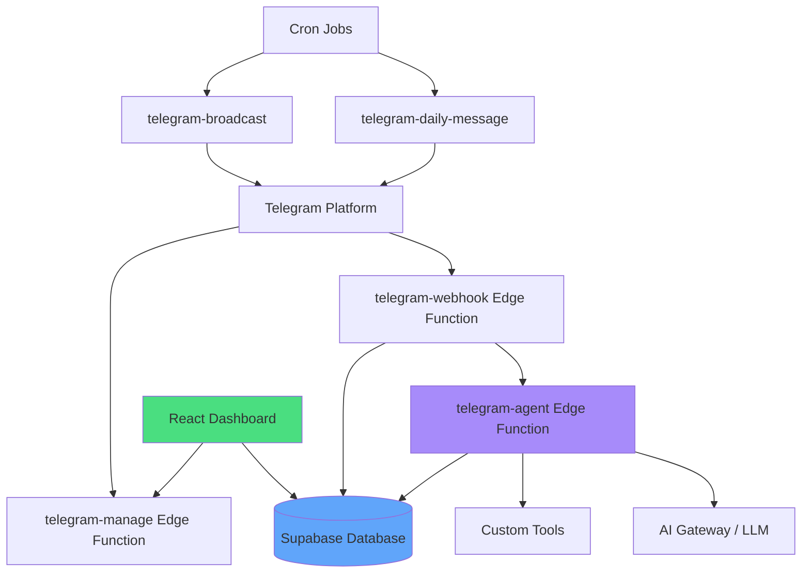

# Telegram Bot Implementation Template

Complete specification for building a fully-featured Telegram bot with AI agent capabilities, community management, and broadcast messaging.

## 🏗️ Architecture Overview



---

## 📋 Prerequisites

### Required Services & API Keys
1. **Supabase Project** - Database, auth, edge functions
2. **Telegram Bot Token** - From @BotFather
3. **AI Provider API Key** - OpenAI, Anthropic, or OpenRouter
4. **Optional Services**:
   - LangSmith (tracing)
   - ElevenLabs (voice)
   - Tavily (web search)

### Environment Secrets Required
```bash
SUPABASE_URL=https://your-project.supabase.co
SUPABASE_SERVICE_ROLE_KEY=your_service_role_key
SUPABASE_ANON_KEY=your_anon_key
TELEGRAM_BOT_TOKEN=your_telegram_bot_token
OPENAI_API_KEY=your_openai_key
OPENROUTER_API_KEY=your_openrouter_key (optional)
LANGSMITH_API_KEY=your_langsmith_key (optional)
ELEVENLABS_API_KEY=your_elevenlabs_key (optional)
```

---

## 🗄️ Database Schema

### Core Tables

#### 1. `communities`
```sql
CREATE TABLE communities (
  id UUID PRIMARY KEY DEFAULT gen_random_uuid(),
  name TEXT NOT NULL,
  description TEXT,
  telegram_bot_token TEXT UNIQUE,
  system_prompt TEXT,
  ai_model TEXT DEFAULT 'gpt-4o',
  
  -- Daily messaging
  daily_message_enabled BOOLEAN DEFAULT false,
  daily_message_content TEXT,
  daily_message_time TIME, -- Local time
  timezone TEXT DEFAULT 'UTC',
  
  -- Analytics
  total_tokens_used BIGINT DEFAULT 0,
  total_cost_usd NUMERIC(10,6) DEFAULT 0,
  
  created_at TIMESTAMPTZ DEFAULT now(),
  updated_at TIMESTAMPTZ DEFAULT now()
);
```

#### 2. `users`
```sql
CREATE TABLE users (
  id UUID PRIMARY KEY DEFAULT gen_random_uuid(),
  auth_user_id UUID REFERENCES auth.users(id), -- NULL for Telegram-only users
  
  -- Identity
  name TEXT,
  username TEXT UNIQUE,
  email TEXT,
  bio TEXT,
  avatar_url TEXT,
  
  -- Telegram linkage
  telegram_user_id BIGINT UNIQUE,
  telegram_username TEXT,
  
  -- Account status
  is_claimed BOOLEAN DEFAULT false, -- True if user signed up via web app
  
  created_at TIMESTAMPTZ DEFAULT now(),
  updated_at TIMESTAMPTZ DEFAULT now()
);
```

#### 3. `community_members`
```sql
CREATE TABLE community_members (
  id UUID PRIMARY KEY DEFAULT gen_random_uuid(),
  community_id UUID REFERENCES communities(id) ON DELETE CASCADE,
  user_id UUID REFERENCES users(id) ON DELETE CASCADE,
  role TEXT DEFAULT 'member', -- 'admin' | 'member'
  joined_at TIMESTAMPTZ DEFAULT now(),
  
  UNIQUE(community_id, user_id)
);
```

#### 4. `telegram_bots`
```sql
CREATE TABLE telegram_bots (
  id UUID PRIMARY KEY DEFAULT gen_random_uuid(),
  community_id UUID REFERENCES communities(id) ON DELETE CASCADE,
  bot_token TEXT NOT NULL,
  bot_username TEXT,
  webhook_url TEXT,
  is_active BOOLEAN DEFAULT true,
  
  created_at TIMESTAMPTZ DEFAULT now(),
  updated_at TIMESTAMPTZ DEFAULT now()
);
```

#### 5. `telegram_chat_sessions`
```sql
CREATE TABLE telegram_chat_sessions (
  id UUID PRIMARY KEY DEFAULT gen_random_uuid(),
  
  -- Session identity
  telegram_chat_id BIGINT NOT NULL,
  telegram_user_id BIGINT,
  community_id UUID REFERENCES communities(id) ON DELETE CASCADE,
  bot_id UUID REFERENCES telegram_bots(id) ON DELETE SET NULL,
  
  -- User info cache
  telegram_username TEXT,
  telegram_first_name TEXT,
  telegram_last_name TEXT,
  
  -- Session state
  is_active BOOLEAN DEFAULT true,
  proactive_outreach_enabled BOOLEAN DEFAULT false, -- DM notifications
  last_message_at TIMESTAMPTZ DEFAULT now(),
  message_count INTEGER DEFAULT 0,
  
  -- Analytics
  tokens_used BIGINT DEFAULT 0,
  cost_usd NUMERIC(10,6) DEFAULT 0,
  
  created_at TIMESTAMPTZ DEFAULT now(),
  updated_at TIMESTAMPTZ DEFAULT now(),
  
  UNIQUE(telegram_chat_id, community_id)
);
```

#### 6. `messages`
```sql
CREATE TABLE messages (
  id UUID PRIMARY KEY DEFAULT gen_random_uuid(),
  
  -- Context
  community_id UUID REFERENCES communities(id) ON DELETE CASCADE,
  chat_session_id UUID REFERENCES telegram_chat_sessions(id) ON DELETE CASCADE,
  sender_id UUID REFERENCES users(id) ON DELETE SET NULL,
  
  -- Content
  content TEXT NOT NULL,
  role TEXT NOT NULL, -- 'user' | 'assistant' | 'system'
  chat_type TEXT, -- 'private' | 'group' | 'supergroup' | 'community'
  
  -- Metadata
  telegram_message_id BIGINT,
  attachments JSONB, -- Images, files, etc.
  
  created_at TIMESTAMPTZ DEFAULT now()
);

CREATE INDEX idx_messages_session ON messages(chat_session_id, created_at);
CREATE INDEX idx_messages_community ON messages(community_id, created_at);
```

#### 7. `custom_tools`
```sql
CREATE TABLE custom_tools (
  id UUID PRIMARY KEY DEFAULT gen_random_uuid(),
  community_id UUID REFERENCES communities(id) ON DELETE CASCADE,
  
  -- Tool identity
  name TEXT NOT NULL, -- snake_case identifier
  display_name TEXT NOT NULL,
  description TEXT NOT NULL,
  
  -- API configuration
  endpoint_url TEXT NOT NULL,
  http_method TEXT DEFAULT 'POST',
  auth_type TEXT, -- 'bearer' | 'basic' | 'none'
  auth_value TEXT, -- Token or credentials
  
  -- Schema
  parameters JSONB, -- Parameter definitions
  request_template JSONB, -- How to format requests
  
  -- State
  is_enabled BOOLEAN DEFAULT true,
  
  created_at TIMESTAMPTZ DEFAULT now(),
  updated_at TIMESTAMPTZ DEFAULT now(),
  
  UNIQUE(community_id, name)
);
```

#### 8. `custom_tool_logs`
```sql
CREATE TABLE custom_tool_logs (
  id UUID PRIMARY KEY DEFAULT gen_random_uuid(),
  tool_id UUID REFERENCES custom_tools(id) ON DELETE CASCADE,
  chat_session_id UUID REFERENCES telegram_chat_sessions(id) ON DELETE SET NULL,
  
  -- Execution details
  request_payload JSONB,
  response_payload JSONB,
  status_code INTEGER,
  error_message TEXT,
  execution_time_ms INTEGER,
  
  created_at TIMESTAMPTZ DEFAULT now()
);
```

---

## 🔧 Edge Functions

### 1. `telegram-webhook` (Primary Entry Point)

**Purpose**: Receives all incoming Telegram updates and routes them appropriately.

**Trigger**: Telegram webhook POST requests

**Key Responsibilities**:
- Parse incoming Telegram updates
- Find or create users (`findOrCreateUser`)
- Add users to communities (`addUserToCommunity`)
- Manage chat sessions (private vs group)
- Route to `telegram-agent` for AI responses
- Handle commands (`/start`, `/help`, `/notifications`)

**Core Logic Flow**:
```typescript
// 1. Extract message data
const { message, chat, from } = update;

// 2. Find or create user
const userId = await findOrCreateUser(supabase, from.id, from.username, communityId);

// 3. Handle session
if (chat.type === 'private') {
  await upsertPrivateChatSession(supabase, chat.id, from, communityId);
} else {
  await upsertGroupChatSession(supabase, chat.id, communityId);
}

// 4. Store message
await supabase.from('messages').insert({
  content: message.text,
  role: 'user',
  sender_id: userId,
  community_id: communityId,
  telegram_message_id: message.message_id
});

// 5. Call AI agent
const response = await supabase.functions.invoke('telegram-agent', {
  body: { chatId: chat.id, communityId, message: message.text }
});

// 6. Send response via Telegram API
await sendTelegramMessage(botToken, chat.id, response.data.reply);
```

**Commands to Implement**:
```typescript
const commands = {
  '/start': 'Enable DM notifications and introduce bot',
  '/help': 'Show available commands',
  '/status': 'Show notification status',
  '/notifications on': 'Enable daily messages',
  '/notifications off': 'Disable daily messages'
};
```

---

### 2. `telegram-agent` (AI Brain)

**Purpose**: Generate AI responses using LLM with tool calling.

**Trigger**: Invoked by `telegram-webhook`

**Key Responsibilities**:
- Load community configuration (system prompt, model)
- Fetch conversation history
- Load enabled custom tools
- Call LLM with tools
- Execute tool calls if requested
- Return final response

**Core Logic Flow**:
```typescript
// 1. Load community settings
const { data: community } = await supabase
  .from('communities')
  .select('system_prompt, ai_model')
  .eq('id', communityId)
  .single();

// 2. Fetch conversation history
const { data: history } = await supabase
  .from('messages')
  .select('content, role')
  .eq('chat_session_id', sessionId)
  .order('created_at', { ascending: true })
  .limit(50);

// 3. Load custom tools
const { data: tools } = await supabase
  .from('custom_tools')
  .select('*')
  .eq('community_id', communityId)
  .eq('is_enabled', true);

// 4. Build tool definitions for LLM
const toolDefinitions = tools.map(tool => ({
  type: 'function',
  function: {
    name: tool.name,
    description: tool.description,
    parameters: tool.parameters
  }
}));

// 5. Call LLM
const completion = await openai.chat.completions.create({
  model: community.ai_model,
  messages: [
    { role: 'system', content: community.system_prompt },
    ...history,
    { role: 'user', content: userMessage }
  ],
  tools: toolDefinitions,
  tool_choice: 'auto'
});

// 6. Handle tool calls
if (completion.choices[0].message.tool_calls) {
  for (const toolCall of completion.choices[0].message.tool_calls) {
    const tool = tools.find(t => t.name === toolCall.function.name);
    const result = await executeCustomTool(tool, toolCall.function.arguments);
    // Continue conversation with tool result...
  }
}

// 7. Return response
return { reply: completion.choices[0].message.content };
```

---

### 3. `telegram-manage` (Bot Setup)

**Purpose**: Create/update Telegram bot and set webhook.

**Trigger**: Dashboard API call

**Key Responsibilities**:
- Register webhook with Telegram
- Store bot credentials
- Validate bot token

**Implementation**:
```typescript
// Set webhook
await fetch(`https://api.telegram.org/bot${botToken}/setWebhook`, {
  method: 'POST',
  headers: { 'Content-Type': 'application/json' },
  body: JSON.stringify({
    url: `${SUPABASE_URL}/functions/v1/telegram-webhook?community_id=${communityId}`,
    allowed_updates: ['message', 'callback_query']
  })
});

// Store bot
await supabase.from('telegram_bots').upsert({
  community_id: communityId,
  bot_token: botToken,
  webhook_url: webhookUrl,
  is_active: true
});
```

---

### 4. `telegram-daily-message` (Scheduled Notifications)

**Purpose**: Send daily messages to opted-in users.

**Trigger**: Cron job (every minute)

**Key Responsibilities**:
- Find communities with daily messages enabled
- Check if current time matches scheduled time (timezone-aware)
- Query opted-in users
- Send messages with rate limiting

**Implementation**:
```typescript
// 1. Get eligible communities
const { data: communities } = await supabase
  .rpc('get_communities_for_daily_message');

for (const community of communities) {
  // 2. Check if it's time to send (timezone conversion)
  const localTime = new Date().toLocaleTimeString('en-US', {
    timeZone: community.timezone,
    hour12: false,
    hour: '2-digit',
    minute: '2-digit'
  });
  
  const scheduledTime = community.daily_message_time;
  
  if (localTime !== scheduledTime) continue;

  // 3. Get opted-in users
  const { data: sessions } = await supabase
    .from('telegram_chat_sessions')
    .select('telegram_chat_id')
    .eq('community_id', community.id)
    .eq('proactive_outreach_enabled', true)
    .eq('is_active', true);

  // 4. Send with rate limiting
  for (const session of sessions) {
    await sendTelegramMessage(
      community.telegram_bot_token,
      session.telegram_chat_id,
      community.daily_message_content
    );
    await new Promise(resolve => setTimeout(resolve, 50)); // 50ms delay
  }
}
```

---

### 5. `telegram-broadcast` (Custom Tool)

**Purpose**: Enable AI agent to send broadcast messages.

**Trigger**: Called by `telegram-agent` when AI invokes broadcast tool

**Key Responsibilities**:
- Query eligible recipients
- Filter based on parameters
- Send messages to multiple users
- Log execution

**Implementation**:
```typescript
const { message, include_opted_out = false } = await req.json();

// Query eligible sessions
let query = supabase
  .from('telegram_chat_sessions')
  .select('telegram_chat_id')
  .eq('community_id', communityId)
  .eq('is_active', true);

if (!include_opted_out) {
  query = query.eq('proactive_outreach_enabled', true);
}

const { data: sessions } = await query;

// Send to all
for (const session of sessions) {
  await sendTelegramMessage(botToken, session.telegram_chat_id, message);
  await new Promise(resolve => setTimeout(resolve, 50));
}

return { sent: sessions.length };
```

---

## 🎨 Frontend Components

### Dashboard Structure

```
src/components/dashboard/
├── AgentSetup.tsx           # System prompt & model config
├── TelegramUsersManagement.tsx  # View Telegram users
├── MembersManagement.tsx    # Community members + DM eligibility
├── CustomToolsManager.tsx   # Add/edit custom tools
├── AnalyticsDashboard.tsx   # Token usage, costs
├── ChatHistoryDashboard.tsx # View conversations
└── CommunitySettings.tsx    # Daily messages, timezone
```

### Key UI Features

#### 1. **Bot Setup Flow**
```typescript
// Connect bot token
const setupBot = async (token: string) => {
  const { data } = await supabase.functions.invoke('telegram-manage', {
    body: { communityId, botToken: token }
  });
  
  if (data.success) {
    // Show webhook URL and setup instructions
    setWebhookUrl(data.webhookUrl);
  }
};
```

#### 2. **Custom Tools Manager**
```typescript
// Add custom tool
const addTool = async (tool: CustomTool) => {
  await supabase.from('custom_tools').insert({
    community_id: communityId,
    name: tool.name,
    display_name: tool.displayName,
    description: tool.description,
    endpoint_url: tool.endpointUrl,
    parameters: tool.parameters,
    is_enabled: true
  });
};
```

#### 3. **Members with DM Eligibility**
```typescript
// Fetch members with session info
const { data: members } = await supabase
  .from('community_members')
  .select(`
    *,
    users!inner(
      id,
      name,
      telegram_user_id,
      telegram_username
    ),
    telegram_chat_sessions!left(
      is_active,
      proactive_outreach_enabled,
      message_count
    )
  `)
  .eq('community_id', communityId);

// Determine eligibility
const canBroadcast = member.telegram_chat_sessions?.[0]?.is_active &&
                     member.telegram_chat_sessions?.[0]?.proactive_outreach_enabled;
```

#### 4. **Daily Message Scheduler**
```typescript
const enableDailyMessage = async (enabled: boolean, time: string, content: string) => {
  await supabase
    .from('communities')
    .update({
      daily_message_enabled: enabled,
      daily_message_time: time,
      daily_message_content: content,
      timezone: Intl.DateTimeFormat().resolvedOptions().timeZone
    })
    .eq('id', communityId);
};
```

---

## 🔒 Security & RLS Policies

### Essential RLS Policies

#### Communities
```sql
-- Users can view communities they're members of
CREATE POLICY "Users view own communities"
ON communities FOR SELECT
USING (
  EXISTS (
    SELECT 1 FROM community_members cm
    JOIN users u ON cm.user_id = u.id
    WHERE cm.community_id = communities.id
    AND u.auth_user_id = auth.uid()
  )
);
```

#### Messages
```sql
-- Users can view messages from their communities
CREATE POLICY "Users view community messages"
ON messages FOR SELECT
USING (
  EXISTS (
    SELECT 1 FROM community_members cm
    JOIN users u ON cm.user_id = u.id
    WHERE cm.community_id = messages.community_id
    AND u.auth_user_id = auth.uid()
  )
);
```

#### Custom Tools
```sql
-- Admins can manage custom tools
CREATE POLICY "Admins manage tools"
ON custom_tools FOR ALL
USING (
  is_community_admin(community_id, auth.uid())
);
```

---

## 🚀 Deployment Checklist

### 1. Database Setup
- [ ] Create all tables with proper indexes
- [ ] Set up RLS policies
- [ ] Create database functions (`get_communities_for_daily_message`, etc.)
- [ ] Enable realtime for necessary tables

### 2. Secrets Configuration
- [ ] Add `TELEGRAM_BOT_TOKEN`
- [ ] Add `OPENAI_API_KEY` or `OPENROUTER_API_KEY`
- [ ] Add `SUPABASE_URL`, `SUPABASE_SERVICE_ROLE_KEY`
- [ ] Add optional service keys (LangSmith, ElevenLabs, etc.)

### 3. Edge Functions
- [ ] Deploy `telegram-webhook`
- [ ] Deploy `telegram-agent`
- [ ] Deploy `telegram-manage`
- [ ] Deploy `telegram-daily-message`
- [ ] Deploy `telegram-broadcast`
- [ ] Configure CORS headers for all functions

### 4. Telegram Bot Setup
- [ ] Create bot via @BotFather
- [ ] Get bot token
- [ ] Set webhook via `telegram-manage`
- [ ] Test with `/start` command
- [ ] Verify message routing

### 5. Cron Jobs
- [ ] Set up cron for `telegram-daily-message` (every minute)
- [ ] Test timezone handling
- [ ] Verify rate limiting

### 6. Frontend
- [ ] Deploy React dashboard
- [ ] Test bot setup flow
- [ ] Test custom tools creation
- [ ] Test member management
- [ ] Test analytics display

### 7. Testing
- [ ] Private chat messages
- [ ] Group messages
- [ ] Command handling
- [ ] Tool calling
- [ ] Daily messages
- [ ] Broadcast messages
- [ ] Member provisioning
- [ ] DM eligibility

---

## 📊 Monitoring & Analytics

### Key Metrics to Track

1. **Token Usage** - Track via `telegram_chat_sessions.tokens_used`
2. **Cost** - Calculate via `telegram_chat_sessions.cost_usd`
3. **Active Sessions** - Count `is_active = true`
4. **Message Volume** - `messages` table count
5. **Tool Usage** - `custom_tool_logs` analysis
6. **Daily Message Delivery** - Success/failure rates

### Logging Strategy

```typescript
// Always log in edge functions
console.log('[telegram-webhook] Received update:', update);
console.log('[telegram-agent] Generated response:', response);
console.error('[telegram-broadcast] Failed to send:', error);
```

### Analytics Queries

```sql
-- Token usage by community
SELECT 
  c.name,
  SUM(tcs.tokens_used) as total_tokens,
  SUM(tcs.cost_usd) as total_cost
FROM communities c
JOIN telegram_chat_sessions tcs ON c.id = tcs.community_id
GROUP BY c.id, c.name;

-- Most active users
SELECT 
  u.name,
  tcs.message_count,
  tcs.last_message_at
FROM telegram_chat_sessions tcs
JOIN users u ON tcs.telegram_user_id = u.telegram_user_id
ORDER BY tcs.message_count DESC
LIMIT 10;
```

---

## 🛠️ Common Customizations

### 1. Add New Custom Tool Type
1. Create tool in `custom_tools` table
2. Implement endpoint (edge function or external API)
3. Test via dashboard
4. Enable in community settings

### 2. Add New Command
```typescript
// In telegram-webhook/index.ts
if (messageText === '/mycommand') {
  await sendTelegramMessage(botToken, chatId, 'Custom response');
  return new Response(JSON.stringify({ ok: true }), { headers: corsHeaders });
}
```

### 3. Customize AI Behavior
- Update `system_prompt` in community settings
- Add context via custom tools
- Modify tool definitions in `telegram-agent`

### 4. Add Message Attachments
- Parse `message.photo`, `message.document`, etc.
- Store in Supabase Storage
- Include URLs in `messages.attachments` JSONB

---

## 🐛 Troubleshooting Guide

### Issue: Messages not reaching bot
- ✅ Check webhook is set correctly (`getWebhookInfo`)
- ✅ Verify bot token is valid
- ✅ Check edge function logs
- ✅ Ensure CORS headers are present

### Issue: Users not added to community
- ✅ Check `findOrCreateUser` logic
- ✅ Verify `addUserToCommunity` is called
- ✅ Check RLS policies on `community_members`

### Issue: DM broadcasts not working
- ✅ Verify `proactive_outreach_enabled = true`
- ✅ Check `telegram_chat_sessions.bot_id` is correct
- ✅ Ensure users have messaged bot privately first

### Issue: Daily messages not sending
- ✅ Check timezone configuration
- ✅ Verify `daily_message_time` format (HH:MM)
- ✅ Check cron job is running
- ✅ Review rate limiting delays

---

## 📚 Reference Links

- [Telegram Bot API](https://core.telegram.org/bots/api)
- [OpenAI Function Calling](https://platform.openai.com/docs/guides/function-calling)
- [Supabase Edge Functions](https://supabase.com/docs/guides/functions)
- [LangSmith Tracing](https://docs.smith.langchain.com/)

---

## ✅ Success Criteria

Your Telegram bot is fully functional when:

- [x] Users can message bot in private and group chats
- [x] AI responds contextually using conversation history
- [x] Custom tools are callable by AI agent
- [x] Daily messages send at scheduled time
- [x] Broadcast messages reach all eligible users
- [x] Members are auto-provisioned on first contact
- [x] DM eligibility shows correctly in dashboard
- [x] Analytics track token usage and costs
- [x] Commands (`/start`, `/notifications`, etc.) work
- [x] Bot handles errors gracefully with logging

---

**Template Version**: 1.0  
**Last Updated**: 2025  
**Maintained By**: AI Community Platform Team
