# Broadcast Recipient Eligibility System

## The Problem

Users chatting with the bot in groups are added to `users` and `community_members` tables, but the broadcast tool can't find them. Here's why:

```mermaid
graph TB
    subgraph "When User Messages Bot"
        MSG[User Sends Message] --> TYPE{Chat Type?}
        
        TYPE -->|Private Chat| PRIV[Create telegram_chat_sessions<br/>with proactive_outreach_enabled=true]
        TYPE -->|Group/Supergroup| GRP[NO Session Created<br/>❌ Can't receive broadcasts]
        
        MSG --> USERS[Add to users table ✅]
        MSG --> MEMBERS[Add to community_members ✅]
    end
    
    subgraph "When Broadcasting"
        BROADCAST[Broadcast Tool] --> QUERY[Query telegram_chat_sessions]
        QUERY --> FILTER1{is_active = true?}
        FILTER1 -->|No| SKIP1[Skip ❌]
        FILTER1 -->|Yes| FILTER2{proactive_outreach_enabled = true?}
        FILTER2 -->|No| SKIP2[Skip ❌]
        FILTER2 -->|Yes| SEND[Send Message ✅]
    end
    
    style PRIV fill:#4ade80
    style GRP fill:#f87171
    style SKIP1 fill:#f87171
    style SKIP2 fill:#f87171
    style SEND fill:#4ade80
```



## Why This Happens

### 1. Group Chat Limitation
**Telegram API Restriction**: Bots can only send private messages to users who have started a private chat with the bot. You can't DM someone just because they're in a group with your bot.

```mermaid
sequenceDiagram
    participant U as User
    participant G as Group Chat
    participant B as Bot
    participant TG as Telegram API
    
    U->>G: Messages in group
    B->>B: Sees message, adds to users table
    
    Note over B: 🤔 Can I DM this user?
    B->>TG: Try to send DM
    TG-->>B: ❌ Error: Bot can't initiate<br/>conversation with user
    
    Note over U,TG: User must start private chat first!
    
    U->>B: /start (private chat)
    B->>B: Create telegram_chat_sessions
    Note over B: ✅ Now can send broadcasts!
```



### 2. Session States

```mermaid
stateDiagram-v2
    [*] --> GroupOnly: User messages in group
    [*] --> PrivateChat: User /start in DM
    
    GroupOnly --> CanReceiveBroadcast: User starts private chat
    PrivateChat --> CanReceiveBroadcast: Session created
    
    CanReceiveBroadcast --> OptedIn: proactive_outreach_enabled = true
    CanReceiveBroadcast --> OptedOut: proactive_outreach_enabled = false
    
    OptedIn --> [*]: ✅ Receives broadcasts
    OptedOut --> [*]: ❌ No broadcasts
    GroupOnly --> [*]: ❌ No broadcasts
    
    note right of GroupOnly
        In users table ✅
        In community_members ✅
        In telegram_chat_sessions ❌
    end note
    
    note right of OptedIn
        In users table ✅
        In community_members ✅
        In telegram_chat_sessions ✅
        Eligible for broadcast ✅
    end note
```



## Database Schema Mismatch

**users & community_members**: Track ALL users who have interacted
**telegram_chat_sessions**: Track ONLY users with private chat capability

| User Type | users table | community_members | telegram_chat_sessions | Can Receive Broadcast? |
|-----------|-------------|-------------------|----------------------|----------------------|
| Group chat only | ✅ | ✅ | ❌ | ❌ |
| Private chat (new) | ✅ | ✅ | ✅ (enabled=true) | ✅ |
| Private chat (old) | ✅ | ✅ | ✅ (enabled=false*) | ❌ |

*Old sessions may have default DB value of `false` if created before auto-enable logic

## Current Broadcast Query Logic

```sql
-- This is what telegram-broadcast function does:
SELECT telegram_chat_id, telegram_username, ...
FROM telegram_chat_sessions
WHERE community_id = :community_id
  AND is_active = true
  AND proactive_outreach_enabled = true  -- 🔴 This filters out opted-out users
  AND message_count >= :min_count (optional)
```

## Solutions

### Solution 1: Fix Old Sessions (Quick Fix)
Update existing sessions that have `proactive_outreach_enabled = false` to `true`:

```sql
UPDATE telegram_chat_sessions
SET proactive_outreach_enabled = true
WHERE community_id = 'your-community-id'
  AND is_active = true
  AND proactive_outreach_enabled = false;
```

### Solution 2: Prompt Group Members to Start Private Chat
Send a message in the group encouraging users to DM the bot:

> "Want to receive personalized updates? Send me a /start message in a private chat!"

### Solution 3: Check Current State
See who's actually eligible:

```sql
-- Count users by state
SELECT 
  'Total users in community' as category,
  COUNT(*) as count
FROM community_members cm
WHERE cm.community_id = 'your-community-id'

UNION ALL

SELECT 
  'Users with private chat sessions' as category,
  COUNT(*) as count
FROM telegram_chat_sessions tcs
WHERE tcs.community_id = 'your-community-id'
  AND tcs.is_active = true

UNION ALL

SELECT 
  'Users eligible for broadcast' as category,
  COUNT(*) as count
FROM telegram_chat_sessions tcs
WHERE tcs.community_id = 'your-community-id'
  AND tcs.is_active = true
  AND tcs.proactive_outreach_enabled = true;
```

## Key Takeaways

1. **Broadcast = Private Chat Only**: You can only broadcast to users who have started a private chat with your bot
2. **Group Members ≠ Broadcast Recipients**: Just because someone is in a group doesn't mean you can DM them
3. **Two Tables, Different Purposes**:
   - `community_members` = Who's in the community
   - `telegram_chat_sessions` = Who can receive DMs
4. **Opt-in Required**: Users must have `proactive_outreach_enabled = true` to receive broadcasts
