# Broadcast Messaging System

## System Architecture


## Broadcast Flow Sequence

```mermaid
sequenceDiagram
    participant Admin
    participant UI as Custom Tools UI
    participant DB as Database
    participant User as Telegram User
    participant Bot as Telegram Bot
    participant Agent as AI Agent
    participant Broadcast as Broadcast Function
    participant Telegram as Telegram API
    participant Recipients
    
    Admin->>UI: Enable "Broadcast Messaging" toggle
    UI->>DB: Create/enable broadcast_message tool
    DB-->>UI: Tool created/enabled
    
    Note over UI: Tool now available to AI agent
    
    User->>Bot: Sends message: "Announce meeting tomorrow"
    Bot->>Agent: Process message with available tools
    Agent->>Agent: Analyzes: needs to notify everyone
    Agent->>Broadcast: invoke broadcast_message(message)
    
    Broadcast->>DB: Get community telegram_bot_token
    DB-->>Broadcast: Returns bot token
    
    Broadcast->>DB: Query active chat sessions
    Note over Broadcast,DB: Filter: is_active=true AND<br/>proactive_outreach_enabled=true
    DB-->>Broadcast: Returns eligible recipients
    
    loop For each recipient
        Broadcast->>Telegram: POST /sendMessage
        Telegram->>Recipients: Deliver message
        Telegram-->>Broadcast: Success/failure
    end
    
    Broadcast->>DB: Log execution to custom_tool_logs
    Broadcast-->>Agent: Return results (sent/failed counts)
    Agent->>Bot: Generate response confirmation
    Bot->>User: "✅ Broadcast sent to 24 users"
```



## Tool Configuration


## Recipient Filtering Logic


## State Diagram: Tool Lifecycle


## Key Features

### Automatic Tool Integration
- When enabled, creates a `custom_tools` entry automatically
- AI agent sees it as an available tool
- Agent decides when to use it based on conversation context

### Smart Filtering
- Only sends to active chat sessions
- Respects user opt-in preferences (proactive_outreach_enabled)
- Optional filters for message count threshold
- Can optionally include opted-out users

### Safety & Rate Limiting
- 50ms delay between messages to avoid Telegram rate limits
- Comprehensive error logging
- Returns detailed results (sent/failed counts)
- Logs each execution to `custom_tool_logs` table

### Use Cases
1. **Event Announcements**: "Meeting tomorrow at 3pm"
2. **System Updates**: "New features available!"
3. **Community Alerts**: "Emergency notice for all members"
4. **Survey Requests**: "Please fill out this quick survey"
5. **Milestone Celebrations**: "We hit 100 members! 🎉"

## Database Tables Involved


## Configuration Example

### Enable in UI
1. Navigate to Custom Tools section
2. Find "Broadcast Messaging" built-in tool
3. Toggle switch to enable
4. Tool is immediately available to AI agent

### Agent Usage
The AI agent will automatically invoke this tool when it detects:
- User wants to notify everyone
- Announcement needs to be shared
- Important updates for all members
- Keywords like "tell everyone", "announce to all", "notify all users"

### Example Conversation
```
User: "Can you announce to everyone that the meeting is moved to 3pm tomorrow?"

Bot: [Internally invokes broadcast_message tool]
     ✅ "I've sent the announcement to all 42 members who have chatted with me.
        Successfully delivered to 40 users, 2 had delivery issues."
```
