# Crypto x AI Agent Vision

A comprehensive exploration of blockchain-enabled AI agent capabilities for community management and P2P transactions.

## 🎯 Priority #1: P2P Crypto Payments via Agent

### Current Foundation
- ✅ Token launch system (Long.xyz + Base blockchain)
- ✅ Custom tools infrastructure  
- ✅ Telegram bot with tool calling capability
- ✅ `bot_tokens` table for community tokens
- ✅ `vibecoin_balance` in users table

### What's Needed
1. **Wallet Management System**
   - User wallet address storage
   - Multi-wallet support (Coinbase, MetaMask, etc.)
   - Wallet verification/linking flow
   - Magic link or signature-based verification

2. **Payment Rail**
   - USDC on Base (cheap, fast, familiar)
   - Vibecoin integration
   - Multi-token support

3. **Payment Custom Tool**
   - `send_crypto` tool for AI agent
   - Balance checking
   - Transaction history
   - Payment verification

## 💡 Payment Flow Architecture

```mermaid
graph TB
    A[User: Send $10 USDC to @alice] --> B[AI Agent Parses Intent]
    B --> C{Validate Request}
    
    C -->|Check Sender Wallet| D[Lookup Sender's Wallet Address]
    C -->|Check Receiver| E[Lookup @alice's Wallet Address]
    C -->|Check Balance| F[Query USDC Balance on Base]
    
    D --> G{All Valid?}
    E --> G
    F --> G
    
    G -->|No| H[Ask for Missing Info]
    G -->|Yes| I[Call send_crypto Tool]
    
    I --> J[Edge Function: crypto-payment]
    J --> K[Construct USDC Transfer Transaction]
    K --> L{Gas Payment Method}
    
    L -->|User Pays| M[User Signs TX via Wallet]
    L -->|Gasless/Sponsored| N[Platform Paymaster Sponsors Gas]
    
    M --> O[Broadcast TX to Base Blockchain]
    N --> O
    
    O --> P[TX Confirmed]
    P --> Q[Log Payment in DB]
    Q --> R[Notify Both Users]
    R --> S[✅ Payment Complete]
    
    style I fill:#c8e6c9
    style J fill:#fff3e0
    style N fill:#e1f5fe
    style P fill:#f3e5f5
    style S fill:#ffecb3
```



## 🔥 Exciting Crypto x AI Agent Ideas

### 1. Token-Gated Features 🔒
**Concept:** Hold X tokens → unlock premium bot features

**Use Cases:**
- NFT holders get special agent personalities
- Tiered access based on token holdings
- Exclusive channels for token holders
- Priority support for premium token holders

**Implementation:**
```typescript
// Custom tool: check_token_gate
{
  name: "check_token_gate",
  description: "Check if user holds required tokens for premium features",
  parameters: {
    feature_name: "string",
    user_telegram_id: "string",
    minimum_balance: "number"
  }
}
```

**Database Schema:**
```sql
CREATE TABLE token_gates (
  id UUID PRIMARY KEY,
  community_id UUID REFERENCES communities(id),
  feature_name TEXT NOT NULL,
  required_token_address TEXT NOT NULL,
  minimum_balance NUMERIC NOT NULL,
  created_at TIMESTAMPTZ DEFAULT NOW()
);
```

---

### 2. Automated Community Treasury 💰
**Concept:** Agent manages community funds autonomously

**Capabilities:**
- Receive and manage community funds
- Vote on spending proposals
- Automatic payouts for contributors
- Transparent transaction history
- Budget tracking and reporting

**Example Commands:**
- "Treasury bot, pay @contributor 50 USDC for the design work"
- "What's our current treasury balance?"
- "Show me all payments this month"
- "Create a budget proposal: Marketing = 500 USDC"

**Architecture:**


**Database Schema:**
```sql
CREATE TABLE treasury_wallets (
  id UUID PRIMARY KEY,
  community_id UUID REFERENCES communities(id),
  wallet_address TEXT NOT NULL,
  balance_usdc NUMERIC DEFAULT 0,
  balance_native NUMERIC DEFAULT 0,
  created_at TIMESTAMPTZ DEFAULT NOW()
);

CREATE TABLE treasury_proposals (
  id UUID PRIMARY KEY,
  treasury_id UUID REFERENCES treasury_wallets(id),
  title TEXT NOT NULL,
  description TEXT,
  amount NUMERIC NOT NULL,
  recipient_address TEXT NOT NULL,
  status TEXT DEFAULT 'pending', -- pending, approved, rejected, executed
  votes_for INT DEFAULT 0,
  votes_against INT DEFAULT 0,
  created_by UUID REFERENCES users(id),
  created_at TIMESTAMPTZ DEFAULT NOW(),
  executed_at TIMESTAMPTZ
);

CREATE TABLE treasury_transactions (
  id UUID PRIMARY KEY,
  treasury_id UUID REFERENCES treasury_wallets(id),
  tx_hash TEXT NOT NULL,
  tx_type TEXT NOT NULL, -- incoming, outgoing, proposal_payout
  amount NUMERIC NOT NULL,
  token_address TEXT,
  recipient_address TEXT,
  proposal_id UUID REFERENCES treasury_proposals(id),
  created_at TIMESTAMPTZ DEFAULT NOW()
);
```

---

### 3. Bounty & Reward System 🎁
**Concept:** Agent posts and manages bounties with automatic payouts

**Features:**
- Create bounties: "Write a blog post, earn 100 USDC"
- Automatic payment on completion verification
- Leaderboards with token rewards
- Skill-based bounty matching
- Reputation system tied to bounty completion

**Example Commands:**
- "Bot, create a bounty: Write a blog post about our community, reward 100 USDC"
- "Show me all open bounties"
- "I completed bounty #123, here's proof: [link]"
- "What's my total bounty earnings this month?"

**Database Schema:**
```sql
CREATE TABLE bounties (
  id UUID PRIMARY KEY,
  community_id UUID REFERENCES communities(id),
  title TEXT NOT NULL,
  description TEXT NOT NULL,
  reward_amount NUMERIC NOT NULL,
  reward_token_address TEXT,
  status TEXT DEFAULT 'open', -- open, claimed, in_progress, completed, paid
  created_by UUID REFERENCES users(id),
  claimed_by UUID REFERENCES users(id),
  verified_by UUID REFERENCES users(id),
  submission_url TEXT,
  created_at TIMESTAMPTZ DEFAULT NOW(),
  claimed_at TIMESTAMPTZ,
  completed_at TIMESTAMPTZ,
  paid_at TIMESTAMPTZ,
  tx_hash TEXT
);
```

---

### 4. On-Chain Reputation System ⭐
**Concept:** Mint NFTs for achievements, build verifiable reputation

**Features:**
- Achievement NFTs (attended event, contributed code, helped others)
- Reputation score determines agent behavior
- Verified credentials on-chain
- Portable reputation across communities

**Example NFTs:**
- "Community Founder" - For creating a community
- "Early Adopter" - First 100 members
- "Super Contributor" - 10+ completed bounties
- "Event Attendee" - Attended specific events
- "Top Helper" - Most helpful community member

**Database Schema:**
```sql
CREATE TABLE reputation_nfts (
  id UUID PRIMARY KEY,
  community_id UUID REFERENCES communities(id),
  nft_contract_address TEXT NOT NULL,
  token_id BIGINT NOT NULL,
  owner_user_id UUID REFERENCES users(id),
  achievement_type TEXT NOT NULL,
  metadata_uri TEXT,
  minted_at TIMESTAMPTZ DEFAULT NOW(),
  tx_hash TEXT NOT NULL
);

CREATE TABLE reputation_scores (
  id UUID PRIMARY KEY,
  user_id UUID REFERENCES users(id),
  community_id UUID REFERENCES communities(id),
  total_score INT DEFAULT 0,
  bounties_completed INT DEFAULT 0,
  events_attended INT DEFAULT 0,
  contributions_made INT DEFAULT 0,
  helpful_actions INT DEFAULT 0,
  updated_at TIMESTAMPTZ DEFAULT NOW(),
  UNIQUE(user_id, community_id)
);
```

---

### 5. Prediction Markets 🎲
**Concept:** Community creates and participates in prediction markets

**Features:**
- Create markets: "Will Bitcoin hit $100k by end of year?"
- Agent manages market lifecycle
- Automatic settlement and payout distribution
- Market analytics and insights

**Example Commands:**
- "Create a prediction market: Will we hit 1000 members by Dec 31?"
- "Bet 50 USDC on YES for market #123"
- "What are the current odds for market #123?"
- "Show me my active predictions"

---

### 6. Subscription Payments 📅
**Concept:** Recurring subscription management through agent

**Features:**
- "Subscribe to premium features for 10 USDC/month"
- Agent tracks subscriptions
- Auto-renewal reminders
- Subscription analytics

**Database Schema:**
```sql
CREATE TABLE subscriptions (
  id UUID PRIMARY KEY,
  user_id UUID REFERENCES users(id),
  community_id UUID REFERENCES communities(id),
  plan_name TEXT NOT NULL,
  price_per_period NUMERIC NOT NULL,
  billing_period TEXT NOT NULL, -- monthly, yearly
  status TEXT DEFAULT 'active', -- active, paused, cancelled
  next_billing_date TIMESTAMPTZ NOT NULL,
  last_payment_tx_hash TEXT,
  created_at TIMESTAMPTZ DEFAULT NOW(),
  cancelled_at TIMESTAMPTZ
);
```

---

### 7. DeFi Integration 📈
**Concept:** Agent handles DeFi operations for users

**Capabilities:**
- Staking: "Bot, stake my 1000 USDC in Aave"
- Yield queries: "What's my yield this month?"
- Automated yield farming strategies
- Portfolio tracking and analytics
- Risk management

**Example Commands:**
- "Stake 500 USDC in the highest yield protocol"
- "Show me my DeFi portfolio"
- "What's the current APY for USDC on Aave?"
- "Withdraw all my staked funds"

---

### 8. Tipping System 💸
**Concept:** Instant micro-payments for valuable contributions

**Features:**
- Command: "/tip @helpful_user 5 USDC for that great answer"
- Agent tracks tips and creates gratitude economy
- Top tippers get special badges
- Tip analytics and leaderboards

**Database Schema:**
```sql
CREATE TABLE tips (
  id UUID PRIMARY KEY,
  from_user_id UUID REFERENCES users(id),
  to_user_id UUID REFERENCES users(id),
  community_id UUID REFERENCES communities(id),
  amount NUMERIC NOT NULL,
  token_address TEXT,
  message_id TEXT, -- Telegram message ID
  reason TEXT,
  tx_hash TEXT NOT NULL,
  created_at TIMESTAMPTZ DEFAULT NOW()
);
```

---

### 9. NFT Minting for Events 🎨
**Concept:** Automatic NFT minting for event participation

**Features:**
- Attend community event → mint attendance NFT
- Agent generates unique art for each event
- NFT doubles as proof of participation
- Collectible series for regular attendees

**Implementation:**
- Integrate with NFT minting service (thirdweb, crossmint)
- Generate unique metadata for each attendee
- Automatic airdrop after event
- Gallery view of collected event NFTs

---

### 10. Cross-Community Token Swaps 🔄
**Concept:** Trade tokens between different bot communities

**Features:**
- "Swap 100 TomásToken for 50 AliceToken"
- Agent handles the DEX interaction
- Fair pricing via oracles
- Liquidity pool management

---

## 🚀 Recommended Implementation Order


### Phase 1: P2P Payments (Foundation)
**Timeline:** 2-3 weeks

**Deliverables:**
- [ ] Wallet connection flow (Coinbase, MetaMask)
- [ ] User wallet address storage in DB
- [ ] USDC balance checking custom tool
- [ ] `send_crypto` custom tool
- [ ] Payment logging and history
- [ ] Transaction notifications

**Database Migrations:**
```sql
-- Add wallet address to users
ALTER TABLE users ADD COLUMN wallet_address TEXT;
ALTER TABLE users ADD COLUMN wallet_verified BOOLEAN DEFAULT FALSE;

-- Create transactions table
CREATE TABLE crypto_transactions (
  id UUID PRIMARY KEY DEFAULT gen_random_uuid(),
  from_user_id UUID REFERENCES users(id),
  to_user_id UUID REFERENCES users(id),
  community_id UUID REFERENCES communities(id),
  amount NUMERIC NOT NULL,
  token_address TEXT NOT NULL,
  token_symbol TEXT,
  tx_hash TEXT NOT NULL,
  status TEXT DEFAULT 'pending', -- pending, confirmed, failed
  created_at TIMESTAMPTZ DEFAULT NOW(),
  confirmed_at TIMESTAMPTZ
);
```

---

### Phase 2: Token Gates (Monetization)
**Timeline:** 1-2 weeks

**Deliverables:**
- [ ] `check_token_gate` custom tool
- [ ] Token-gated feature configuration UI
- [ ] NFT minting for achievements
- [ ] Token holding verification

---

### Phase 3: Treasury Management (Community Power)
**Timeline:** 3-4 weeks

**Deliverables:**
- [ ] Community treasury wallet creation
- [ ] Proposal creation and voting system
- [ ] Automated payout execution
- [ ] Treasury analytics dashboard
- [ ] Budget tracking

---

### Phase 4: Advanced DeFi (Power User Features)
**Timeline:** 4-6 weeks

**Deliverables:**
- [ ] DeFi protocol integrations (Aave, Compound)
- [ ] Yield optimization strategies
- [ ] Portfolio tracking
- [ ] Risk analytics
- [ ] Automated rebalancing

---

## 🔧 Technical Stack Recommendations

### For P2P Payments

**Option A: Circle's Account Kit** (Recommended - Easiest)
- ✅ Smart accounts with gasless transactions
- ✅ USDC native
- ✅ User-friendly onboarding
- ✅ No wallet installation required
- ❌ Less flexibility for custom flows

**Option B: Coinbase Commerce API** (Merchant Focus)
- ✅ Great for accepting payments
- ✅ Trusted brand
- ❌ Less flexible for P2P
- ❌ Requires Coinbase account

**Option C: Custom Smart Contract + Viem** (Most Control)
- ✅ Build exactly what you need
- ✅ Integrate with existing Long.xyz setup
- ✅ Gas sponsorship via paymaster
- ✅ Full control over logic
- ❌ More development time
- ❌ Security auditing required

**Recommendation:** Start with **Circle's Account Kit** or **Base Pay API** since you're already on Base. Gasless USDC transfers would be 🔥 for user experience.

### Wallet Connection Options

**Option 1: Simple Manual Address Entry**
- User pastes their wallet address
- No signature required
- Good for read-only checks (balance, holdings)
- Risk: Can't verify ownership

**Option 2: One-Time Signature Verification** (Recommended)
- User signs a message with their wallet
- Proves ownership without ongoing connection
- Works with any EVM wallet (MetaMask, Coinbase, etc.)
- Best balance of security and UX

**Option 3: Telegram Mini App with Wallet Connect**
- Full wallet connection via Telegram Mini App
- Native Web3 experience
- More complex but most powerful
- Requires Telegram Mini App setup

---

## 📊 Database Schema Overview

```sql
-- Wallet Management
ALTER TABLE users ADD COLUMN wallet_address TEXT;
ALTER TABLE users ADD COLUMN wallet_verified BOOLEAN DEFAULT FALSE;
ALTER TABLE users ADD COLUMN wallet_signature TEXT;
ALTER TABLE users ADD COLUMN wallet_linked_at TIMESTAMPTZ;

-- Transactions
CREATE TABLE crypto_transactions (
  id UUID PRIMARY KEY,
  from_user_id UUID REFERENCES users(id),
  to_user_id UUID REFERENCES users(id),
  community_id UUID REFERENCES communities(id),
  amount NUMERIC NOT NULL,
  token_address TEXT NOT NULL,
  token_symbol TEXT,
  tx_hash TEXT NOT NULL,
  status TEXT DEFAULT 'pending',
  created_at TIMESTAMPTZ DEFAULT NOW(),
  confirmed_at TIMESTAMPTZ
);

-- Token Gates
CREATE TABLE token_gates (
  id UUID PRIMARY KEY,
  community_id UUID REFERENCES communities(id),
  feature_name TEXT NOT NULL,
  required_token_address TEXT NOT NULL,
  minimum_balance NUMERIC NOT NULL,
  created_at TIMESTAMPTZ DEFAULT NOW()
);

-- Treasury Management
CREATE TABLE treasury_wallets (
  id UUID PRIMARY KEY,
  community_id UUID REFERENCES communities(id),
  wallet_address TEXT NOT NULL,
  balance_usdc NUMERIC DEFAULT 0,
  created_at TIMESTAMPTZ DEFAULT NOW()
);

CREATE TABLE treasury_proposals (
  id UUID PRIMARY KEY,
  treasury_id UUID REFERENCES treasury_wallets(id),
  title TEXT NOT NULL,
  amount NUMERIC NOT NULL,
  recipient_address TEXT NOT NULL,
  status TEXT DEFAULT 'pending',
  votes_for INT DEFAULT 0,
  votes_against INT DEFAULT 0,
  created_at TIMESTAMPTZ DEFAULT NOW()
);

-- Bounties
CREATE TABLE bounties (
  id UUID PRIMARY KEY,
  community_id UUID REFERENCES communities(id),
  title TEXT NOT NULL,
  reward_amount NUMERIC NOT NULL,
  status TEXT DEFAULT 'open',
  created_by UUID REFERENCES users(id),
  claimed_by UUID REFERENCES users(id),
  created_at TIMESTAMPTZ DEFAULT NOW()
);

-- Tips
CREATE TABLE tips (
  id UUID PRIMARY KEY,
  from_user_id UUID REFERENCES users(id),
  to_user_id UUID REFERENCES users(id),
  amount NUMERIC NOT NULL,
  token_address TEXT,
  tx_hash TEXT NOT NULL,
  created_at TIMESTAMPTZ DEFAULT NOW()
);

-- Subscriptions
CREATE TABLE subscriptions (
  id UUID PRIMARY KEY,
  user_id UUID REFERENCES users(id),
  plan_name TEXT NOT NULL,
  price_per_period NUMERIC NOT NULL,
  status TEXT DEFAULT 'active',
  next_billing_date TIMESTAMPTZ NOT NULL,
  created_at TIMESTAMPTZ DEFAULT NOW()
);
```

---

## 🎨 User Experience Flows

### Wallet Connection Flow

```mermaid
sequenceDiagram
    participant U as User
    participant TB as Telegram Bot
    participant EF as Edge Function
    participant BC as Blockchain

    U->>TB: /connect-wallet
    TB->>U: Choose wallet: Coinbase / MetaMask
    U->>TB: Select Coinbase
    TB->>EF: Generate signature request
    EF->>U: Send magic link
    U->>BC: Sign message with wallet
    BC->>EF: Signature verified
    EF->>TB: Store wallet address
    TB->>U: ✅ Wallet connected!
```



### P2P Payment Flow

```mermaid
sequenceDiagram
    participant S as Sender
    participant TB as Telegram Bot
    participant EF as Edge Function
    participant BC as Base Blockchain
    participant R as Receiver

    S->>TB: "Send 10 USDC to @alice"
    TB->>EF: Parse payment intent
    EF->>BC: Check sender USDC balance
    BC->>EF: Balance: 50 USDC ✅
    EF->>TB: Confirm transaction?
    S->>TB: Yes, confirm
    TB->>EF: Execute payment
    EF->>BC: Transfer 10 USDC
    BC->>EF: TX confirmed: 0xabc...
    EF->>TB: Log transaction
    TB->>S: ✅ Sent 10 USDC to @alice
    TB->>R: 💰 You received 10 USDC from @sender
```



### Treasury Proposal Flow

```mermaid
sequenceDiagram
    participant M as Member
    participant TB as Telegram Bot
    participant DB as Database
    participant V as Voters
    participant BC as Blockchain

    M->>TB: Create proposal: Pay @dev 500 USDC
    TB->>DB: Store proposal (status: pending)
    TB->>V: 📢 New proposal! Vote now
    V->>TB: Vote YES / NO
    TB->>DB: Tally votes
    
    alt Proposal Approved
        TB->>BC: Execute payment
        BC->>TB: TX confirmed
        TB->>M: ✅ Proposal executed
        TB->>V: 📊 Proposal passed & executed
    else Proposal Rejected
        TB->>DB: Update status: rejected
        TB->>M: ❌ Proposal rejected
    end
```



---

## 🔐 Security Considerations

### Wallet Security
- **Never store private keys** - Only public addresses
- **Signature verification** - Use EIP-191 or EIP-712 for wallet ownership proof
- **Rate limiting** - Prevent spam wallet connections
- **Address validation** - Verify checksummed addresses

### Payment Security
- **Transaction limits** - Daily/per-transaction limits
- **Confirmation prompts** - Always confirm before executing payments
- **Multi-sig for treasury** - Require multiple signatures for large amounts
- **Audit trail** - Log all transactions immutably

### Smart Contract Security
- **Audited contracts** - Use battle-tested contracts when possible
- **Upgrade mechanisms** - Proxy patterns for future improvements
- **Emergency pause** - Circuit breaker for critical issues

---

## 📈 Success Metrics

### Phase 1: P2P Payments
- Number of wallets connected
- Total payment volume (USD)
- Number of successful transactions
- Average transaction size
- User retention after first payment

### Phase 2: Token Gates
- Number of token-gated features created
- Token holding verification rate
- Premium feature adoption rate
- Revenue from token gates

### Phase 3: Treasury Management
- Treasury balance growth
- Number of proposals created
- Proposal approval rate
- Average time to proposal execution
- Community participation rate

### Phase 4: DeFi Integration
- Total value locked (TVL)
- Average yield generated
- Number of active DeFi users
- Portfolio diversification index

---

## 🎯 Next Steps

1. **Immediate:** Add wallet connection flow (Phase 1, Week 1)
2. **Short-term:** Build P2P payment custom tool (Phase 1, Week 2-3)
3. **Medium-term:** Implement token gates (Phase 2)
4. **Long-term:** Treasury and DeFi features (Phase 3-4)

---

## 📚 Additional Resources

### APIs & Services
- **Circle Account Kit:** https://developers.circle.com/account-kit
- **Base Paymaster:** https://docs.base.org/tools/paymasters
- **Viem Library:** https://viem.sh/
- **Coinbase Wallet SDK:** https://docs.cloud.coinbase.com/wallet-sdk/docs
- **Privy Wallet:** https://www.privy.io/
- **thirdweb:** https://thirdweb.com/

### Smart Contracts
- **USDC on Base:** 0x833589fCD6eDb6E08f4c7C32D4f71b54bdA02913
- **OpenZeppelin Contracts:** https://docs.openzeppelin.com/contracts/
- **Gnosis Safe (Multi-sig):** https://safe.global/

### Blockchain Tools
- **BaseScan API:** https://basescan.org/apis
- **Alchemy:** https://www.alchemy.com/
- **Moralis:** https://moralis.io/

---

*Last Updated: 2025-01-XX*
*Status: Brainstorming & Planning Phase*
