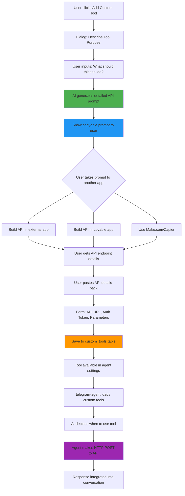

# Custom Tools Dream Flow Architecture

This diagram shows the complete flow for adding custom tools to the bot using AI-generated API specifications.



## Flow Breakdown

### Phase 1: Tool Definition (Steps A-D)
- User describes what they want the tool to do in natural language
- AI generates a comprehensive specification prompt
- Includes API design, request/response format, authentication

### Phase 2: External Implementation (Steps E-J)
- User takes the AI-generated prompt to any platform
- Options: Lovable app, external API, Make.com, Zapier, custom server
- User builds or configures the API endpoint

### Phase 3: Integration (Steps K-N)
- User returns with API details (URL, auth, parameters)
- Tool is saved to `custom_tools` table
- Becomes available in workflow builder

### Phase 4: Runtime Execution (Steps O-R)
- telegram-agent dynamically loads custom tools
- AI agent decides when to call the tool based on context
- HTTP POST request made with parameters
- Response integrated into conversation naturally

## Database Schema

```sql
custom_tools:
- id (uuid)
- community_id (uuid)
- name (text) - snake_case identifier
- display_name (text) - Human readable
- description (text) - What the tool does
- endpoint_url (text) - API endpoint
- http_method (text) - POST/GET/etc
- auth_type (text) - bearer/none/basic
- auth_value (text) - Token/key
- parameters (jsonb) - Parameter schema
- request_template (jsonb) - How to format requests
- is_enabled (boolean)
```

## Key Features

1. **AI-Powered Spec Generation**: Users don't need API knowledge
2. **Platform Agnostic**: Works with any HTTP endpoint
3. **Dynamic Loading**: Tools are loaded at runtime
4. **Smart Invocation**: AI agent decides when to use tools
5. **Error Handling**: Logs and tracks tool failures
