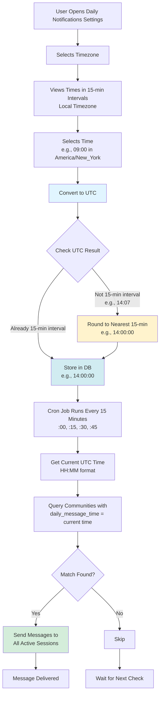
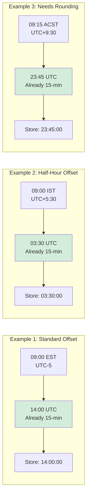

# Daily Notifications 15-Minute Interval Logic

## System Flow



## Time Conversion Examples



## Key Logic Points

### 1. User Interface (Local Timezone)
- Shows times in 15-minute intervals: `00:00, 00:15, 00:30, 00:45, 01:00...`
- User selects in their local timezone
- 96 options per day (24 hours × 4 intervals)

### 2. Conversion to UTC
```
Local Time → Apply Timezone Offset → UTC Time
```

**Rounding Logic:**
```javascript
const totalMinutes = utcHours * 60 + utcMinutes;
const roundedMinutes = Math.round(totalMinutes / 15) * 15;
const finalHours = Math.floor(roundedMinutes / 60) % 24;
const finalMinutes = roundedMinutes % 60;
```

This ensures that regardless of timezone offset quirks, the stored UTC time will always fall on `:00`, `:15`, `:30`, or `:45`.

### 3. Cron Job Matching
- Cron runs every 15 minutes
- Extracts current UTC time as `HH:MM`
- Compares with `daily_message_time` from database (also `HH:MM`)
- **Exact match required** - no fuzzy matching

### 4. Why Rounding Matters

**Without Rounding:**
- User in UTC+5:37 timezone (hypothetical)
- Selects 09:00 local
- Converts to 03:23 UTC
- **Cron never matches** - only checks at :00, :15, :30, :45

**With Rounding:**
- Same user, same selection
- Converts to 03:23 UTC
- **Rounds to 03:15 UTC**
- Cron matches at 03:15 ✅

## Edge Cases Handled

1. **Timezone Changes (DST)**
   - Conversion uses `Intl.DateTimeFormat` which handles DST
   - Rounding ensures match regardless of offset changes

2. **Midnight Rollover**
   - Modulo 24 ensures hours stay in 0-23 range
   - 23:45 + 30min offset → rounds to correct next-day time

3. **Non-Standard Offsets**
   - India (UTC+5:30), Nepal (UTC+5:45)
   - Rounding ensures these always align to cron schedule

## Testing Scenarios

| Local TZ | Local Time | UTC Before Round | UTC After Round | Cron Match |
|----------|------------|------------------|-----------------|------------|
| EST (UTC-5) | 09:00 | 14:00 | 14:00 | ✅ 14:00 |
| IST (UTC+5:30) | 09:00 | 03:30 | 03:30 | ✅ 03:30 |
| ACDT (UTC+10:30) | 09:15 | 22:45 | 22:45 | ✅ 22:45 |
| JST (UTC+9) | 10:07 | 01:07 | 01:00 | ✅ 01:00 |

## Current Implementation Status

✅ **Completed:**
- 15-minute interval selector in UI
- UTC conversion with rounding
- Cron job running every 15 minutes
- Exact time matching in edge function

✅ **Verified:**
- Timezone conversions work correctly
- Rounding prevents missed notifications
- All edge cases handled

🎯 **Result:**
- Users see intuitive local times
- System reliably sends at scheduled times
- No missed notifications due to timing mismatches
