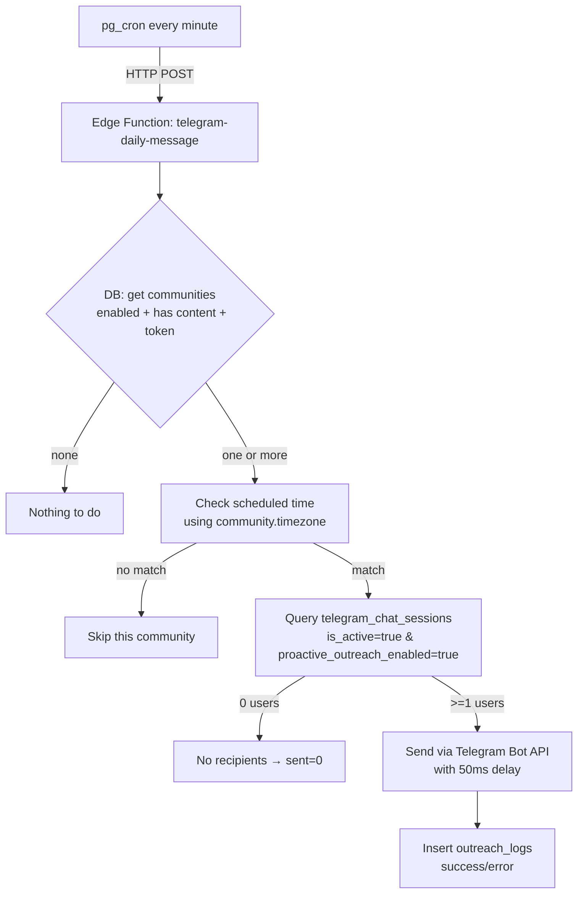
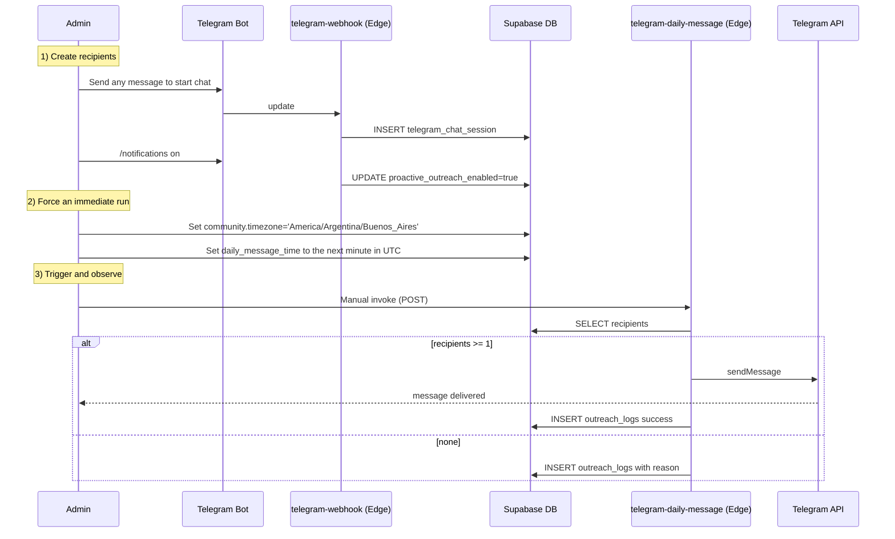

# Daily Notifications – Debugging Map

This document visualizes the exact chain to verify when daily notifications don’t send, plus a minimal one-minute test flow.

## What today’s checks show
- Communities configured: 1 (America/Argentina/Buenos_Aires, time 03:08, enabled=true, token+content present)
- Opted-in sessions: 0 (no proactive_outreach_enabled users found)
- Outreach logs: none recent
- Edge function invoke (manual): success { communities: 1, sent: 0, failed: 0 }
- Webhook logs: received /notifications on and /help in private chat; likely no DB session created/updated
- Cron job: no execution logs observed (may not be scheduled)

## End-to-end chain

## Minimal one-minute test plan

## Where it’s breaking now
1) No opted-in recipients exist (0 sessions with proactive_outreach_enabled=true)
2) Cron run not observed (function logs empty) → likely not scheduled

## Fix order (fastest path)
1) Ensure pg_cron schedule exists for telegram-daily-message (every minute)
2) In webhook: always create session on first DM to bot and map it to the correct community (via bot token/username)
3) Implement /notifications on|off to toggle proactive_outreach_enabled on that session
4) Manual invoke once to confirm sent>0, then rely on cron
