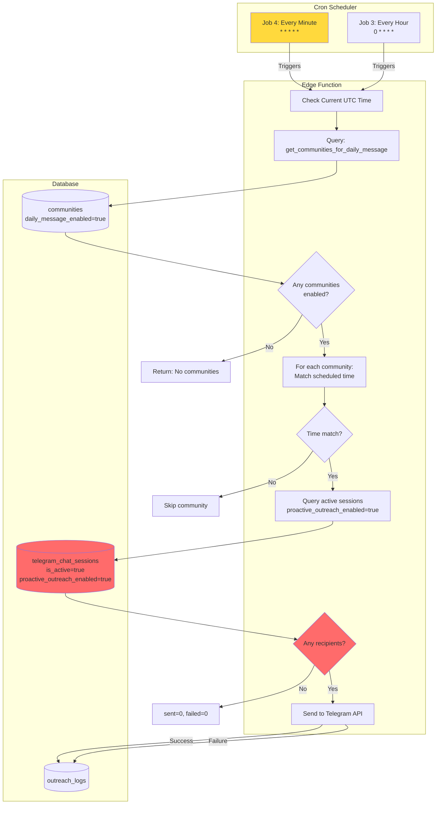
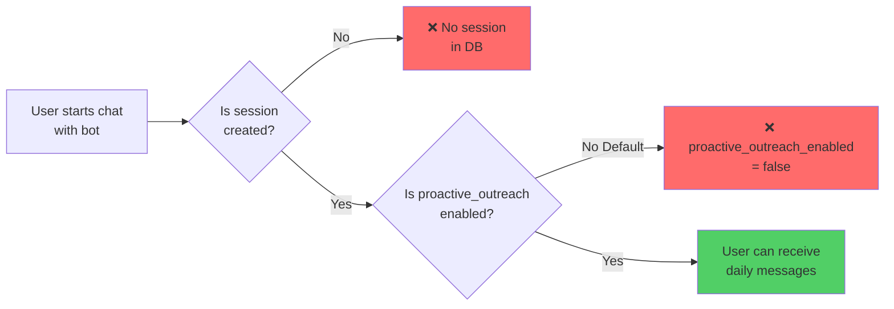
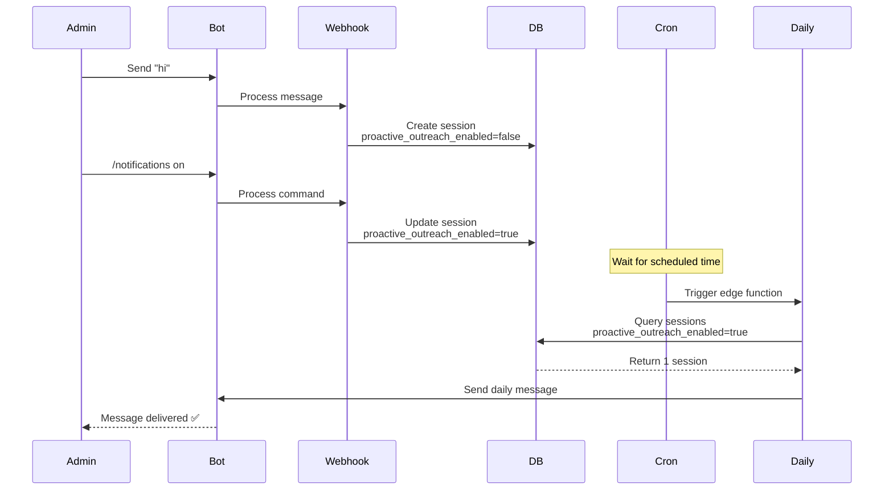

# Daily Notifications System - Complete Diagnosis

## 🔴 Critical Issues Found

### 1. **No Active Recipients (PRIMARY ISSUE)**
```
Query Result: 0 active telegram_chat_sessions with proactive_outreach_enabled=true
```
- Communities have daily messages enabled
- But NO users have opted in to receive them
- The edge function runs successfully but sends 0 messages

### 2. **Cron Job Running Every Minute (PERFORMANCE ISSUE)**
```sql
-- Job ID 4: Runs EVERY MINUTE (wasteful)
schedule: * * * * *

-- Job ID 3: Runs every hour at :00
schedule: 0 * * * *
```
**Problem**: Having two jobs (especially one every minute) wastes resources when you only need to check once per hour or even less frequently.

### 3. **Timezone Conversion Logic**
```
Communities configured:
- Vibe Check Bot: 03:08:00 UTC (timezone: America/Argentina/Buenos_Aires)
- TOMAS BOT: 03:00:00 UTC (timezone: America/Argentina/Buenos_Aires)
```
The edge function stores times in UTC but doesn't convert from user's timezone to UTC during setup.

---

## 📊 System Architecture



---

## 🔍 Current State

### Communities with Daily Messages Enabled
| Community | Time (UTC) | Timezone | Content | Enabled |
|-----------|-----------|----------|---------|---------|
| Vibe Check Bot | 03:08:00 | America/Argentina/Buenos_Aires | ✅ Set | ✅ True |
| TOMAS BOT | 03:00:00 | America/Argentina/Buenos_Aires | ✅ Set | ✅ True |

### Active Chat Sessions (Recipients)
```
Total active sessions: 0
Sessions with proactive_outreach_enabled=true: 0
```
**❌ This is why no messages are being sent!**

---

## 🔧 Root Cause Analysis



**Missing Implementation:**
1. Automatic session creation when users start a chat
2. `/notifications on` command implementation
3. Default opt-in mechanism or onboarding flow

---

## ✅ Recommended Fixes (Priority Order)

### Fix 1: Consolidate Cron Jobs
```sql
-- Delete the every-minute job (wasteful)
SELECT cron.unschedule(4);

-- Keep only the hourly job (or make it every 15 minutes)
SELECT cron.schedule(
  'telegram-daily-message-cron',
  '*/15 * * * *',  -- Every 15 minutes is sufficient
  $$
  SELECT net.http_post(
    url:='https://efdqqnubowgwsnwvlalp.supabase.co/functions/v1/telegram-daily-message',
    headers:='{"Content-Type": "application/json", "Authorization": "Bearer [KEY]"}'::jsonb
  );
  $$
);
```

### Fix 2: Implement Session Creation
Update `telegram-webhook` to automatically create sessions:
```typescript
// When user sends first message
const { data: session } = await supabase
  .from('telegram_chat_sessions')
  .upsert({
    telegram_chat_id: message.chat.id,
    community_id: community.id,
    is_active: true,
    proactive_outreach_enabled: false  // Default off
  });
```

### Fix 3: Implement /notifications Command
```typescript
if (message.text === '/notifications on') {
  await supabase
    .from('telegram_chat_sessions')
    .update({ proactive_outreach_enabled: true })
    .eq('telegram_chat_id', message.chat.id);
}
```

### Fix 4: Test Flow


---

## 🧪 Quick Test (Manual Trigger)

To test immediately without waiting for cron:
1. Message the bot to create a session
2. Run `/notifications on` 
3. Set community's `daily_message_time` to current UTC time + 1 minute
4. Manually invoke the edge function:
```bash
curl -X POST https://efdqqnubowgwsnwvlalp.supabase.co/functions/v1/telegram-daily-message \
  -H "Authorization: Bearer [ANON_KEY]"
```

Expected result: `{ sent: 1, failed: 0 }`
