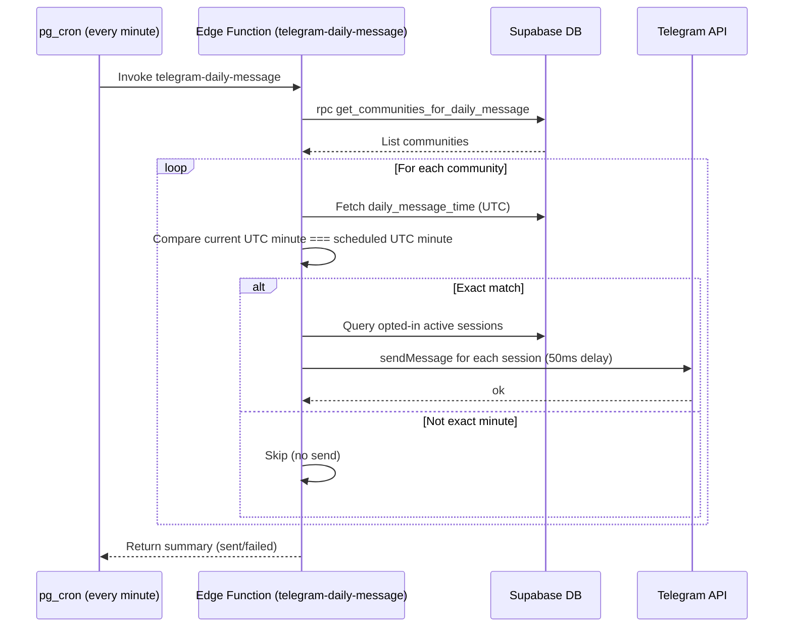

# Daily Notifications Exact-Match Fix

This document records the change to prevent duplicate daily messages caused by a ±7 minute time window.

## What changed
- Previous behavior: If current UTC time was within ±7 minutes of the scheduled UTC time, messages were sent. With cron running every minute, this could send up to 15 duplicates.
- New behavior: Messages send only when the current UTC minute EXACTLY matches the scheduled UTC minute.

## Rationale
- Eliminates duplicate sends across the 14-minute window.
- Still compatible with cron running every minute.
- Future improvement: add idempotency (per-community/per-user daily log) for extra safety.

## Sequence Diagram

## Next
- Optional: add per-day idempotency table (daily_message_logs) or a last_sent_at column and check within 24h.
- Optional: change cron to run every 15 minutes and store rounded times to HH:00/15/30/45.
