# Daily Notifications - Implementation Fix

## Changes Made

### 1. ✅ Consolidated Cron Jobs

**Before:**
```sql
Job #4: * * * * * (every minute) - telegram-daily-message-cron
Job #3: 0 * * * * (every hour) - send-daily-telegram-messages
```

**After:**
```sql
Job #3: 0 * * * * (every hour) - send-daily-telegram-messages
```

Deleted Job #4 which was running every minute and wasting resources.

---

### 2. ✅ Auto-Enrollment for Private Chats

**Implementation Location:** `telegram-webhook/index.ts` (lines ~800-845)

**Logic:**
```typescript
if (chatType === 'private') {
  // Check for existing session
  const existingSession = await supabase
    .from('telegram_chat_sessions')
    .select('id, proactive_outreach_enabled')
    .eq('telegram_chat_id', chatId)
    .eq('community_id', communityId)
    .maybeSingle();
  
  if (!existingSession) {
    // Create new session with notifications ENABLED by default
    await supabase
      .from('telegram_chat_sessions')
      .insert({
        telegram_chat_id: chatId,
        telegram_user_id: telegramUserId,
        community_id: communityId,
        proactive_outreach_enabled: true, // ✅ TRUE by default
        is_active: true
      });
  }
}
```

**Key Features:**
- ✅ Automatically creates session when user sends first private message
- ✅ Sets `proactive_outreach_enabled = true` by default
- ✅ Only applies to private chats (not groups/supergroups)
- ✅ Users can still opt-out with `/notifications off`

---

## New User Flow

```mermaid
sequenceDiagram
    participant User as User
    participant Bot as Telegram Bot
    participant Webhook as telegram-webhook
    participant DB as Database
    participant Cron as Cron Job (hourly)
    participant Daily as telegram-daily-message
    
    Note over User,DB: First-Time User Flow
    User->>Bot: Sends first message (private chat)
    Bot->>Webhook: Message received
    Webhook->>DB: Check for existing session
    DB-->>Webhook: No session found
    Webhook->>DB: CREATE telegram_chat_session<br/>proactive_outreach_enabled=true<br/>is_active=true
    Webhook-->>Bot: Response sent
    
    Note over User: User is NOW enrolled in daily notifications
    
    Note over Cron,Daily: Every hour at :00
    Cron->>Daily: Trigger edge function
    Daily->>DB: Query communities with daily_message_enabled=true
    Daily->>DB: Query sessions with proactive_outreach_enabled=true
    DB-->>Daily: Return User's session
    Daily->>Bot: Send daily message to User
    Bot-->>User: Daily notification received ✅
    
    Note over User: User can opt-out anytime
    User->>Bot: /notifications off
    Bot->>Webhook: Command received
    Webhook->>DB: UPDATE proactive_outreach_enabled=false
    Webhook-->>Bot: Confirmation sent
    Bot-->>User: "Daily notifications disabled"
```



---

## Testing Checklist

### ✅ Pre-Deployment Verification
- [x] Cron job deleted (Job #4)
- [x] Only one hourly cron job remains (Job #3)
- [x] Session creation logic added to telegram-webhook
- [x] Default value set to `proactive_outreach_enabled = true`

### 🧪 Test Plan

#### Test 1: New User Auto-Enrollment
1. **Setup:** Enable daily messages in community settings
2. **Action:** Send first message to bot from new private chat
3. **Expected:** 
   - New session created in `telegram_chat_sessions`
   - `proactive_outreach_enabled = true`
   - `is_active = true`
4. **Verify:**
   ```sql
   SELECT telegram_chat_id, proactive_outreach_enabled, is_active
   FROM telegram_chat_sessions
   WHERE telegram_user_id = [test_user_id]
   ```

#### Test 2: Opt-Out Flow
1. **Action:** Send `/notifications off` to bot
2. **Expected:** `proactive_outreach_enabled = false`
3. **Verify:**
   ```sql
   SELECT proactive_outreach_enabled
   FROM telegram_chat_sessions
   WHERE telegram_chat_id = [test_chat_id]
   ```

#### Test 3: Daily Message Delivery
1. **Setup:** 
   - Community has `daily_message_enabled = true`
   - Set `daily_message_time` to current time + 1 minute
   - Ensure at least one session with `proactive_outreach_enabled = true`
2. **Action:** Wait for cron to trigger (or manually invoke)
3. **Expected:** Daily message sent to all opted-in users
4. **Verify:** Check `outreach_logs` table for success entries

#### Test 4: Group Chats (No Auto-Enrollment)
1. **Action:** Send message in group chat
2. **Expected:** No session created (only private chats auto-enroll)
3. **Verify:** No new entries in `telegram_chat_sessions` for group chat

---

## Current State Summary

| Component | Status | Notes |
|-----------|--------|-------|
| Cron Job | ✅ Fixed | Running every hour (not every minute) |
| Session Creation | ✅ Fixed | Auto-created on first private chat message |
| Default Opt-In | ✅ Fixed | `proactive_outreach_enabled = true` by default |
| Opt-Out Command | ✅ Working | `/notifications off` command functional |
| Edge Function | ✅ Working | Sends messages to opted-in users |

---

## Expected Results

### Before Fix:
```
Communities with daily messages: 2
Active sessions with notifications enabled: 0
Messages sent: 0 ❌
```

### After Fix:
```
Communities with daily messages: 2
Active sessions with notifications enabled: [number of private chat users]
Messages sent: [matches number of opted-in users] ✅
```

---

## Rollback Plan (If Needed)

If issues arise, rollback by:

1. **Restore cron job:**
   ```sql
   SELECT cron.unschedule(3);  -- Remove hourly job
   -- Re-add original schedule if needed
   ```

2. **Revert session creation logic:**
   - Remove the session creation block from telegram-webhook
   - Set `proactive_outreach_enabled = false` by default

3. **Manual cleanup:**
   ```sql
   -- Optional: Reset all sessions to opt-out
   UPDATE telegram_chat_sessions
   SET proactive_outreach_enabled = false
   WHERE proactive_outreach_enabled = true;
   ```
