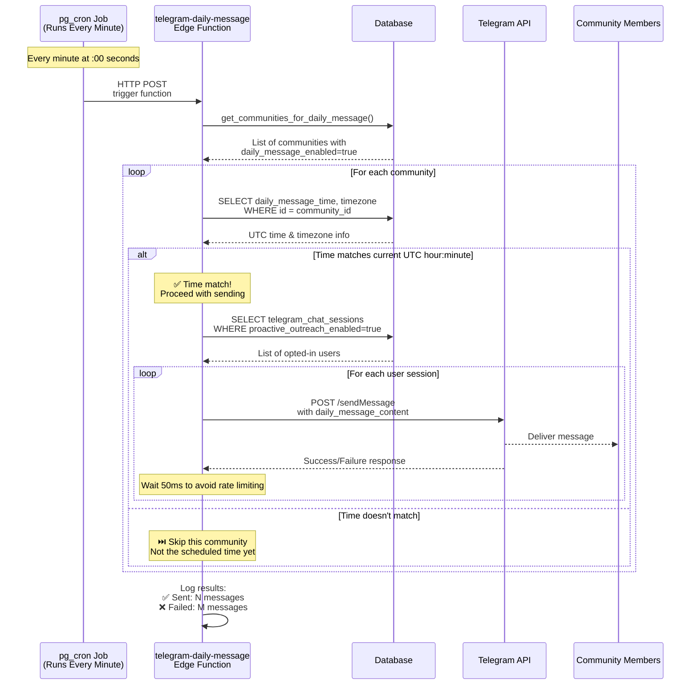
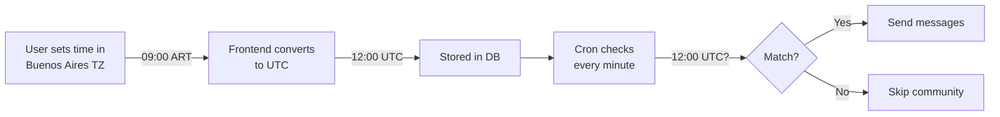
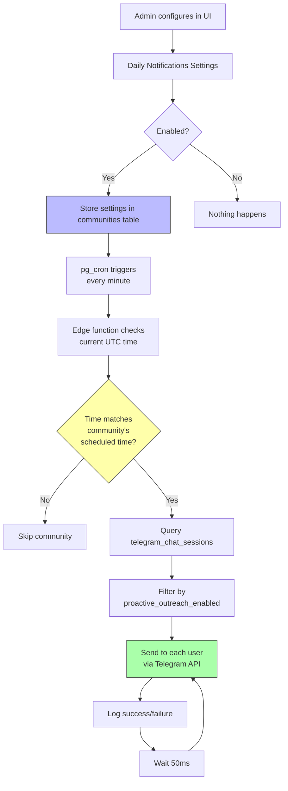

# Daily Notifications System

## System Overview

This diagram shows how the daily notification system works for Telegram communities.



## Key Components

### 1. Cron Job
- **Frequency**: Runs every minute (`* * * * *`)
- **Function**: Calls the telegram-daily-message edge function
- **Setup**: Uses pg_cron extension in Supabase
- **HTTP Call**: Makes POST request to edge function endpoint

### 2. Database Function
```sql
get_communities_for_daily_message()
```
Returns communities where:
- `daily_message_enabled = true`
- `daily_message_content IS NOT NULL`
- `telegram_bot_token IS NOT NULL`

### 3. Timezone Handling



**Example**:
- User in Buenos Aires sets: `09:00` (local time)
- System stores: `12:00` (UTC, because ART is UTC-3)
- Cron runs at: `12:00` UTC
- Messages sent at what users see as: `09:00` in Buenos Aires

### 4. User Opt-in System
Messages are ONLY sent to users where:
- `telegram_chat_sessions.is_active = true`
- `telegram_chat_sessions.proactive_outreach_enabled = true`

### 5. Rate Limiting
- 50ms delay between each message
- Prevents Telegram API rate limits
- Ensures reliable delivery

## Data Flow



## Configuration Steps

1. **Enable Daily Messages** (Admin UI)
   - Toggle `daily_message_enabled`
   - Set `daily_message_content` (the message text)
   - Choose `timezone` (default: Buenos Aires)
   - Set `daily_message_time` (displayed in local TZ, stored as UTC)

2. **User Opt-in** (Telegram Bot)
   - Users enable `proactive_outreach_enabled` via bot commands
   - Stored in `telegram_chat_sessions` table

3. **Automatic Execution**
   - Cron job runs every minute
   - Checks all communities for time matches
   - Sends messages to opted-in users

## Troubleshooting

### Messages not sending?
1. Check `daily_message_enabled = true` in communities table
2. Verify `telegram_bot_token` is set correctly
3. Check logs in edge function
4. Confirm users have `proactive_outreach_enabled = true`
5. Verify time conversion is correct (check UTC time in DB)

### Wrong time?
1. Verify timezone is set correctly (e.g., 'America/Argentina/Buenos_Aires')
2. Check stored UTC time in database matches expected
3. Use edge function logs to see what time it's checking

### Rate limiting?
- Messages are sent with 50ms delay between each
- If hitting limits, increase delay in edge function code
