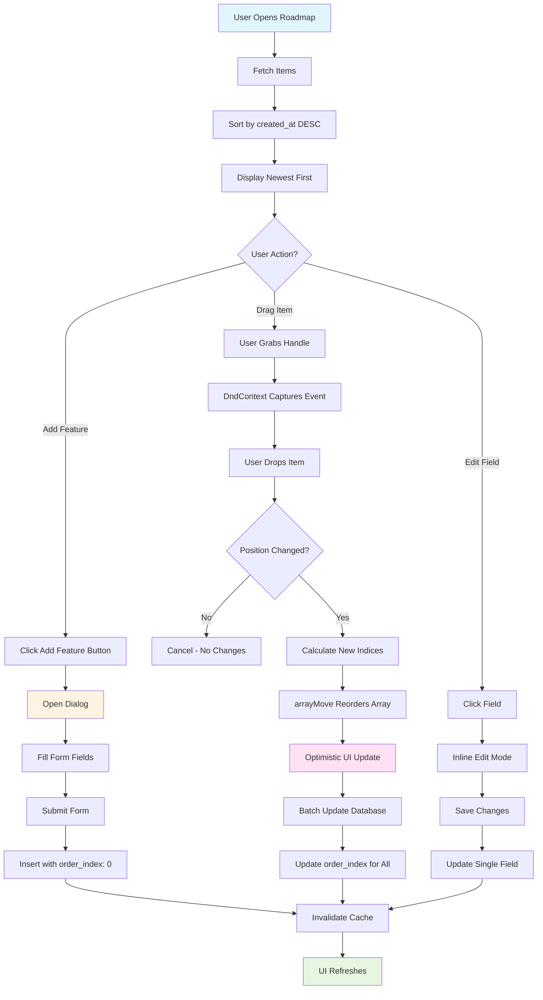
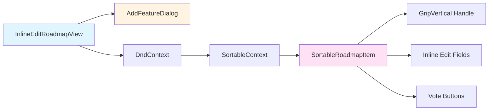
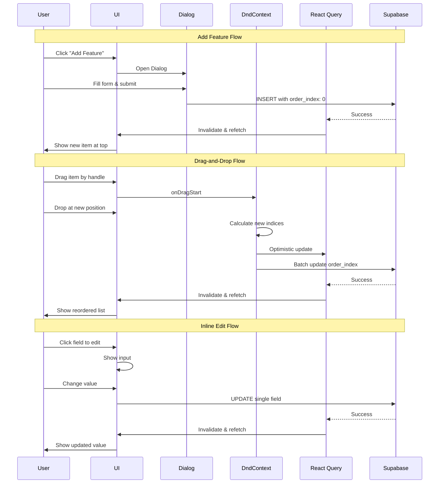

# Enhanced Roadmap Drag-and-Drop System

This diagram illustrates the complete enhanced roadmap system with newest-first sorting, drag-and-drop reordering, and Add Feature dialog.



## System Architecture

### Component Structure



## Data Flow Sequence



## Key Features

### 1. Newest-First Sorting
- **Primary Sort**: `created_at DESC` (newest items first)
- **Secondary Sort**: `order_index ASC` (respects manual reordering)
- New items always appear at top by default
- Manual drag-and-drop can override chronological order

### 2. Add Feature Dialog
- Professional dialog UI with form validation
- Required fields: Title, Description
- Optional fields: Status, Category, Priority, Timeline, Tags, Icon
- Auto-focus on title field
- Keyboard shortcuts: Enter to submit, Escape to cancel
- Insert with `order_index: 0` to appear at top

### 3. Drag-and-Drop Reordering
- **Library**: `@dnd-kit/core` + `@dnd-kit/sortable`
- **Visual Handle**: `GripVertical` icon (opacity 30% → 100% on hover)
- **Sensors**: PointerSensor + KeyboardSensor
- **Collision Detection**: `closestCenter`
- **Strategy**: `verticalListSortingStrategy`
- **Feedback**: 50% opacity while dragging, smooth transitions

### 4. Inline Editing
- Click any field to edit in-place
- Auto-save on blur
- Keyboard shortcuts: Enter to save, Escape to cancel
- Fields: Title, Description, Status, Category, Timeline

### 5. Voting System
- Upvote/Downvote buttons with counts
- Optimistic UI updates
- Hover states for better UX

## Database Schema

```sql
-- product_roadmap table
CREATE TABLE product_roadmap (
  id UUID PRIMARY KEY DEFAULT gen_random_uuid(),
  title TEXT NOT NULL,
  description TEXT NOT NULL,
  status TEXT NOT NULL DEFAULT 'planned',
  priority TEXT NOT NULL,
  category TEXT NOT NULL,
  estimated_timeline TEXT,
  icon TEXT,
  tags TEXT[],
  upvotes INTEGER DEFAULT 0,
  downvotes INTEGER DEFAULT 0,
  order_index INTEGER DEFAULT 0,
  created_at TIMESTAMPTZ DEFAULT NOW(),
  updated_at TIMESTAMPTZ DEFAULT NOW()
);

-- Index for efficient sorting
CREATE INDEX idx_roadmap_created_at ON product_roadmap(created_at DESC);
CREATE INDEX idx_roadmap_order ON product_roadmap(order_index ASC);
```

## Reorder Algorithm

```typescript
// 1. Find old and new positions
const oldIndex = items.findIndex(i => i.id === active.id);
const newIndex = items.findIndex(i => i.id === over.id);

// 2. Reorder array using arrayMove utility
const reordered = arrayMove(items, oldIndex, newIndex);

// 3. Optimistic UI update (instant feedback)
queryClient.setQueryData(['roadmap-items'], reordered);

// 4. Batch update all items with new order_index
const updates = reordered.map((item, index) =>
  supabase
    .from('product_roadmap')
    .update({ order_index: index })
    .eq('id', item.id)
);
await Promise.all(updates);

// 5. Invalidate cache to sync with database
queryClient.invalidateQueries(['roadmap-items']);
```

## Visual States

| State | Opacity | Cursor | Transform |
|-------|---------|--------|-----------|
| Normal | 100% | default | none |
| Hover Handle | 100% | grab | none |
| Dragging Item | 50% | grabbing | scale(1.02) |
| Drop Target | 100% | default | highlight border |

## UX Improvements

✅ **Newest items appear at top** - Natural chronological order  
✅ **Drag-and-drop reordering** - Visual, intuitive interface  
✅ **Add Feature dialog** - Professional form with validation  
✅ **Inline editing** - Click-to-edit all fields  
✅ **Optimistic updates** - Instant UI feedback  
✅ **Visual drag handles** - Clear affordance for dragging  
✅ **Smooth transitions** - Polish and professional feel  
✅ **Keyboard shortcuts** - Power user efficiency  
✅ **Empty states** - Helpful guidance when no items  

## Performance Optimizations

1. **Optimistic Updates**: UI responds instantly before database confirms
2. **Batch Operations**: Single Promise.all() for all order_index updates
3. **Efficient Queries**: Uses database indexes for fast sorting
4. **Debounced Saves**: Inline edits save on blur, not on every keystroke
5. **Query Invalidation**: Only refetches affected queries

## Accessibility

- **Keyboard Navigation**: Full keyboard support for drag-and-drop
- **ARIA Labels**: Proper labels for drag handles and buttons
- **Focus Management**: Auto-focus in dialogs and inputs
- **Screen Reader Support**: Semantic HTML and ARIA attributes
- **Color Contrast**: All text meets WCAG AA standards

## Future Enhancements

🔮 **Possible additions** (not implemented yet):
- Bulk actions (multi-select + batch operations)
- Roadmap views (timeline, kanban, calendar)
- Filtering by tags, category, priority
- Search functionality
- Export to CSV/JSON
- Public vs. private roadmaps
- Comments and discussions per item
- File attachments
- Activity log/audit trail
