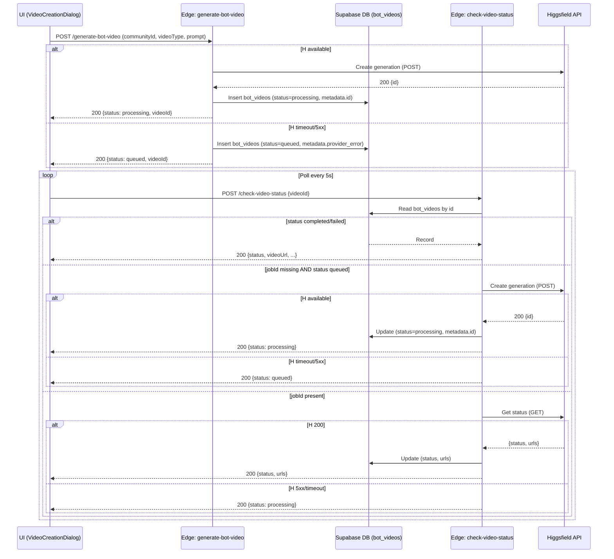

# Higgsfield Resilience and Fallback Flow

This diagram documents the graceful-degradation path added to avoid 500s when the provider (Higgsfield) is down. Jobs are queued and bootstrapped later by the status poller.

