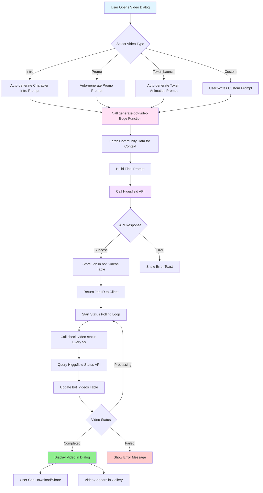

# Higgsfield AI Video Creation Implementation



## Flow Details

### Phase 1: Video Type Selection
- User opens VideoCreationDialog from bot dashboard
- Selects one of 4 video types:
  - **Character Intro**: Cinematic reveal of bot avatar
  - **Promotional**: Dynamic showcase of bot capabilities
  - **Token Launch**: Epic token animation for launches
  - **Custom**: User-defined prompt

### Phase 2: Prompt Generation
- For predefined types (intro/promo/token), auto-generate cinematic prompts using:
  - Bot name from community.agent_name or community.name
  - Bot description from community.agent_instructions
  - Predefined templates optimized for each video type
- For custom type, user writes their own prompt

### Phase 3: Edge Function Call
- Frontend calls `generate-bot-video` edge function with:
  - communityId
  - videoType
  - customPrompt (optional)
- Edge function:
  1. Fetches community data for context
  2. Builds/enhances final prompt
  3. Calls Higgsfield API with:
     - prompt
     - model: "higgsfield/realistic-vision-v5" (free)
     - duration: 5 seconds
     - resolution: "1080p"
  4. Stores job in bot_videos table with status "processing"
  5. Returns videoId and jobId to client

### Phase 4: Status Polling
- Frontend starts polling check-video-status every 5 seconds
- Edge function:
  1. Queries Higgsfield API for job status
  2. Updates bot_videos table with latest status
  3. Returns current status to client
- Continues until status is "completed" or "failed"
- Auto-stops after 5 minutes

### Phase 5: Video Display & Management
- On completion:
  - Video displayed in dialog with controls
  - User can download or create another
  - Video appears in BotVideoGallery
- Gallery features:
  - Grid view of all generated videos
  - Filter by type
  - Download/delete actions
  - Real-time status updates

## Database Schema

```sql
bot_videos (
  id uuid PRIMARY KEY,
  community_id uuid REFERENCES communities,
  video_type text, -- 'intro', 'promo', 'token_reveal', 'custom'
  prompt text,
  source_image_url text,
  model text,
  status text, -- 'pending', 'processing', 'completed', 'failed'
  video_url text,
  thumbnail_url text,
  duration integer,
  resolution text,
  generation_metadata jsonb,
  error_message text,
  created_by uuid REFERENCES users,
  created_at timestamptz,
  completed_at timestamptz
)
```

## UI Components

### VideoCreationDialog
- Modal dialog for initiating video generation
- Video type selector dropdown
- Optional custom prompt textarea
- Real-time status display with spinner
- Video preview on completion
- Download and "Create Another" actions

### BotVideoGallery
- Grid layout of generated videos
- Video thumbnail/preview with play button
- Status badges (processing/completed/failed)
- Download and delete actions
- "Create Video" button to open dialog

## Integration Points

1. **Bot Dashboard**: Add "Videos" tab with BotVideoGallery
2. **Token Launch Success**: Offer to create token reveal video
3. **Bot Onboarding**: Optional intro video creation step

## Future Enhancements

- Image-to-video mode with source image upload
- Multiple model selection (premium models)
- Batch generation (create multiple variations)
- Social sharing (Twitter/X, Telegram)
- Analytics (views, shares, downloads)
- Template library with pre-made prompts
