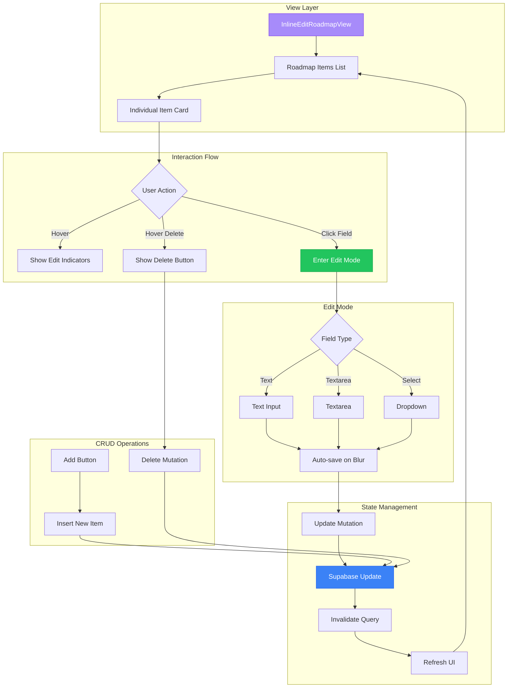
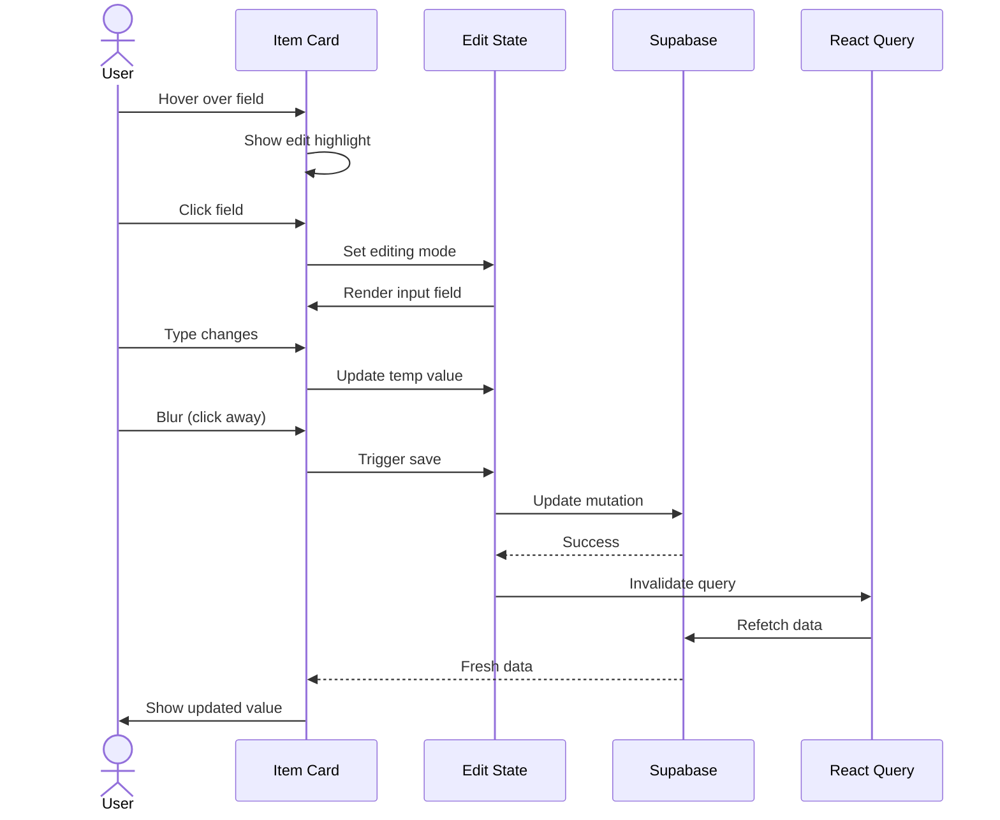
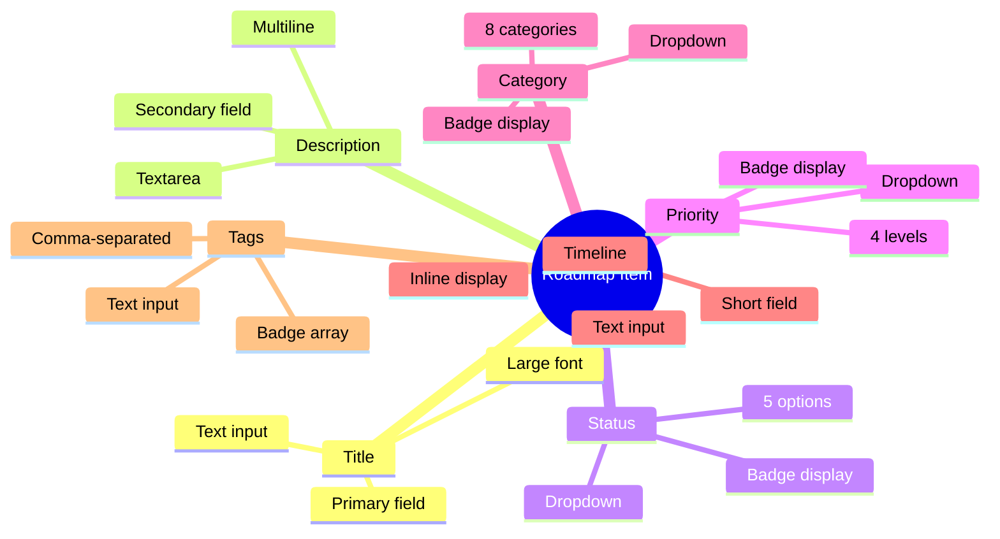
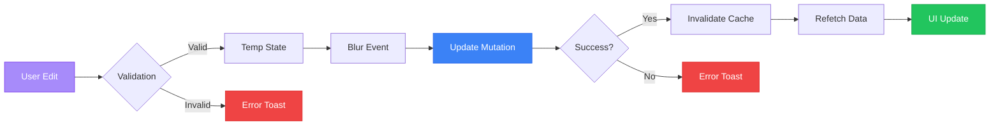

# Inline Roadmap Editing System

## Overview
The inline editing system provides a Notion-like experience for editing roadmap items directly without dialogs or complex workflows.

## System Architecture



## Interaction Patterns



## Editable Fields



## Data Flow



## Key Features

### 1. Hover Interactions
- **Field Highlighting**: Subtle background change on hover
- **Delete Button**: Appears on card hover (top-right)
- **Visual Feedback**: Cursor changes to indicate editability

### 2. Edit Modes
- **Text Fields**: Single-line input for title, timeline
- **Text Areas**: Multi-line for descriptions
- **Dropdowns**: Pre-defined options for status, priority, category
- **Tag Input**: Comma-separated values parsed to array

### 3. Save Behavior
- **Auto-save**: On blur (clicking away)
- **Keyboard Shortcuts**: 
  - `Enter` saves (for text inputs)
  - `Escape` cancels
- **No Manual Save Button**: Seamless UX

### 4. State Management
- **Optimistic Updates**: UI updates immediately
- **Cache Invalidation**: React Query refetches on change
- **Toast Notifications**: Success/error feedback

## View Modes Comparison

| Feature | Inline Edit | Grid View | List View |
|---------|------------|-----------|-----------|
| Default View | ✅ | ❌ | ❌ |
| Inline Editing | ✅ | ❌ | ✅ |
| Visual Cards | ✅ | ✅ | ❌ |
| Drag & Drop | ❌ | ❌ | ✅ |
| Compact Display | ✅ | ❌ | ✅ |
| Quick CRUD | ✅ | ❌ | ✅ |

## Technical Implementation

### State Structure
```typescript
editingField: { 
  id: string;      // Item ID being edited
  field: string;   // Field name being edited
} | null

tempValue: string  // Temporary value during editing
```

### Mutation Flow
1. User clicks field → Enter edit mode
2. User types → Update temp state
3. User blurs → Trigger mutation
4. Mutation → Update Supabase
5. Success → Invalidate cache
6. Cache → Refetch data
7. UI → Show fresh data

### Database Schema
- All updates use the `product_roadmap` table
- RLS policies require admin role for modifications
- Order preserved via `order_index` field
