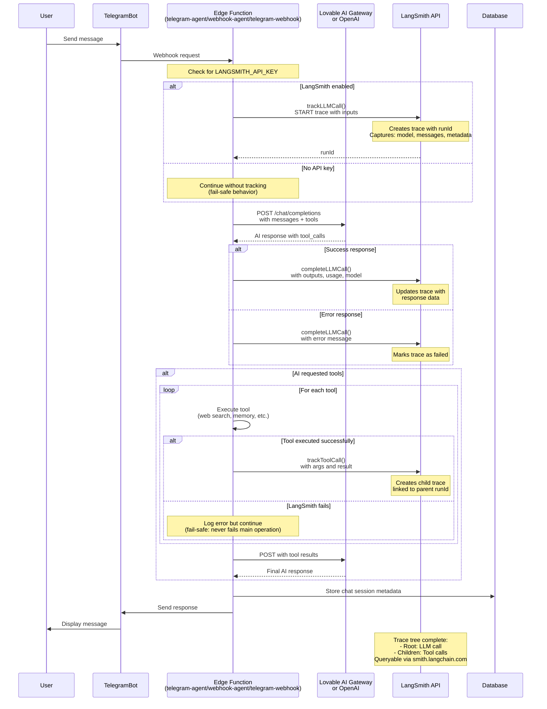

# LangSmith Tracking Integration Flow

This diagram shows how LangSmith observability is integrated across the three LLM-calling edge functions with fail-safe error handling.



## Key Components

### 1. Three Instrumented Functions
- **telegram-agent** (lines 686-703, 727-744, 852-862)
  - Agentic tool-calling bot
  - Tracks multiple iterations
  - Tags: `telegram-bot`, `lovable-ai`, `telegram-agent`

- **webhook-agent** (lines 533-549, 565-577, 613-626)  
  - External API webhook handler
  - Tracks community-specific calls
  - Tags: `telegram-bot`, `lovable-ai`, `webhook-agent`

- **telegram-webhook** (lines 1437-1453, 1465-1479, 1580-1592)
  - Standard OpenAI integration
  - Tracks both initial and tool-response calls
  - Tags: `telegram-bot`, `lovable-ai`, `telegram-webhook`

### 2. Fail-Safe Architecture

```typescript
// Example from langsmith.ts
export async function trackLLMCall(...) {
  if (!apiKey) return null;  // Silent skip if no key
  
  try {
    await fetch('https://api.smith.langchain.com/runs', ...);
    return runId;
  } catch (error) {
    console.error('LangSmith tracking error (non-fatal):', error);
    return null;  // Never throw - operation continues
  }
}
```

**Fail-Safe Guarantees:**
- ✅ No API key? → Silent skip, bot works normally
- ✅ LangSmith API down? → Log error, bot works normally  
- ✅ Network timeout? → Log error, bot works normally
- ✅ Invalid response? → Log error, bot works normally

### 3. Tracked Data

**LLM Call Traces:**
- Model used (gemini-2.5-flash, gpt-5, etc.)
- Input messages (conversation history)
- Output response (full message)
- Token usage and cost
- Community/user metadata
- Timestamps

**Tool Call Traces:**
- Tool name (web_search, search_memory, etc.)
- Input arguments
- Output results
- Parent trace linkage
- Execution time

### 4. Viewing Traces

Access at **https://smith.langchain.com/**

**Filter by project:**
- `telegram-agent` - Agent bot traces
- `webhook-agent` - Webhook API traces  
- `telegram-webhook` - Standard OpenAI traces

**What you'll see:**
- Full conversation context for debugging
- Which tools were called and why
- Response times (P50/P95/P99)
- Error patterns and rates
- Cost per user/community
- Model performance comparison

### 5. Example Trace Tree

```
telegram-agent-iteration-1 (LLM)
├── web_search (Tool)
│   └── Query: "latest news about AI"
│   └── Result: [search results...]
├── save_memory (Tool)  
│   └── Memory: "User interested in AI news"
└── Response: "Here's what I found..."
```

## Cost & Limits

**LangSmith Free Tier:**
- 5,000 traces/month
- Each LLM call = 1 trace
- Each tool call = 1 additional trace
- Likely sufficient unless >100 active users

## Testing

After deployment, test by:
1. Sending a message to your Telegram bot
2. Visit https://smith.langchain.com/
3. Navigate to project ("telegram-agent", etc.)
4. See full trace with:
   - Complete prompt sent to AI
   - Tool calls made
   - Response received
   - Token usage and timing

## Security Notes

- `LANGSMITH_API_KEY` stored in Supabase secrets
- Only accessible in edge functions (not client-side)
- Trace data includes message content (be aware for privacy)
- Can exclude sensitive data by modifying tracking inputs
