# Magic Link Authentication Flow

This diagram shows how users go from Telegram bot to authenticated web users with one click.

```mermaid
sequenceDiagram
    participant U as User
    participant TB as Telegram Bot
    participant WH as Webhook
    participant ML as generate-magic-link
    participant DB as Database
    participant Web as Web App (bot-builder.app)
    participant Val as validate-magic-link
    participant Auth as Supabase Auth
    
    Note over U,Auth: User Discovery & Initial Contact
    U->>TB: Sends /start in DM
    TB->>WH: Webhook triggered
    WH->>DB: Find or create user profile
    Note over DB: Creates user with:<br/>telegram_user_id<br/>is_claimed = false<br/>auth_user_id = null
    
    Note over U,Auth: First Message: Welcome
    WH->>TB: Send intro message
    TB->>U: "Hi! I'm your bot..."
    
    Note over U,Auth: Second Message: Magic Link
    WH->>ML: Request magic link
    ML->>DB: Generate unique token
    Note over DB: Stores in magic_link_tokens:<br/>token, user_id, expires_at
    ML-->>WH: Returns magic_link URL
    WH->>TB: Send magic link message
    TB->>U: "🔗 Click to unlock web features"
    
    Note over U,Auth: User Claims Profile
    U->>Web: Clicks magic link
    Web->>Val: Validate token
    Val->>DB: Check token validity
    
    alt Token Valid & Not Expired
        Val->>Auth: Create Supabase auth user
        Auth-->>Val: Returns auth_user_id
        Val->>DB: Update user:<br/>is_claimed = true<br/>auth_user_id = [id]
        Val->>DB: Mark token as used
        Val->>Auth: Generate session link
        Val-->>Web: Return session URL
        Web->>U: Redirect to session URL
        Note over U: Auto-logged in! 🎉
        U->>Web: Redirects to dashboard
    else Token Invalid/Expired
        Val-->>Web: Error response
        Web->>U: Show error page
    end
    
    Note over U,Auth: User State After Claiming
    Note over DB: User record now has:<br/>telegram_user_id (linked to Telegram)<br/>is_claimed = true<br/>auth_user_id (linked to Supabase Auth)<br/>Can use BOTH bot & web!
```

## Key Benefits

✅ **No passwords needed** - Users never type credentials
✅ **One-click authentication** - Just click the link
✅ **Telegram-first** - Bot works immediately, web is optional
✅ **Synced profiles** - Same data everywhere
✅ **Secure** - Tokens expire in 24hrs, one-time use

## User States

## Implementation Details

### Database Tables

**users**
- `telegram_user_id` - Links to Telegram
- `auth_user_id` - Links to Supabase Auth
- `is_claimed` - Tracks verification status

**magic_link_tokens**
- `token` - UUID for the link
- `user_id` - Which user it's for
- `community_id` - Which community
- `expires_at` - 24 hour expiry
- `used` - One-time use flag

### Edge Functions

1. **generate-magic-link** - Creates tokens
2. **validate-magic-link** - Verifies and authenticates
3. **telegram-webhook** - Handles /start command

### Web Route

- `/claim?token=abc123` - Auto-authentication page
