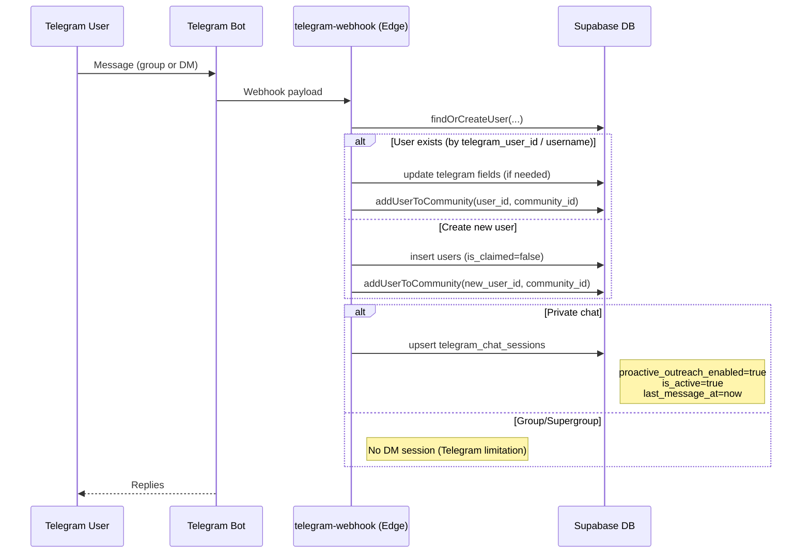
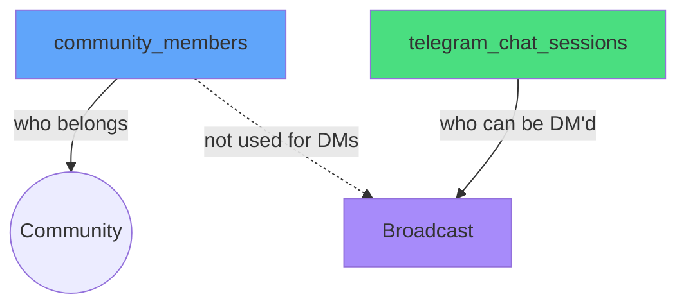

# Member Provisioning & DM Eligibility Flow

Key points:
- Existing users are now always added to the community on first contact
- DM eligibility requires a private chat session in `telegram_chat_sessions`
- Group-only interactions cannot be DM'd by the bot due to Telegram rules
