# User Notification Enablement Flow

This diagram shows how users can enable/disable daily notifications from the Telegram bot.

```mermaid
sequenceDiagram
    participant User as Telegram User
    participant Bot as Telegram Bot
    participant Webhook as telegram-webhook<br/>Edge Function
    participant DB as Database
    participant Cron as Daily Message<br/>Cron Job

    Note over User,Cron: First Time Setup
    User->>Bot: Sends first message
    Bot->>Webhook: Message event
    Webhook->>DB: CREATE telegram_chat_session<br/>proactive_outreach_enabled=false
    DB-->>Webhook: Session created
    Webhook->>Bot: AI response
    Bot-->>User: Welcome message

    Note over User,Cron: User Enables Notifications
    User->>Bot: /notifications on
    Bot->>Webhook: Command event
    Webhook->>DB: UPDATE telegram_chat_session<br/>SET proactive_outreach_enabled=true
    DB-->>Webhook: Updated
    Webhook->>Bot: Confirmation message
    Bot-->>User: 🔔 Daily notifications enabled!

    Note over User,Cron: Daily Message Delivery
    loop Every Minute
        Cron->>Webhook: Check for scheduled messages
        Webhook->>DB: SELECT communities WHERE<br/>daily_message_time matches current UTC time
        DB-->>Webhook: Communities to notify
        Webhook->>DB: SELECT sessions WHERE<br/>proactive_outreach_enabled=true
        DB-->>Webhook: List of opted-in users
        Webhook->>Bot: Send daily message
        Bot-->>User: 📨 Daily community message
    end

    Note over User,Cron: User Disables Notifications
    User->>Bot: /notifications off
    Bot->>Webhook: Command event
    Webhook->>DB: UPDATE telegram_chat_session<br/>SET proactive_outreach_enabled=false
    DB-->>Webhook: Updated
    Webhook->>Bot: Confirmation message
    Bot-->>User: 🔕 Daily notifications disabled
```



## Available Bot Commands

### User Commands
- `/start` - Initialize the bot and see welcome message
- `/help` - Display available commands
- `/status` - Check current notification settings
- `/notifications on` - Enable daily notifications
- `/notifications off` - Disable daily notifications

### Admin Dashboard
Admins can also manage notification settings for all users through the **Telegram Users** tab:
- View all users and their notification status
- Toggle notifications for individual users
- Bulk enable/disable for all active users

## How It Works

1. **First Interaction**: When a user first messages the bot, a `telegram_chat_session` record is created with `proactive_outreach_enabled=false` by default

2. **Opt-In**: Users must explicitly enable notifications using `/notifications on` command

3. **Daily Delivery**: The cron job runs every minute, checking if it's time to send messages based on the community's timezone and configured time

4. **User Control**: Users can check their status with `/status` and toggle at any time with `/notifications on|off`

## Database Fields

### telegram_chat_sessions table
- `proactive_outreach_enabled`: boolean - Whether user receives daily messages
- `is_active`: boolean - Whether the session is still active
- `telegram_chat_id`: bigint - Telegram chat identifier
- `community_id`: uuid - Associated community
- `last_message_at`: timestamp - Last interaction time

## Flow States


## Example User Flow

**Step 1: Start the bot**
```
User: /start
Bot: 👋 Welcome! I'm your community assistant.
     Type /help to see available commands.
```

**Step 2: Check status**
```
User: /status
Bot: 📊 Your Status:
     Daily Notifications: ❌ Disabled
     Use /notifications on or /notifications off to change.
```

**Step 3: Enable notifications**
```
User: /notifications on
Bot: 🔔 Daily notifications enabled!
     You will receive daily messages from the community.
```

**Step 4: Receive daily messages**
```
[Next day at scheduled time]
Bot: GOOOD morning!
     Time for your vibe check mf https://vibe-check-with-a.lovable.app/
```

**Step 5: Disable if desired**
```
User: /notifications off
Bot: 🔕 Daily notifications disabled!
     You will no longer receive daily messages.
```
