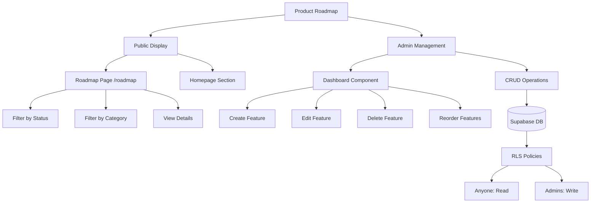
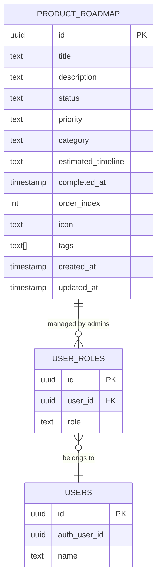
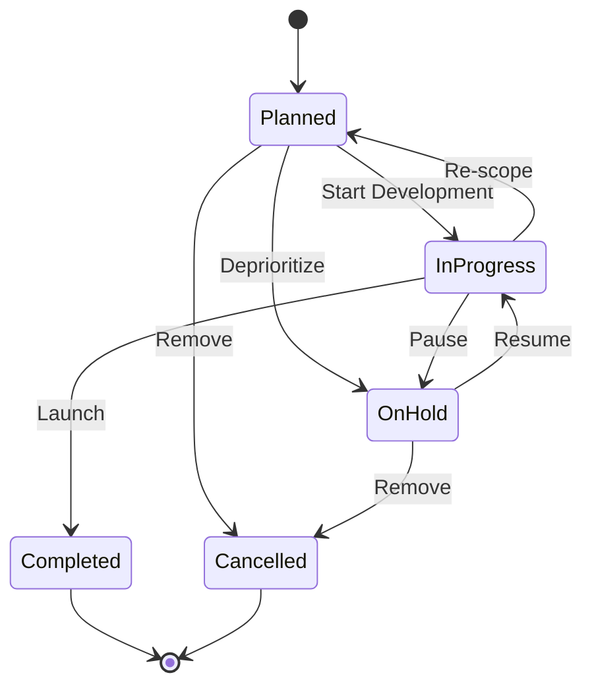
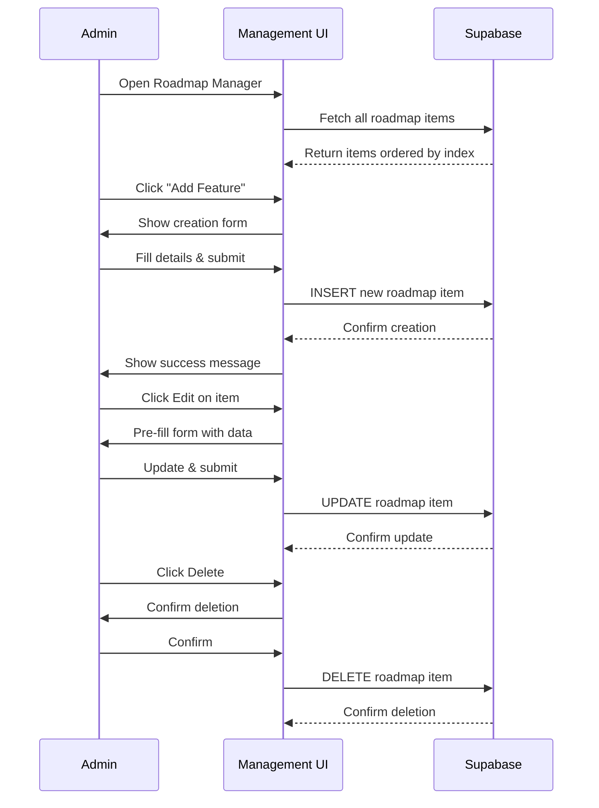
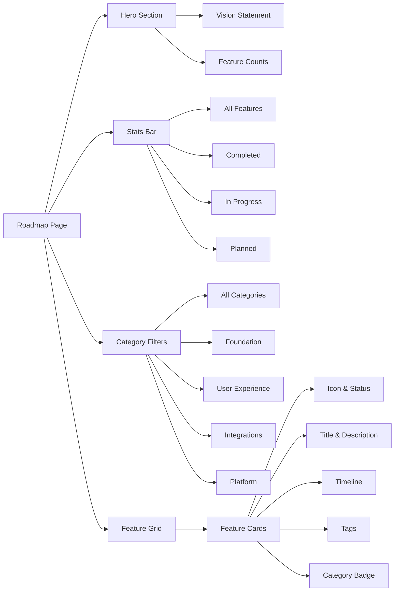
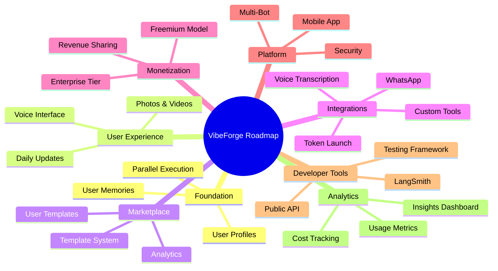
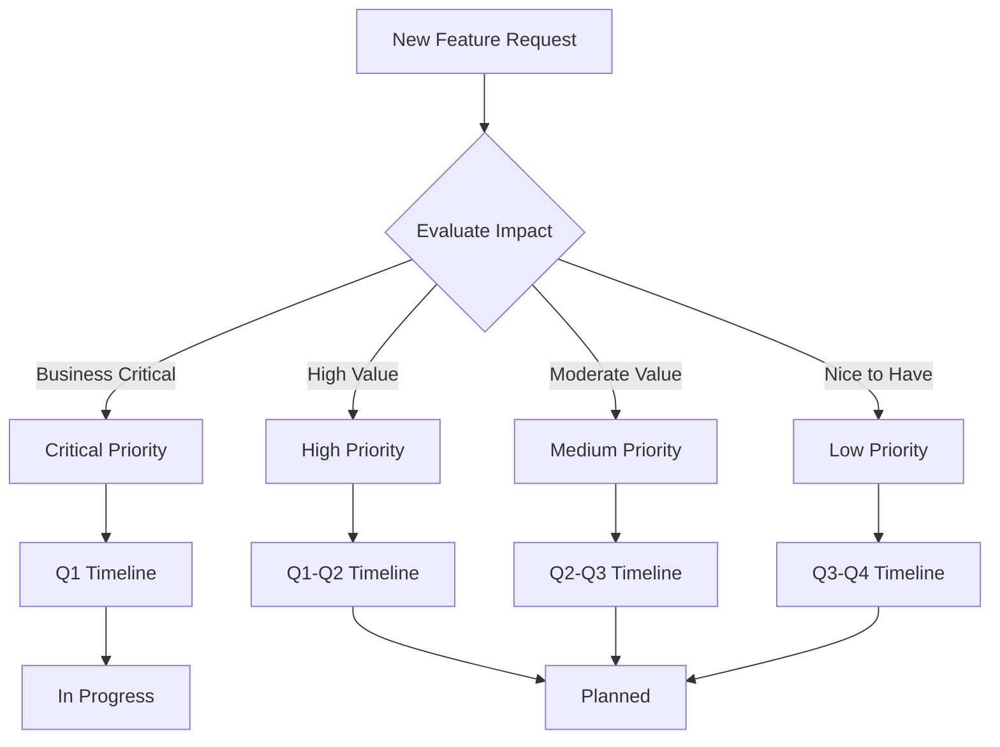

# Product Roadmap System

## System Architecture

## Data Model

## Feature Status Flow

## Admin Management Flow

## Public Display Components

## Feature Categories

## Priority System

## Display Features

### Status Indicators
- **Completed**: Green with checkmark - fully launched
- **In Progress**: Blue with clock - actively being built
- **Planned**: Purple with sparkles - designed and prioritized
- **On Hold**: Yellow with pause - temporarily paused
- **Cancelled**: Red with X - removed from roadmap

### Priority Levels
- **Critical**: Core platform functionality, urgent
- **High**: Important features, near-term value
- **Medium**: Valuable improvements, medium-term
- **Low**: Enhancements, long-term nice-to-haves

### Category Groupings
- **Foundation**: Core user system and data model
- **User Experience**: Interface and interaction improvements
- **Integrations**: Third-party connections and APIs
- **Monetization**: Revenue and business model features
- **Developer Tools**: SDK, debugging, and dev experience
- **Platform**: Infrastructure and scalability
- **Analytics**: Metrics, insights, and reporting
- **Marketplace**: Template system and creator economy

## Pre-Populated Features

### Phase 1 (Q1 2025)
1. Template Marketplace ✅
2. Improved User Profiles (In Progress)
3. User Memories System
4. Photos & Videos for Memories
5. Parallel Message Execution
6. Smart Daily Updates

### Phase 2 (Q2 2025)
7. Voice Transcription
8. Automated Discussion Summaries
9. Enhanced Custom Tools
10. LangSmith Integration
11. Analytics Dashboard
12. Monetization System

### Phase 3 (Q3 2025)
13. WhatsApp Support
14. Token Launch Integration
15. DevConnect QR Bot
16. Multi-Bot Management
17. Cross-App Actions
18. External Data Sync

### Phase 4 (Q4 2025)
19. Mobile Admin App
20. Public Developer API
21. Enterprise Security
22. A/B Testing Framework
23. 3D Avatar Generation

## Key Design Elements

### Visual Hierarchy
- Large, bold headings with gradient effects
- Clear status indicators with icons and colors
- Grid layout for easy scanning
- Sticky filter bar for navigation

### Interaction Patterns
- Click filters to narrow results
- Hover cards for details
- Admin buttons for management
- Smooth transitions and animations

### Responsive Design
- Mobile-first grid system
- Collapsible filters on mobile
- Touch-friendly tap targets
- Optimized for all screen sizes

## Security & Access Control

### Public Access
- Anyone can view roadmap
- Read-only for non-admins
- No authentication required
- Transparent progress sharing

### Admin Access
- Create new features
- Edit existing items
- Delete features
- Reorder priorities
- Update status and timelines
