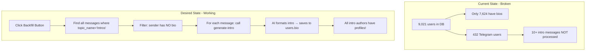
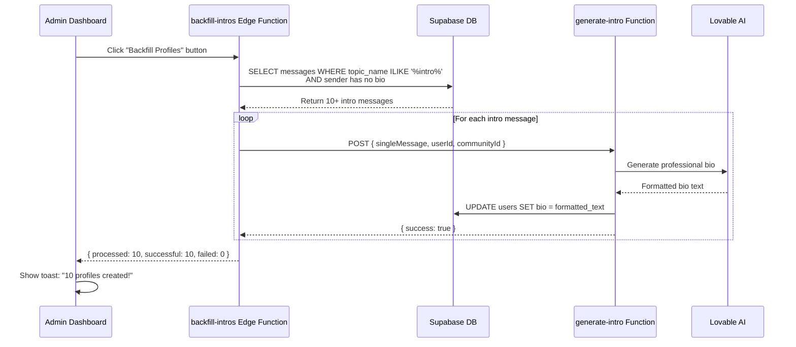
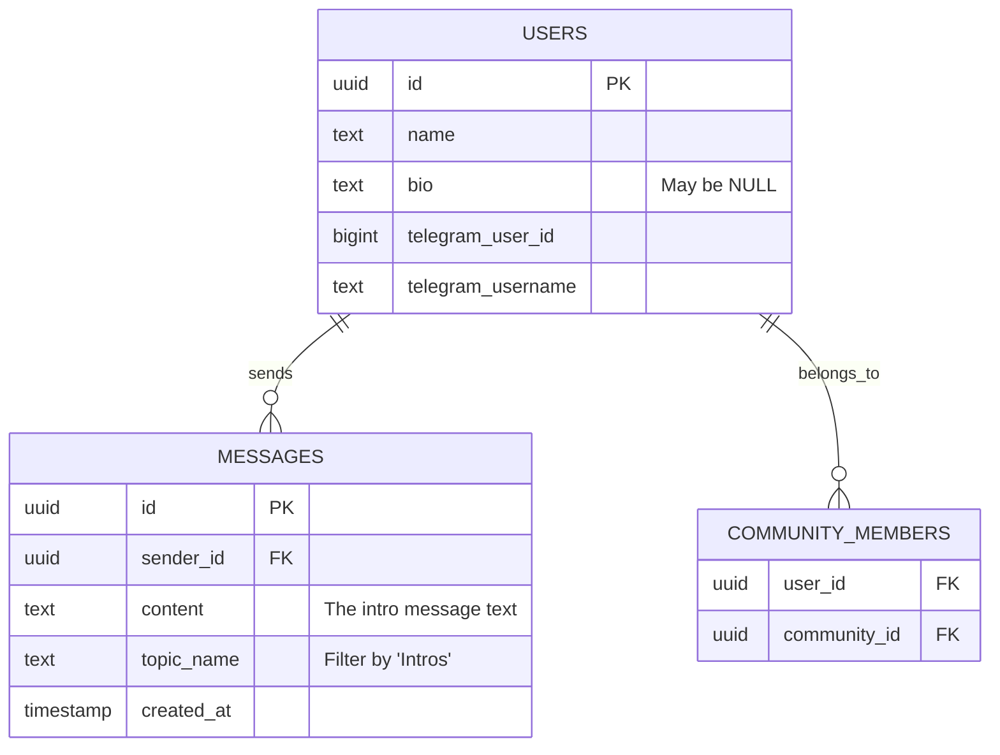

# Profile Backfill System

This diagram shows how we'll backfill user profiles from existing intro messages in Telegram.

## Current State vs Desired State

## Backfill Process Flow

## Database Relationships

## Key Implementation Details

1. **Edge Function**: `supabase/functions/backfill-intros/index.ts`
   - Queries all intro messages from users without bios
   - Calls `generate-intro` for each one
   - Returns stats: processed, successful, failed

2. **UI Button**: Add to `UnifiedAgentSetup.tsx`
   - Only visible to admins
   - Shows loading state during processing
   - Displays success/error toast

3. **Safety Measures**:
   - Only processes messages > 50 characters
   - Skips users who already have bios
   - Rate limits: 50ms delay between calls
   - Logs all successes/failures

4. **Reusable**: 
   - Can be run multiple times safely
   - Only processes NEW intro messages
   - Won't overwrite existing bios
