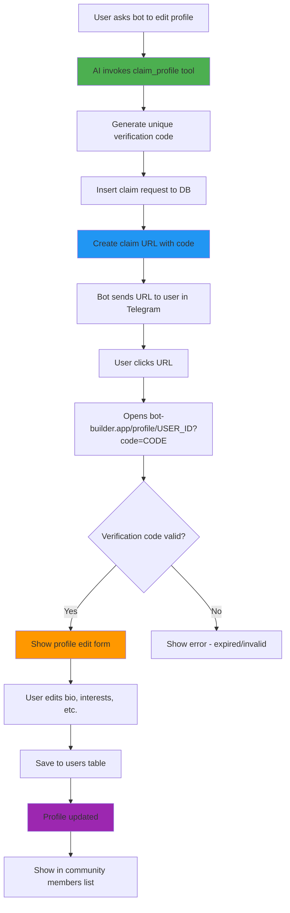

# Profile Claim Tool Flow

This diagram shows how the claim_profile tool works to allow Telegram users to claim and edit their profiles on bot-builder.app.



## Flow Breakdown

### Phase 1: Tool Invocation (Steps A-E)
- User asks to edit their profile via Telegram bot
- AI agent recognizes intent and calls claim_profile tool
- Tool generates a unique verification code (UUID)
- Stores claim request in database with 24-hour expiration
- Constructs claim URL: `https://bot-builder.app/profile/{userId}?code={code}`

### Phase 2: User Action (Steps F-H)
- Bot sends clickable URL to user in Telegram
- User clicks the URL, opens in browser
- Redirects to bot-builder.app profile page with verification parameters

### Phase 3: Verification & Editing (Steps I-N)
- Frontend checks verification code against database
- If valid and not expired, shows profile edit form
- User updates bio, interests, headline, social links
- Changes saved to users table
- Profile is now claimed and updated

### Phase 4: Visibility (Step O)
- Updated profile appears in community members list
- Bio is now visible to admins and other community members
- Profile shows as "claimed" with full information

## Database Schema

```sql
profile_claim_requests:
- id (uuid)
- user_id (uuid) - References users table
- verification_code (uuid) - Unique verification code
- expires_at (timestamp) - 24 hours from creation
- created_at (timestamp)

users:
- id (uuid)
- name (text)
- bio (text) - Editable via claim flow
- interests_skills (text[])
- headline (text)
- username (text)
- is_claimed (boolean) - Set to true after claiming
- auth_user_id (uuid) - Links to authenticated account
```

## Key Features

1. **Automatic Tool**: AI decides when to offer profile claiming based on user intent
2. **Secure Verification**: UUID-based verification codes prevent unauthorized access
3. **Time-Limited**: 24-hour expiration for security
4. **Seamless Flow**: Direct link from Telegram to web profile editor
5. **No Manual Steps**: Fully automated - no admin intervention needed

## Example Usage

**User in Telegram:**
```
User: "I want to update my bio"
Bot: "🔗 Click here to claim and edit your profile:
https://bot-builder.app/profile/abc123?code=def456

This link expires in 24 hours."
```

**After Clicking:**
- Opens profile edit page
- Pre-filled with existing data
- User edits and saves
- Profile updated instantly
