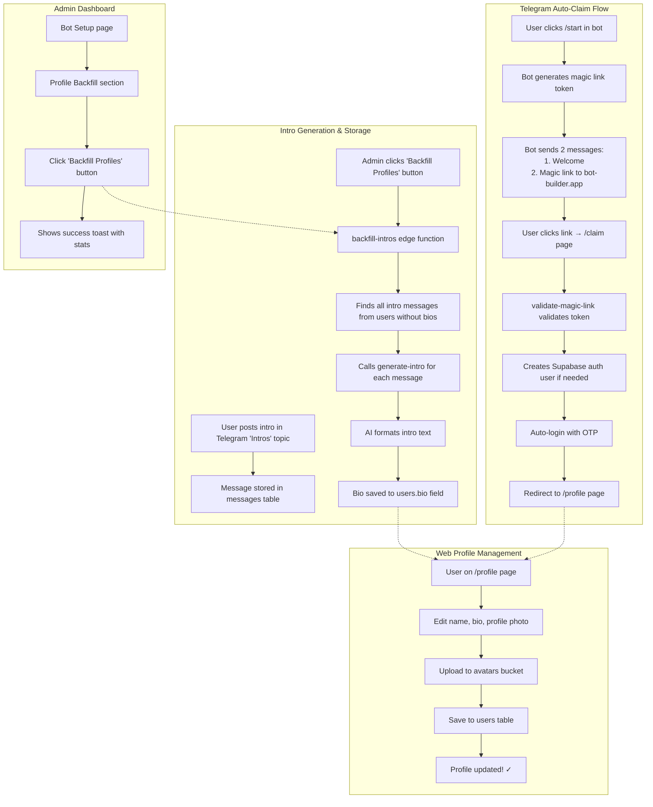
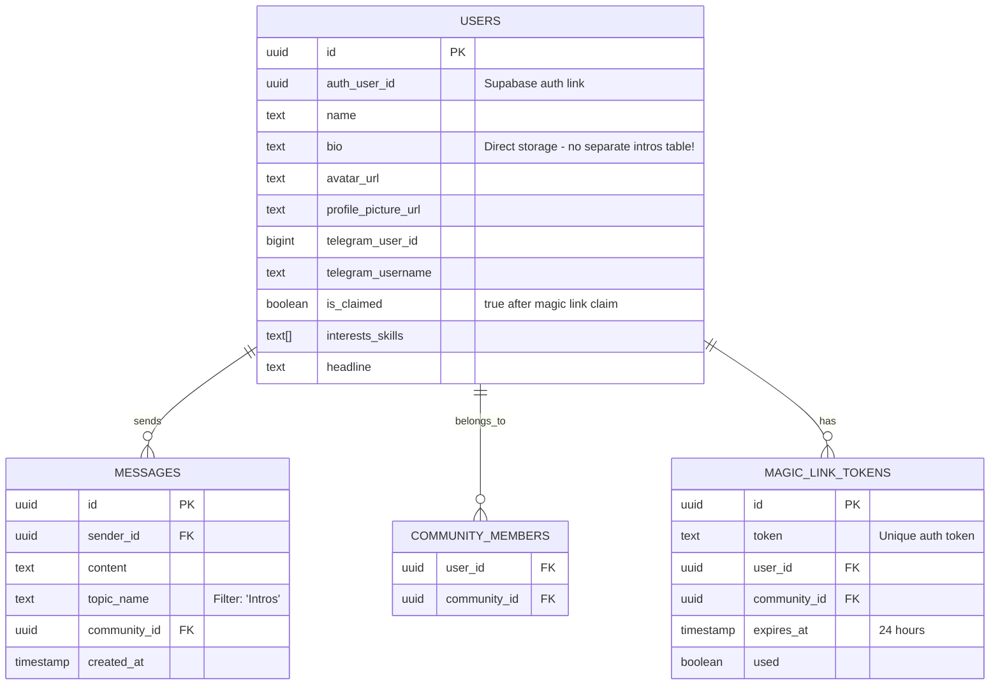

# Profile & Intro System - Complete Implementation

This diagram shows the complete profile and intro generation system with magic link authentication and backfill capabilities.

## Current Implementation

## Database Schema

## Key Features

- **Magic Link Auth**: Users click `/start` → get magic link → instantly authenticated on web app
- **Profile Page**: Clean, simple interface to edit name, bio, and profile photo
- **Direct Bio Storage**: Intros go straight into `users.bio` (no separate intro messages table)
- **Backfill Tool**: Admin button to import all existing intro messages from Telegram into profiles
- **Batch Processing**: Backfill processes all intros with 50ms delay between calls
- **Cross-Platform**: Same profile data accessible in Telegram bot and web app
- **Avatar Storage**: Profile photos stored in Supabase `avatars` bucket
