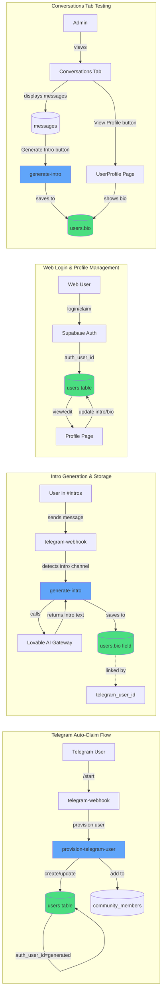
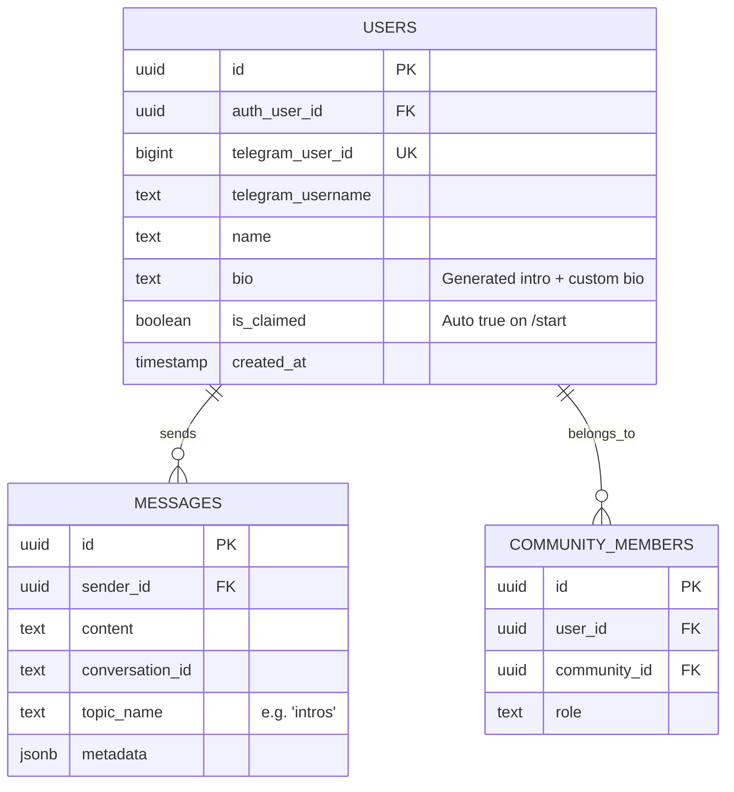

# Profile & Intro System Architecture

## Current Implementation (New Profile-Centric System)

## Database Schema Changes

## Key Features

1. **Auto-Claiming**: `/start` command automatically creates claimed profile with generated auth credentials
2. **Intro Storage**: Intros stored directly on `users.bio` field (not in memories table)
3. **Testing UI**: Conversations tab has "Generate Intro" button + "View Profile" link
4. **Cross-Platform**: Same profile works across Telegram, web apps, and external integrations
