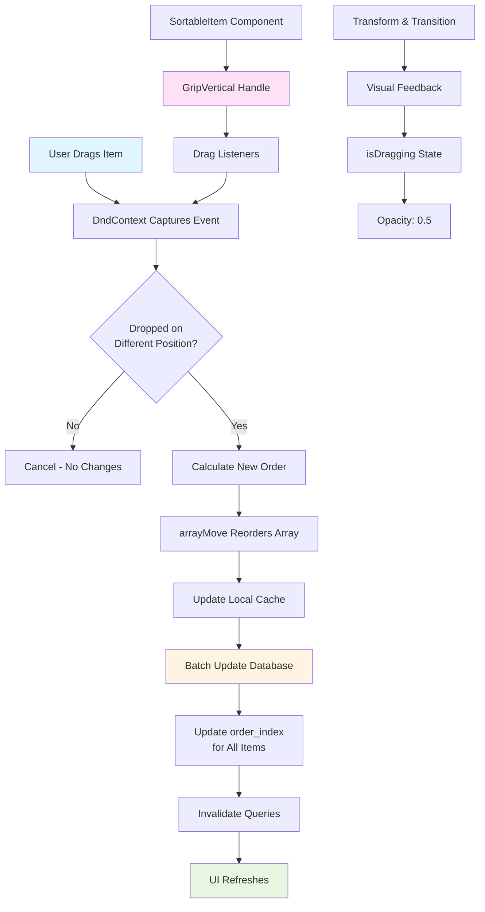
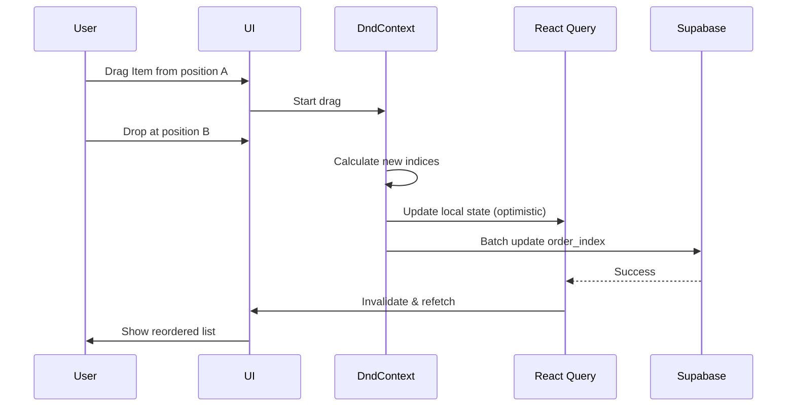

# Roadmap Drag-and-Drop System

This diagram illustrates the drag-and-drop reordering system for roadmap items.



## Key Components

### DndContext
- Manages drag and drop state
- Uses `PointerSensor` and `KeyboardSensor`
- Collision detection: `closestCenter`
- Triggers `onDragEnd` event

### SortableContext
- Wraps sortable items
- Uses `verticalListSortingStrategy`
- Maintains item order

### SortableItem
- Individual draggable component
- Has `GripVertical` handle for dragging
- Shows visual feedback during drag
- Transforms position smoothly

## Data Flow



## Reorder Logic

1. **Find Positions**: Locate old and new index
2. **Array Move**: Use `arrayMove` utility from dnd-kit
3. **Optimistic Update**: Immediately update cache
4. **Batch DB Update**: Update all affected items' `order_index`
5. **Refresh**: Invalidate queries to sync state

## Visual States

- **Normal**: Full opacity, cursor-grab
- **Dragging**: 50% opacity, cursor-grabbing
- **Hover**: Accent background on handle
- **Transition**: Smooth CSS transform

## Database Schema

```sql
order_index: integer
-- Sequential index starting from 0
-- Determines display order
-- Updated in batch after reordering
```
