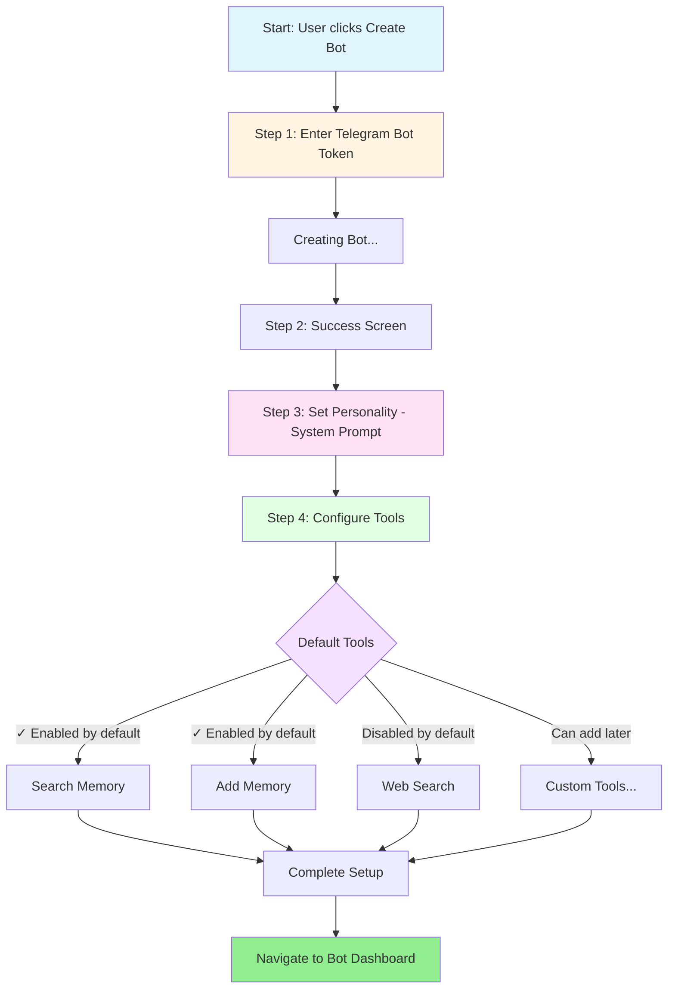

# Simplified Bot Onboarding Flow v2

## Changes from v1

### Removed
- ❌ Tokenization step (Step 5) - can be done later from settings
- ❌ Token launch dialog from onboarding flow

### Kept Simple
- ✅ Memory tools (Search + Add) enabled by default
- ✅ Web Search available but disabled by default
- ✅ Custom tools can be added later from dashboard
- ✅ All bots are in "agent mode" by default

### Flow Details

#### Step 1: Enter Bot Token
- User pastes Telegram bot token from BotFather
- System validates token and fetches bot info

#### Step 2: Success Screen
- Shows bot avatar, name, username
- Quick confirmation before configuration

#### Step 3: Set Personality
- Single textarea for system prompt
- "Improve Prompt" AI assistance button
- Keep it simple - just the core personality

#### Step 4: Configure Tools
- Scrollable list of available tools
- **Default enabled (agent mode):**
  - ✅ Search Memory - search through saved conversations
  - ✅ Add Memory - save new information
- **Optional:**
  - Web Search - search the internet
  - Custom tools (configured later in dashboard)

#### Completion
- Bot is created in agent mode by default
- All memory tools are active
- Navigate to bot dashboard for further customization

## Design Principles

1. **Simplicity First**: Only essential configuration during onboarding
2. **Smart Defaults**: Memory tools enabled = agent mode active
3. **Progressive Disclosure**: Advanced features available in dashboard
4. **No Overwhelming Choices**: Core tools only, custom tools later
