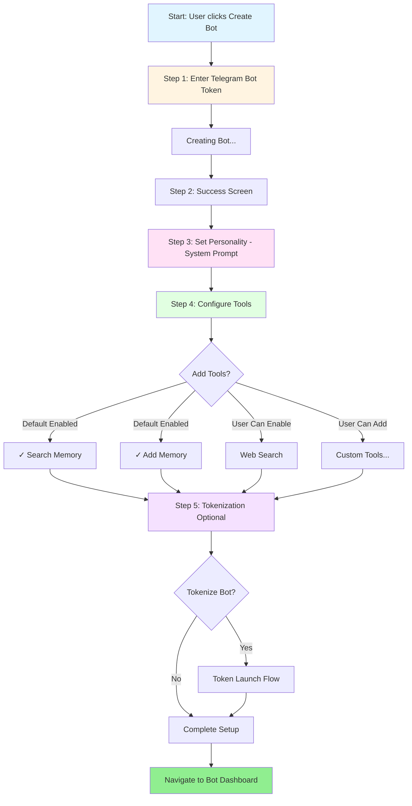

# Simplified Bot Onboarding Flow

## Flow Details

### Step 1: Enter Bot Token
- User pastes Telegram bot token from BotFather
- System validates token and fetches bot info

### Step 2: Success Screen
- Shows bot avatar, name, username
- Quick confirmation before configuration

### Step 3: Set Personality
- Single textarea for system prompt
- "Improve Prompt" AI assistance button
- Keep it simple - just the core personality

### Step 4: Configure Tools
- Dropdown/checklist interface
- **Default enabled:**
  - Search Memory (search through saved conversations)
  - Add Memory (save new information)
- **Optional:**
  - Web Search
  - Custom tools (if any exist)

### Step 5: Tokenization (Optional)
- "Would you like to tokenize this bot?"
- If yes → Launch token flow (existing TokenLaunchDialog)
- If no → Skip to dashboard

### Simplified Approach
- Remove: Intro message configuration (can be set later in settings)
- Remove: Message type toggles (DMs/Groups) - default to DMs only, configure later
- Remove: Memory chunks setup - too complex for onboarding
- Focus: Get bot running with minimal configuration, refine later
