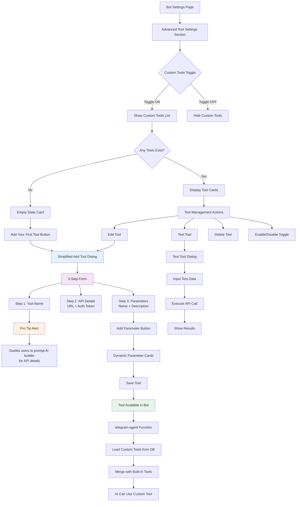
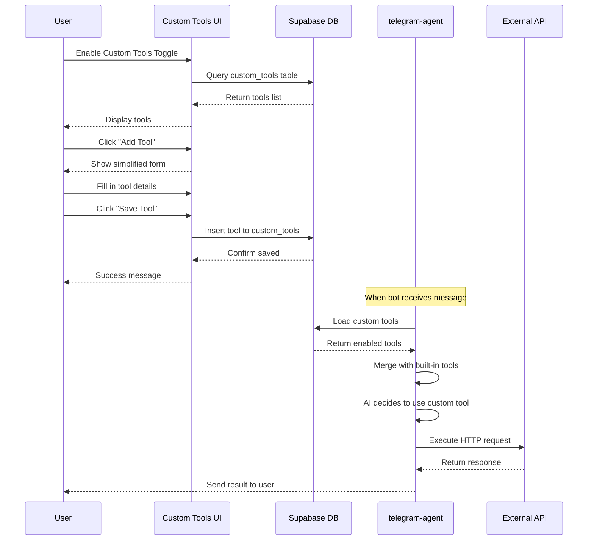

# Simplified Custom Tools Flow

## Overview
This diagram shows the streamlined custom tools interface that makes it easy for users to connect external APIs to their bot.

## Key Features

### 1. Toggle Interface
- Located in Advanced Tool Settings
- Shows/hides custom tools section
- Clean and non-intrusive

### 2. Simplified Form (3 Steps)
1. **Tool Name**: Simple display name
2. **API Details**: 
   - Endpoint URL
   - Optional auth token (bearer or API key)
3. **Parameters**: 
   - Dynamic list of key-value pairs
   - Each parameter has name + description

### 3. Pro Tip Guidance
Alert box provides exact prompt for users to ask their AI builder:
> "I want to connect [API name] to my bot. Give me: 1) The API endpoint URL, 2) The auth token/API key, 3) All required parameters with descriptions"

### 4. Auto-Configuration
- Automatically sets HTTP method to POST
- Automatically creates request template from parameters
- Uses bearer token auth if provided, otherwise no auth
- All parameters marked as required by default

### 5. Tool Management
Each tool card shows:
- Tool name and parameter count
- Last used timestamp
- Quick actions: Test, Edit, Delete, Enable/Disable

## Data Flow

## Benefits

1. **Simplicity**: Only 3 required fields (name, URL, parameters)
2. **Guidance**: Pro tip tells users exactly what to ask their AI builder
3. **Flexibility**: Works with any API that accepts JSON
4. **Testing**: Built-in test dialog for verification
5. **Non-invasive**: Toggle keeps advanced features optional
