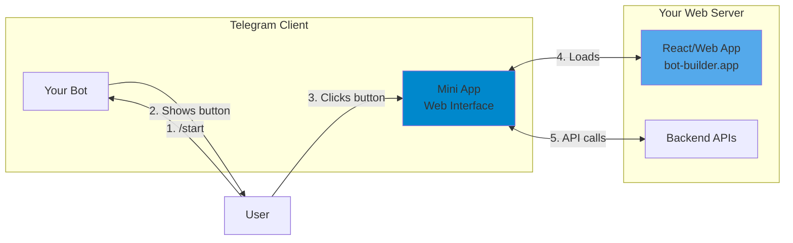

# Telegram Mini Apps Guide

This document explains Telegram Mini Apps and how to implement them with your bot.

## What are Telegram Mini Apps?

Telegram Mini Apps (formerly Web Apps) are full-featured web applications that run inside Telegram's native interface. They provide a seamless, app-like experience without users leaving Telegram.

## Key Features

- **Full-screen web apps** inside Telegram
- **Access to Telegram user data** (name, photo, language)
- **Native-like UI** with Telegram's theme colors
- **Inline keyboards** to launch mini apps
- **Payment integration** with Telegram Payments
- **Haptic feedback** and device features
- **No app store** needed - instant access

## How Mini Apps Work with Your Bot

### Current Setup vs Mini App

| Feature | Current Magic Link | With Mini App |
|---------|-------------------|---------------|
| User flow | Click link → Opens browser → Login | Click button → Opens in Telegram |
| Authentication | Magic link token | `window.Telegram.WebApp.initData` |
| Experience | Leaves Telegram | Stays in Telegram |
| Mobile UX | Opens Safari/Chrome | Native Telegram UI |

### Implementation Steps

1. **Update your web app to detect Telegram environment:**

\`\`\`typescript
// Check if running inside Telegram Mini App
if (window.Telegram?.WebApp) {
  const tg = window.Telegram.WebApp;
  tg.ready(); // Tell Telegram the app is ready
  
  // Get user data from Telegram
  const initData = tg.initDataUnsafe;
  console.log('Telegram user:', initData.user);
  
  // Auto-authenticate using initData
  authenticateWithTelegram(tg.initData);
}
\`\`\`

2. **Add Telegram WebApp script to your HTML:**

\`\`\`html

\`\`\`

3. **Update bot to send Web App buttons instead of links:**

\`\`\`typescript
// Instead of sending a text link, send a WebApp button
await bot.sendMessage(chatId, "Click to open your profile:", {
  reply_markup: {
    inline_keyboard: [[
      { 
        text: "Open Profile 🚀", 
        web_app: { url: "https://bot-builder.app/profile" }
      }
    ]]
  }
});
\`\`\`

4. **Create backend validation for Telegram init data:**

\`\`\`typescript
// Validate that the request came from Telegram
function validateTelegramWebAppData(initData: string, botToken: string) {
  // Telegram provides cryptographic validation
  const dataCheckString = /* parse initData */;
  const secretKey = crypto.createHmac('sha256', 'WebAppData')
    .update(botToken).digest();
  const hash = crypto.createHmac('sha256', secretKey)
    .update(dataCheckString).digest('hex');
  
  return hash === receivedHash;
}
\`\`\`

## Benefits for Your Users

- ✅ **Seamless**: Never leaves Telegram
- ✅ **Fast**: No browser redirect delays
- ✅ **Native feel**: Matches Telegram's UI
- ✅ **Secure**: Cryptographically signed data
- ✅ **Mobile-first**: Perfect for mobile users

## Migration Path

You can keep both systems running:
1. **Magic links** for web users who want to use the full website
2. **Mini App** for Telegram users who want the native experience

\`\`\`typescript
// Bot sends both options
await bot.sendMessage(chatId, "Choose how to access your profile:", {
  reply_markup: {
    inline_keyboard: [
      [{ text: "Open in Telegram 📱", web_app: { url: "https://bot-builder.app/mini" }}],
      [{ text: "Open in Browser 🌐", url: "https://bot-builder.app/claim?token=..." }]
    ]
  }
});
\`\`\`

## Next Steps to Implement

1. Add `telegram-web-app.js` script to your index.html
2. Create a `/mini` route that detects `window.Telegram.WebApp`
3. Implement `validateTelegramWebAppData` edge function
4. Update bot messages to use `web_app` buttons
5. Test in Telegram mobile and desktop apps

## Resources

- [Telegram Mini Apps Docs](https://core.telegram.org/bots/webapps)
- [Web App Examples](https://core.telegram.org/bots/webapps#example-apps)
- [Design Guidelines](https://core.telegram.org/bots/webapps#design-guidelines)
