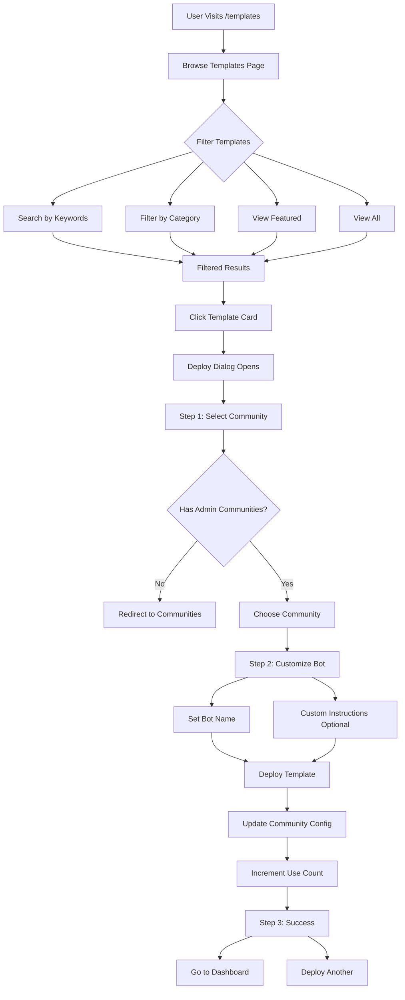
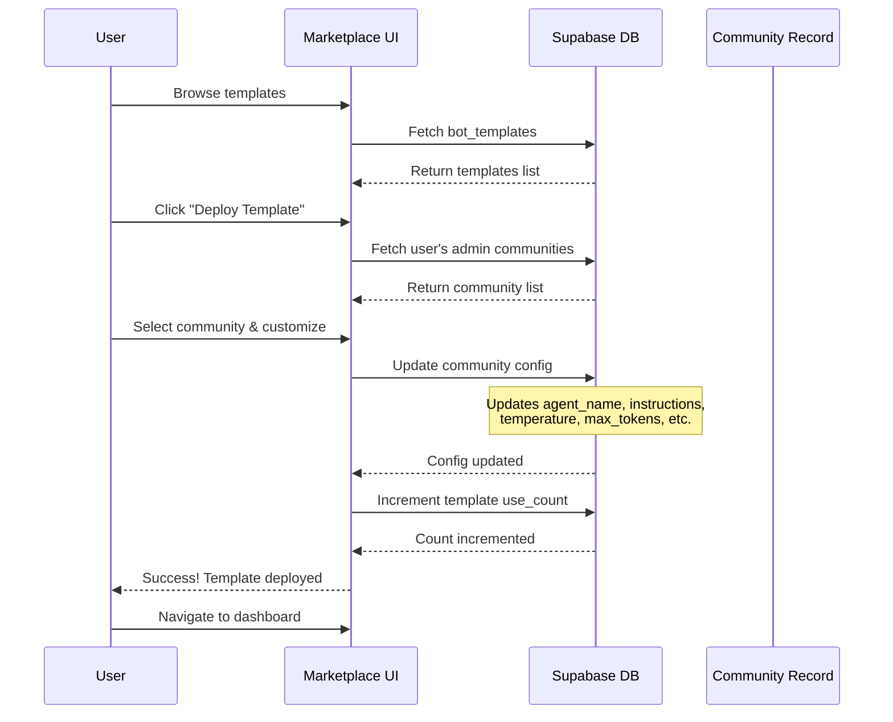
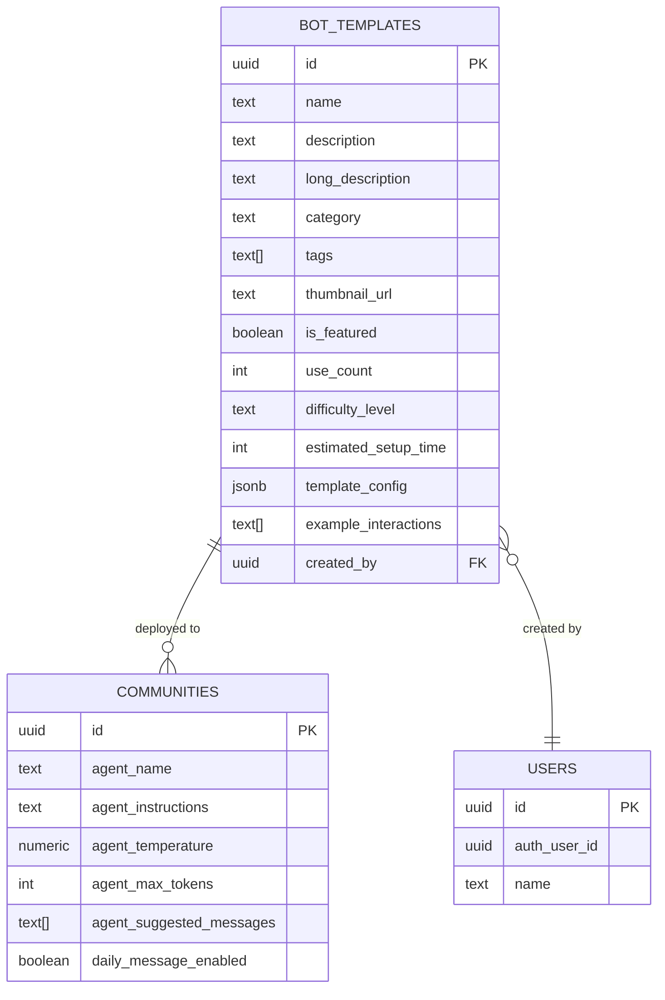
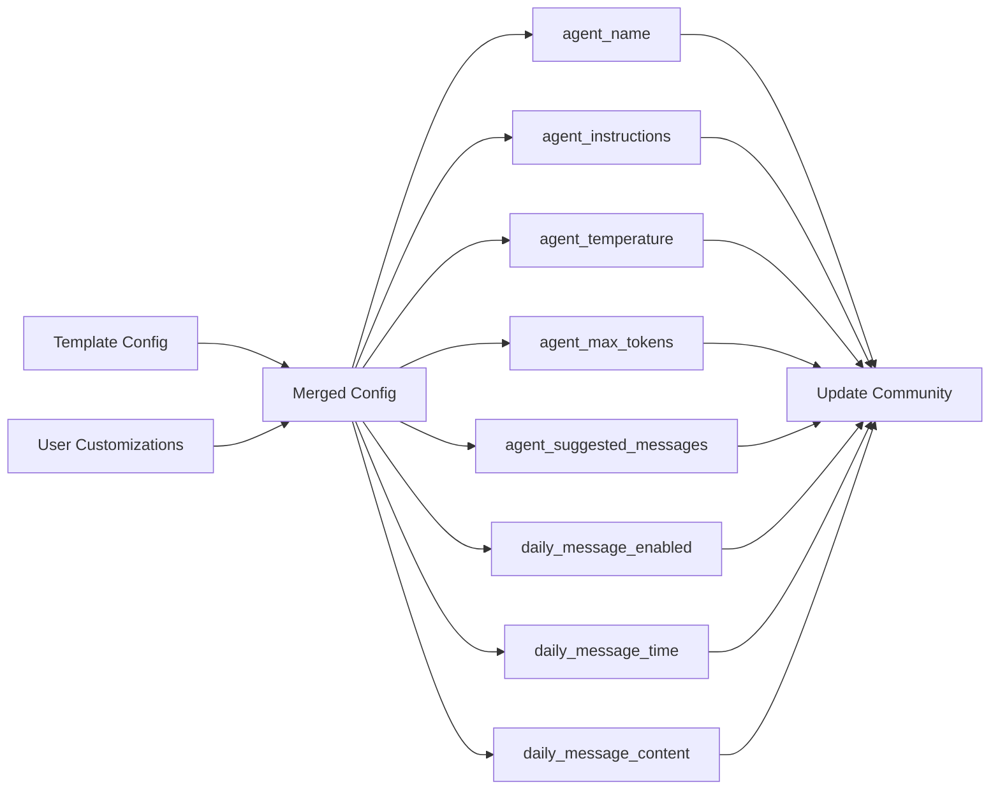

# Template Marketplace Flow

## User Journey Through Template Marketplace

## Template Deployment Process

## Template Data Structure

## Template Configuration Merge

## Key Features

### Template Categories
- **Community**: Community management, FAQs, welcome bots
- **Productivity**: Stand-ups, task management, reminders
- **Education**: Learning companions, study groups
- **Entertainment**: Content curation, games
- **Business**: Customer support, sales
- **Support**: Help desk, troubleshooting
- **Custom**: Specialized use cases

### Template Attributes
- **Difficulty Level**: Beginner, Intermediate, Advanced
- **Estimated Setup Time**: Minutes to configure
- **Use Count**: Popularity metric
- **Featured Status**: Highlighted templates
- **Tags**: Searchable keywords
- **Example Interactions**: Sample conversations

### Deployment Flow
1. **Browse**: Search and filter templates
2. **Preview**: View details and examples
3. **Select**: Choose target community
4. **Customize**: Set bot name and instructions
5. **Deploy**: Apply configuration
6. **Manage**: Access from dashboard

### Security
- Only community admins can deploy templates
- RLS policies enforce user permissions
- Template configs validated before deployment
- Use count tracking for analytics

## Sample Templates Included

1. **Community Assistant** (Featured)
   - Welcome new members
   - Answer FAQs
   - Facilitate introductions

2. **Daily Stand-up Bot** (Featured)
   - Automated check-ins
   - Team updates compilation
   - Async workflows

3. **Event Coordinator** (Featured)
   - RSVP management
   - Event reminders
   - Q&A handling

4. **Learning Companion**
   - Resource sharing
   - Progress tracking
   - Peer learning

5. **Customer Support Bot**
   - 24/7 availability
   - Issue troubleshooting
   - Ticket escalation

6. **Content Curator**
   - Content discovery
   - Discussion facilitation
   - Recommendations
