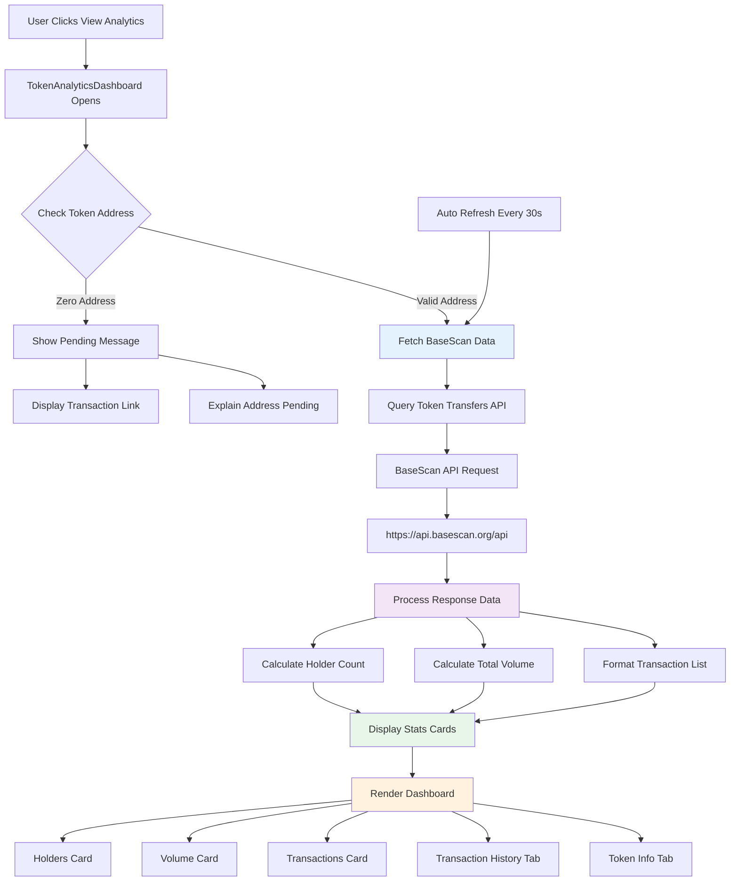
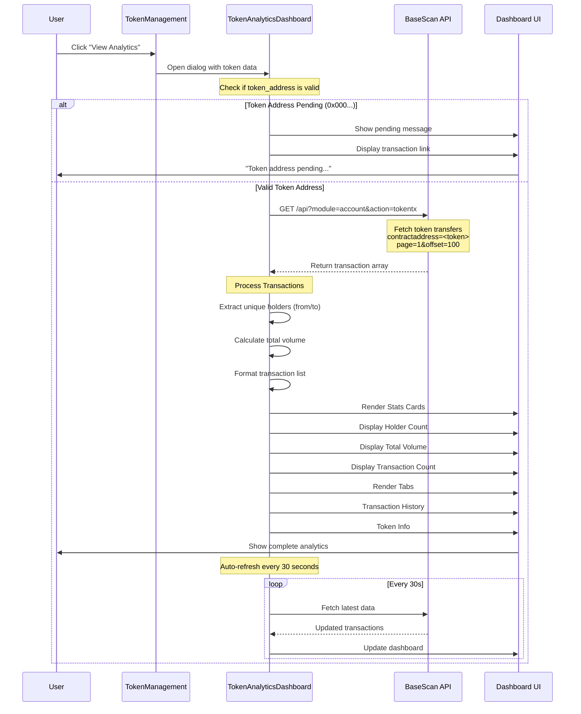
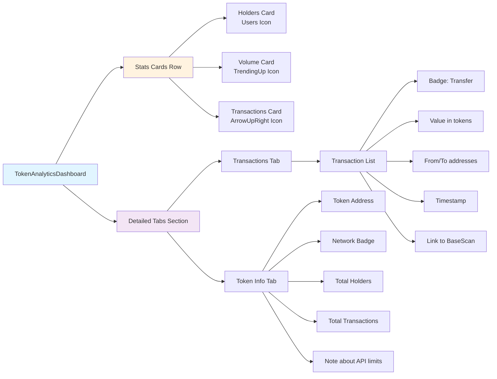
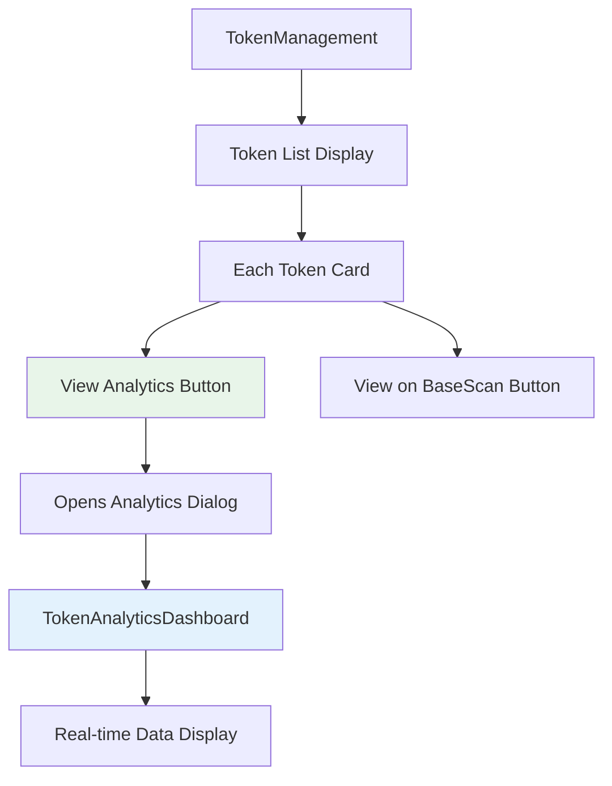
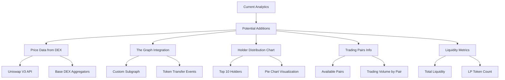

# Token Analytics System

## Overview
This diagram shows how the token analytics dashboard fetches real-time data from BaseScan API to display holder counts, transaction history, and volume metrics.



## Data Flow Sequence



## Analytics Dashboard Components



## BaseScan API Integration

### Endpoints Used

1. **Token Transfers**
   ```
   GET https://api.basescan.org/api
   ?module=account
   &action=tokentx
   &contractaddress={TOKEN_ADDRESS}
   &page=1
   &offset=100
   &sort=desc
   ```

### Data Processing

1. **Holder Calculation**
   - Extract all unique addresses from `to` and `from` fields
   - Store in Set to ensure uniqueness
   - Return Set size as holder count

2. **Volume Calculation**
   - Sum all transaction `value` fields
   - Convert from wei (divide by 1e18)
   - Format to 2 decimal places

3. **Transaction History**
   - Display most recent 10 transactions
   - Format addresses (0x1234...5678)
   - Convert timestamps to readable dates
   - Link to BaseScan for details

## Integration Points

### TokenManagement Component



## Features Implemented

1. ✅ **Real-time Holder Count** - Calculated from unique addresses in transactions
2. ✅ **Transaction Volume** - Sum of all token transfers
3. ✅ **Transaction History** - List of recent transfers with details
4. ✅ **Auto-refresh** - Updates every 30 seconds
5. ✅ **Zero Address Handling** - Shows pending message for tokens being deployed
6. ✅ **BaseScan Integration** - Direct links to view on block explorer
7. ✅ **Responsive Design** - Works on mobile and desktop

## Future Enhancements



## API Rate Limits

- **Without API Key**: 1 call/5 seconds per IP
- **With Free API Key**: 5 calls/second
- **Implementation**: Auto-refresh set to 30 seconds to stay within limits

## Error Handling

1. **Zero Address**: Shows user-friendly pending message
2. **API Failures**: Falls back to "No data available"
3. **Empty Results**: Shows "No transactions found yet"
4. **Network Errors**: Query automatically retries with exponential backoff
