# Token Launch Flow for BotBuilder

## Overview
This diagram shows how the Long.xyz APIs enable gasless token launches for bots on the platform, unlocking tokenomics for every community.

```mermaid
graph TD
    A[User/Bot Initiates Token Launch] --> B{Has Required Info?}
    
    B -->|No| C[Collect Token Details]
    B -->|Yes| D[Start Token Creation]
    
    C --> C1[Token Name & Symbol]
    C --> C2[Bot Avatar/Logo]
    C --> C3[Description & Social Links]
    C --> C4[Vesting Recipients Optional]
    C --> C5[Beneficiaries Optional]
    C1 --> D
    C2 --> D
    C3 --> D
    C4 --> D
    C5 --> D
    
    D --> E[Step 1: Upload Image to IPFS]
    E --> E1[POST /ipfs/upload-image]
    E1 --> E2[Receive IPFS image hash]
    
    E2 --> F[Step 2: Upload Metadata to IPFS]
    F --> F1[POST /ipfs/upload-metadata]
    F1 --> F2[Include: name, description,<br/>image_hash, social_links,<br/>vesting_recipients]
    F2 --> F3[Receive IPFS metadata hash]
    
    F3 --> G[Step 3: Encode Auction Template]
    G --> G1[POST /auction-templates?chainId=8453]
    G1 --> G2[Include: template_id, metadata<br/>token_name, token_symbol,<br/>token_uri ipfs://, user_address,<br/>beneficiaries]
    G2 --> G3[Receive encoded_payload]
    
    G3 --> H[Step 4: Broadcast Sponsored Transaction]
    H --> H1[POST /sponsorship]
    H1 --> H2[Send encoded_payload]
    H2 --> H3[Platform pays gas fees!]
    
    H3 --> I[Token Deployed! 🎉]
    I --> I1[Receive transaction_hash]
    I1 --> I2[Store in DB: custom_tools table]
    
    I2 --> J[Token Now Available]
    
    J --> J1[Bot can reference token]
    J --> J2[Users can trade token]
    J --> J3[Enable token-gated features]
    J --> J4[Track token metrics]
    
    style E fill:#e3f2fd
    style F fill:#f3e5f5
    style G fill:#fff3e0
    style H fill:#e8f5e9
    style I fill:#c8e6c9
    style J fill:#ffecb3
```



## Key Innovation: Gasless Launches

The **sponsorship endpoint** means your platform pays the gas fees, removing barriers for non-crypto users:


## Integration with BotBuilder

### Database Schema Addition
```sql
CREATE TABLE bot_tokens (
  id UUID PRIMARY KEY DEFAULT gen_random_uuid(),
  community_id UUID REFERENCES communities(id),
  token_name TEXT NOT NULL,
  token_symbol TEXT NOT NULL,
  token_address TEXT NOT NULL,
  transaction_hash TEXT NOT NULL,
  image_ipfs_hash TEXT,
  metadata_ipfs_hash TEXT,
  chain_id INTEGER DEFAULT 8453, -- Base chain
  created_at TIMESTAMP DEFAULT NOW(),
  created_by UUID REFERENCES users(id)
);
```

### Custom Tool Integration
These Long.xyz APIs would be perfect as **custom tools** that the bot can invoke:

1. **launch_token** - Full token creation flow
2. **check_token_balance** - Query user's token holdings
3. **get_token_price** - Fetch current auction price
4. **distribute_tokens** - Airdrop tokens to community members

### UI Components Needed

1. **Token Launch Dashboard**
   - Form to collect token details
   - Preview of token metadata
   - Progress indicator (4 steps)
   - Transaction explorer link

2. **Token Management Panel**
   - List all tokens created by community
   - Token metrics (holders, price, volume)
   - Vesting schedule viewer
   - Beneficiary management

3. **Bot Token Widget**
   - Display bot's token if exists
   - Quick buy/sell actions
   - Token gate status indicator

## Benefits Over Traditional Token Launches

| Feature | Traditional | With Long.xyz |
|---------|------------|---------------|
| **Gas Fees** | User pays $50-200 | Platform sponsors |
| **Technical Knowledge** | Need MetaMask, understand tx | Just fill a form |
| **Time to Launch** | Hours of setup | Minutes |
| **Metadata Storage** | Centralized or manual IPFS | Automatic IPFS |
| **Fair Launch** | Complex auction setup | Built-in templates |
| **Multi-chain** | Deploy separately | One API, multiple chains |

## Revenue Opportunities

1. **Freemium Model**
   - Free: 1 token launch per bot
   - Paid: Unlimited launches + premium templates

2. **Transaction Fees**
   - Platform takes 1% of token sales
   - Shared with bot creator

3. **Premium Features**
   - Custom vesting schedules
   - Advanced tokenomics
   - Whitelist management

4. **Sponsored Launches**
   - Brands pay to sponsor bot token launches
   - Community gets token, brand gets exposure
