# Token Launch Implementation

## Overview
This diagram shows the complete implementation of the Long.xyz token launch workflow integrated into the BotBuilder platform.

```mermaid
graph TD
    A[User Opens Bot Settings] --> B[Token Management Section]
    B --> C{Tokens Exist?}
    
    C -->|No| D[Empty State: Launch First Token]
    C -->|Yes| E[Display Token Cards]
    
    D --> F[Click Launch Token]
    E --> F
    
    F --> G[Token Launch Dialog Opens]
    G --> H[User Fills Form]
    
    H --> H1[Token Name]
    H --> H2[Token Symbol]
    H --> H3[Description Optional]
    H --> H4[Wallet Address Required]
    H --> H5[Upload Image or Use Cover]
    
    H1 --> I[Submit Form]
    H2 --> I
    H3 --> I
    H4 --> I
    H5 --> I
    
    I --> J[launch-token Edge Function]
    
    J --> K[Step 1: Upload Image to IPFS]
    K --> K1[POST /ipfs/upload-image]
    K1 --> K2[Convert image to blob]
    K2 --> K3[Receive image_hash]
    
    K3 --> L[Step 2: Upload Metadata]
    L --> L1[POST /ipfs/upload-metadata]
    L1 --> L2[Include: name, description,<br/>image_hash, social_links]
    L2 --> L3[Receive metadata_hash]
    
    L3 --> M[Step 3: Encode Template]
    M --> M1[POST /auction-templates]
    M1 --> M2[templateId: fecbd0f1-7a92-4671]
    M2 --> M3[chainId: 8453 Base]
    M3 --> M4[token_uri: ipfs://metadata_hash]
    M4 --> M5[Receive encoded_payload]
    
    M5 --> N[Step 4: Broadcast Sponsored]
    N --> N1[POST /sponsorship]
    N1 --> N2[Platform pays gas!]
    N2 --> N3[Receive transaction_hash]
    
    N3 --> O[Step 5: Store in Database]
    O --> O1[Insert into bot_tokens table]
    O1 --> O2[Include all token details]
    
    O2 --> P[Success! 🎉]
    P --> P1[Show transaction link]
    P --> P2[Display in Token Management]
    P --> P3[Refresh token list]
    
    style K fill:#e3f2fd
    style L fill:#f3e5f5
    style M fill:#fff3e0
    style N fill:#e8f5e9
    style O fill:#ffecb3
    style P fill:#c8e6c9
```



## Component Architecture


## Database Schema


## API Flow Sequence


## Key Features Implemented

### 1. Token Launch Dialog
- **Form validation** using React Hook Form + Zod
- **Image upload/preview** with fallback to community cover
- **Live progress** indicator during 4-step process
- **Transaction link** to BaseScan for verification
- **Auto-refresh** token list on success

### 2. Token Management Dashboard
- **Token cards** displaying all launched tokens
- **IPFS image** display from hash
- **Token metadata** (name, symbol, address, chain)
- **BaseScan links** for each token transaction
- **Empty state** encouraging first token launch

### 3. Edge Function (launch-token)
- **Authentication** via Supabase Auth
- **4-step API calls** to Long.xyz
- **Image conversion** from URL/base64 to blob
- **Error handling** with detailed logging
- **Database storage** of all token details
- **RLS compliance** for security

### 4. Database Structure
- **bot_tokens table** with comprehensive fields
- **RLS policies** ensuring only admins can create/modify
- **Foreign keys** to communities and users
- **Indexes** on community_id and token_address
- **Auto-updated** updated_at timestamp

### 5. API Configuration
- **LONG_API_KEY** secret stored securely
- **Template ID** hardcoded: `fecbd0f1-7a92-4671-9be6-30d5a14571e5`
- **Chain ID** default: `8453` (Base)
- **Gasless transactions** via sponsorship endpoint

## Integration Points

### Where to Add Token Management

Add `TokenManagement` component to your community settings:

```typescript
// In CommunitySettings.tsx or similar
import { TokenManagement } from "./TokenManagement";

// Inside your settings page
<TokenManagement 
  communityId={communityId}
  communityName={community.name}
  coverImageUrl={community.cover_image_url}
/>
```

### Environment Variables Required

```bash
LONG_API_KEY=7N1MiAaBNZ0cgEnJjtRHrON4dPC0Evrr
```

## Testing Checklist

- [ ] Upload new image works
- [ ] Use community cover works
- [ ] Form validation catches errors
- [ ] Progress indicator updates correctly
- [ ] Transaction hash is valid
- [ ] Token appears in management list
- [ ] BaseScan link opens correctly
- [ ] RLS policies prevent unauthorized access
- [ ] Multiple tokens per community work
- [ ] Error handling shows meaningful messages

## Future Enhancements

1. **Token Analytics**
   - Holder count tracking
   - Price history charts
   - Volume metrics

2. **Token-Gated Features**
   - Require X tokens to access bot features
   - Token balance checks in custom tools

3. **Advanced Tokenomics**
   - Custom vesting schedules
   - Multiple beneficiaries
   - Token burning mechanics

4. **Social Features**
   - Token transfer within community
   - Leaderboards by token holdings
   - Token-based rewards system
