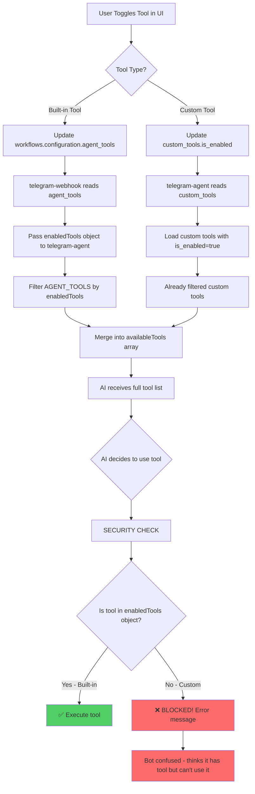
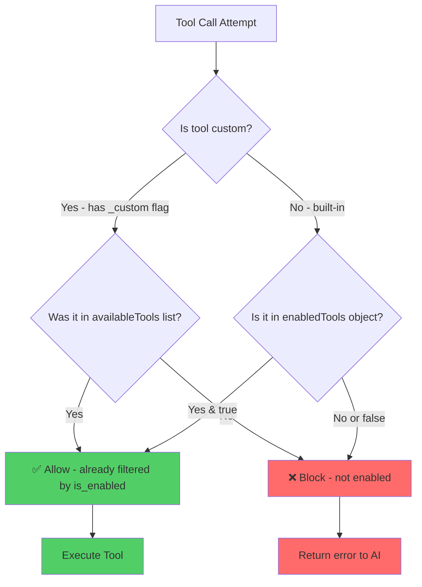

# Tool Availability Issue & Solution

## Current Problem

The bot is confused about which tools it can use because of a mismatch between custom tools and built-in tools in the security check.



## The Bug

**Location:** `supabase/functions/telegram-agent/index.ts` lines 998-1007

```typescript
// SECURITY CHECK: Verify tool is actually enabled
if (!enabledTools || !enabledTools[toolName]) {
  console.error(`⚠️ Tool ${toolName} was called but is not enabled`);
  // Block execution
}
```

**Problem:** This checks if `enabledTools[toolName]` exists, but:
- `enabledTools` only contains **built-in** tool toggles (web_search, search_memory, etc.)
- **Custom tools** aren't in this object - they're filtered separately by `is_enabled` in the database
- So custom tools that ARE enabled get blocked by this check!

## The Solution

Update the security check to handle both built-in and custom tools:



## Implementation

We need to:
1. Track which tools are actually available (from the filtered list)
2. Check against the available tools list instead of just the enabledTools object
3. Custom tools that passed the `is_enabled=true` filter are automatically authorized

```typescript
// Build a Set of actually available tool names for security checks
const availableToolNames = new Set(availableTools.map(t => t.function.name));

// Later in security check:
if (!availableToolNames.has(toolName)) {
  // Tool not in available list - blocked
}
```

## Why This Matters

Without this fix:
- Bot receives tool definitions (sees them in its context)
- Bot tries to use the tools
- Security check blocks execution
- Bot gets confused error messages
- User sees inconsistent behavior

With the fix:
- Only truly enabled tools reach the bot
- Security check validates against actual available tools
- Custom tools work seamlessly
- Consistent, predictable behavior
