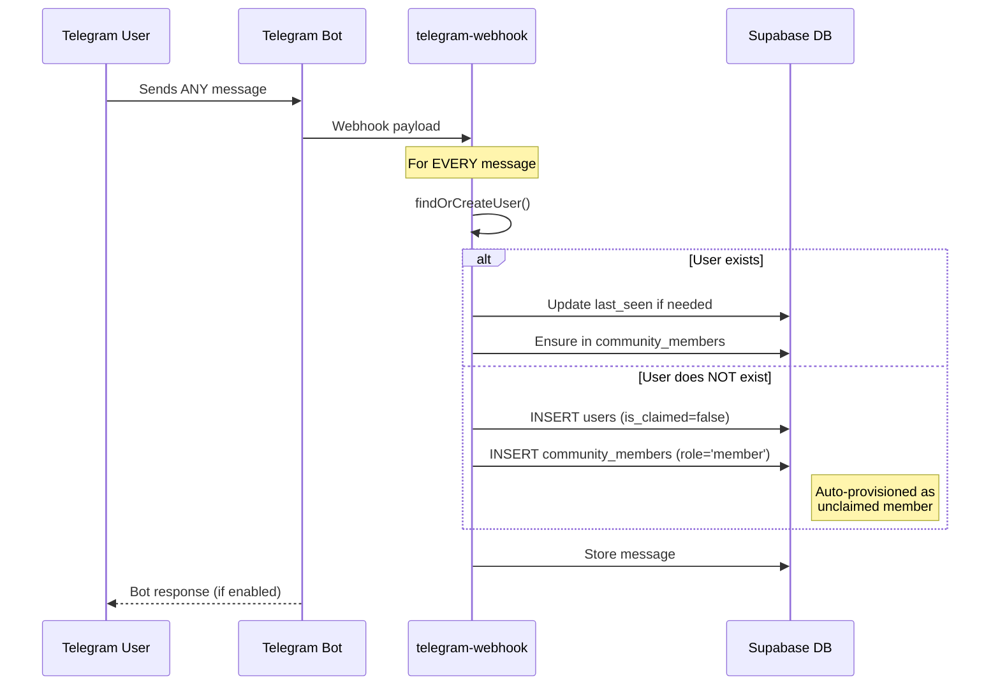
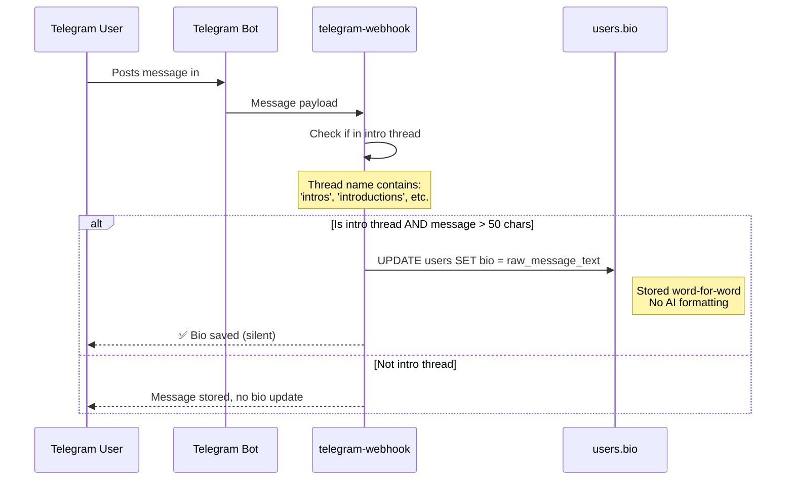
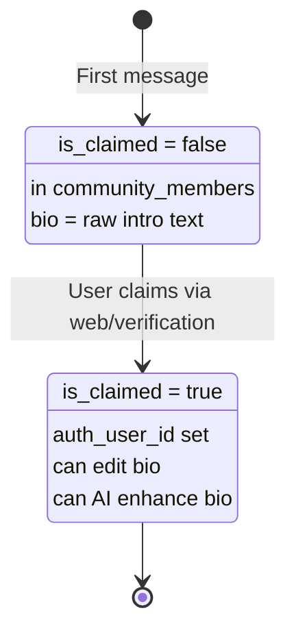

# Unclaimed Users & Raw Intro Storage

This diagram shows how users are automatically provisioned as unclaimed members and how intro messages are stored word-for-word.

## Auto-Provisioning Flow

## Raw Intro Storage Flow

## User States

## Key Points

1. **100% Capture**: Every message sender is auto-provisioned
2. **Unclaimed by Default**: New users have `is_claimed=false`
3. **Raw Storage**: Intro messages stored exactly as written
4. **No AI on Entry**: AI enhancement only happens when admin/user requests it
5. **Silent Updates**: Bio is saved without notifying the user in chat
6. **Thread Detection**: Automatic based on thread name matching

## Configuration

Auto-intro storage requires:
- `community_workflows.workflow_type = 'telegram_integration'`
- `configuration.auto_intro_generation.enabled = true`
- `configuration.auto_intro_generation.thread_names = ['intros', ...]`
