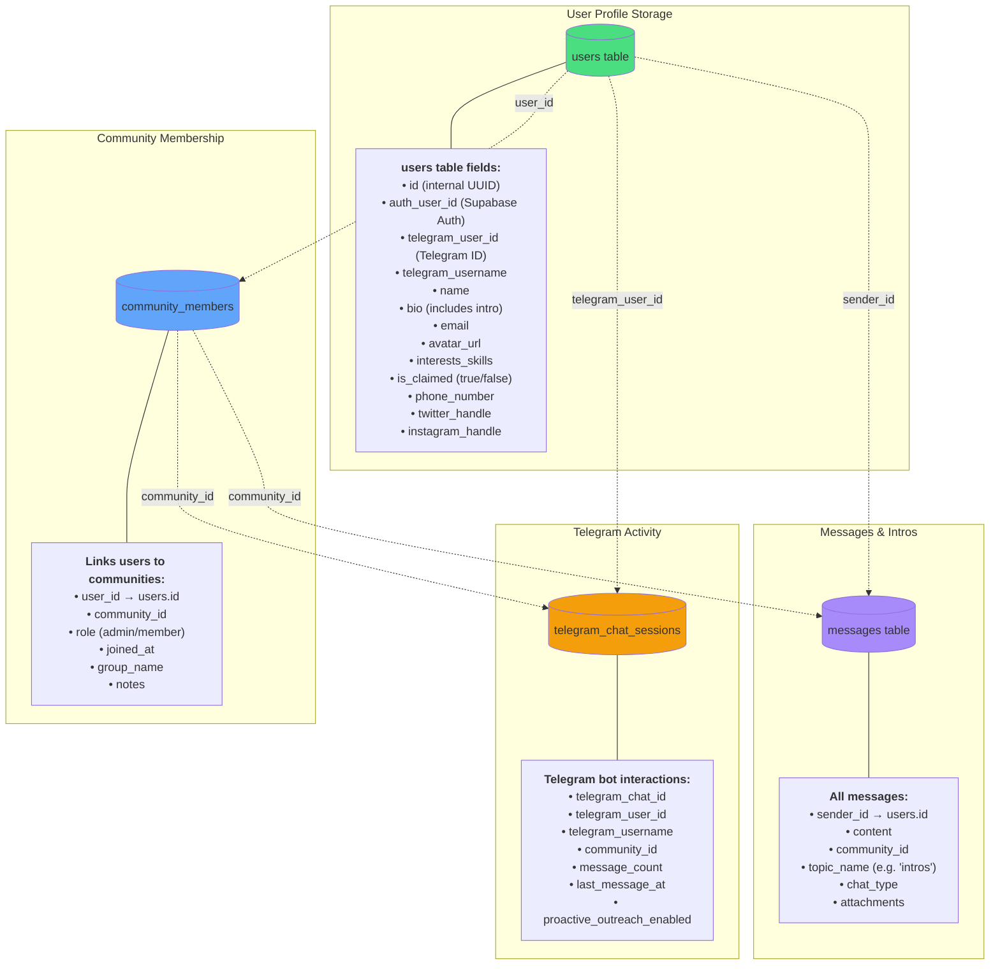
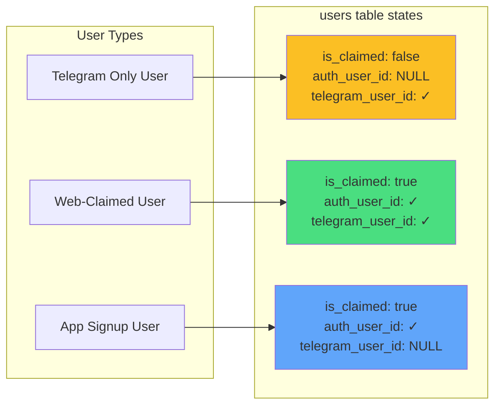

# User Data Architecture

## Where Users Are Stored



## How to Query Users for a Specific Community

### 1. Get All Users in Edge City Patagonia

```sql
-- Get community ID first
SELECT id, name FROM communities WHERE name ILIKE '%edge city%patagonia%';
-- Returns: f6850f7e-3744-4e3c-bac3-7fe63242ad42

-- Get all members with full profile info
SELECT 
  u.id,
  u.name,
  u.telegram_username,
  u.telegram_user_id,
  u.email,
  u.bio,
  u.is_claimed,
  u.avatar_url,
  u.interests_skills,
  cm.role,
  cm.joined_at,
  cm.group_name
FROM users u
JOIN community_members cm ON u.id = cm.user_id
WHERE cm.community_id = 'f6850f7e-3744-4e3c-bac3-7fe63242ad42'
ORDER BY cm.joined_at DESC;
```

### 2. Get Telegram Activity for Community Members

```sql
SELECT 
  u.name,
  u.telegram_username,
  tcs.message_count,
  tcs.last_message_at,
  tcs.proactive_outreach_enabled,
  tcs.is_active
FROM telegram_chat_sessions tcs
JOIN users u ON tcs.telegram_user_id = u.telegram_user_id
WHERE tcs.community_id = 'f6850f7e-3744-4e3c-bac3-7fe63242ad42'
ORDER BY tcs.last_message_at DESC;
```

### 3. User Account Types



## Key Points

1. **Single Source of Truth**: `users` table stores ALL user profiles
2. **Community Linking**: `community_members` table links users to communities
3. **Telegram Activity**: `telegram_chat_sessions` tracks bot interactions
4. **Intro Storage**: Intros are saved directly in `users.bio` field (not memories table)
5. **Account Status**: `is_claimed` indicates if user has web/app login credentials

## Accessing via UI

You can view community members in the dashboard:
- Go to: `/community/{community_id}` 
- Click "Members" tab
- See full member list with roles and join dates
