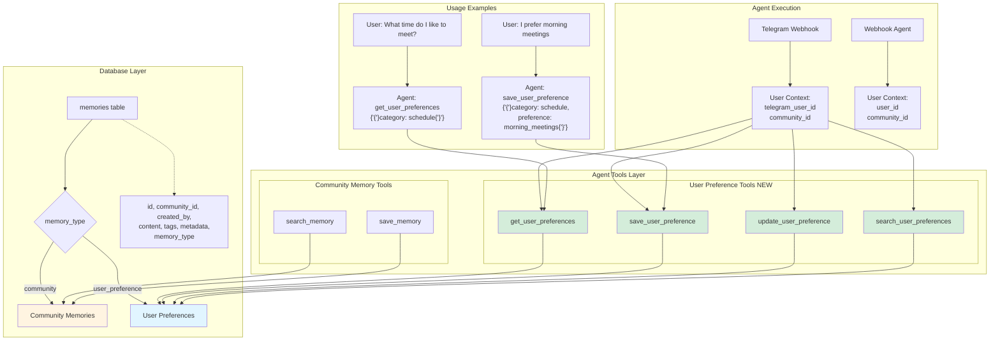
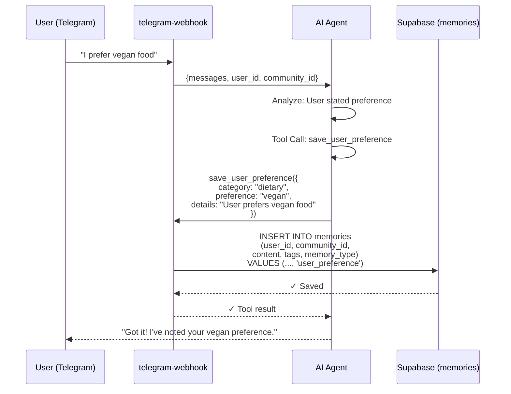
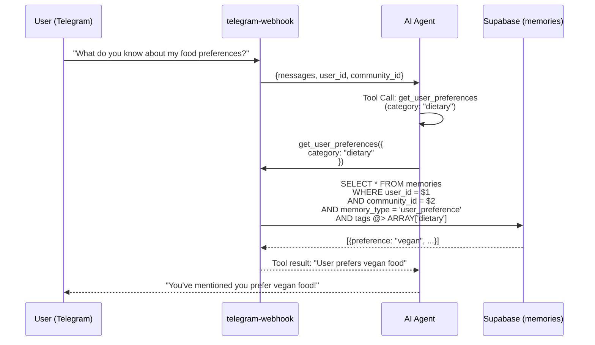

# User Preferences System Architecture



## Flow: Saving User Preference



## Flow: Retrieving User Preferences



## Schema Changes Needed

```sql
-- Add memory_type column to memories table
ALTER TABLE memories 
ADD COLUMN memory_type TEXT DEFAULT 'community' 
CHECK (memory_type IN ('community', 'user_preference'));

-- Add index for faster user preference queries
CREATE INDEX idx_memories_user_preferences 
ON memories(created_by, community_id, memory_type) 
WHERE memory_type = 'user_preference';

-- Add RLS policy for user preferences
CREATE POLICY "Users can view their own preferences"
ON memories FOR SELECT
USING (
  memory_type = 'user_preference' 
  AND created_by IN (
    SELECT id FROM users WHERE auth_user_id = auth.uid()
  )
);
```

## Tool Definitions

### 1. get_user_preferences
```typescript
{
  name: "get_user_preferences",
  description: "Retrieve all preferences/memories for the current user. Use this to remember user-specific information like dietary restrictions, meeting preferences, communication style, etc.",
  parameters: {
    type: "object",
    properties: {
      category: {
        type: "string",
        description: "Optional category to filter by (e.g., 'dietary', 'schedule', 'communication')"
      }
    }
  }
}
```

### 2. save_user_preference
```typescript
{
  name: "save_user_preference",
  description: "Save a new preference/memory for the current user. Use when user shares personal preferences, habits, or information they want remembered.",
  parameters: {
    type: "object",
    properties: {
      category: {
        type: "string",
        description: "Category of preference (e.g., 'dietary', 'schedule', 'communication')"
      },
      preference: {
        type: "string",
        description: "Short label for the preference (e.g., 'vegan', 'morning_person')"
      },
      details: {
        type: "string",
        description: "Full details about this preference"
      }
    },
    required: ["category", "preference", "details"]
  }
}
```

### 3. update_user_preference
```typescript
{
  name: "update_user_preference",
  description: "Update an existing user preference",
  parameters: {
    type: "object",
    properties: {
      preference_id: {
        type: "string",
        description: "ID of the preference to update"
      },
      details: {
        type: "string",
        description: "Updated details"
      }
    },
    required: ["preference_id", "details"]
  }
}
```

### 4. search_user_preferences
```typescript
{
  name: "search_user_preferences",
  description: "Search through user's preferences using keywords",
  parameters: {
    type: "object",
    properties: {
      query: {
        type: "string",
        description: "Search query"
      }
    },
    required: ["query"]
  }
}
```

## Key Features

✅ **Privacy**: User preferences only accessible to that user + agents  
✅ **Context-Aware**: Agents automatically get user context from telegram_user_id  
✅ **Organized**: Category-based tagging (dietary, schedule, communication, etc.)  
✅ **Searchable**: Full-text and semantic search within user preferences  
✅ **Backward Compatible**: Existing community memories unchanged  
✅ **Flexible**: Can store any type of user preference or personal memory  

## Example Use Cases

1. **Dietary Preferences**: "I'm vegan" → Agent remembers for event planning
2. **Schedule Preferences**: "I prefer morning meetings" → Agent suggests morning times
3. **Communication Style**: "Keep messages brief" → Agent adjusts tone
4. **Personal Context**: "I'm learning Spanish" → Agent can reference this later
5. **Project Interests**: "I want to build a mobile app" → Agent suggests relevant events/people
