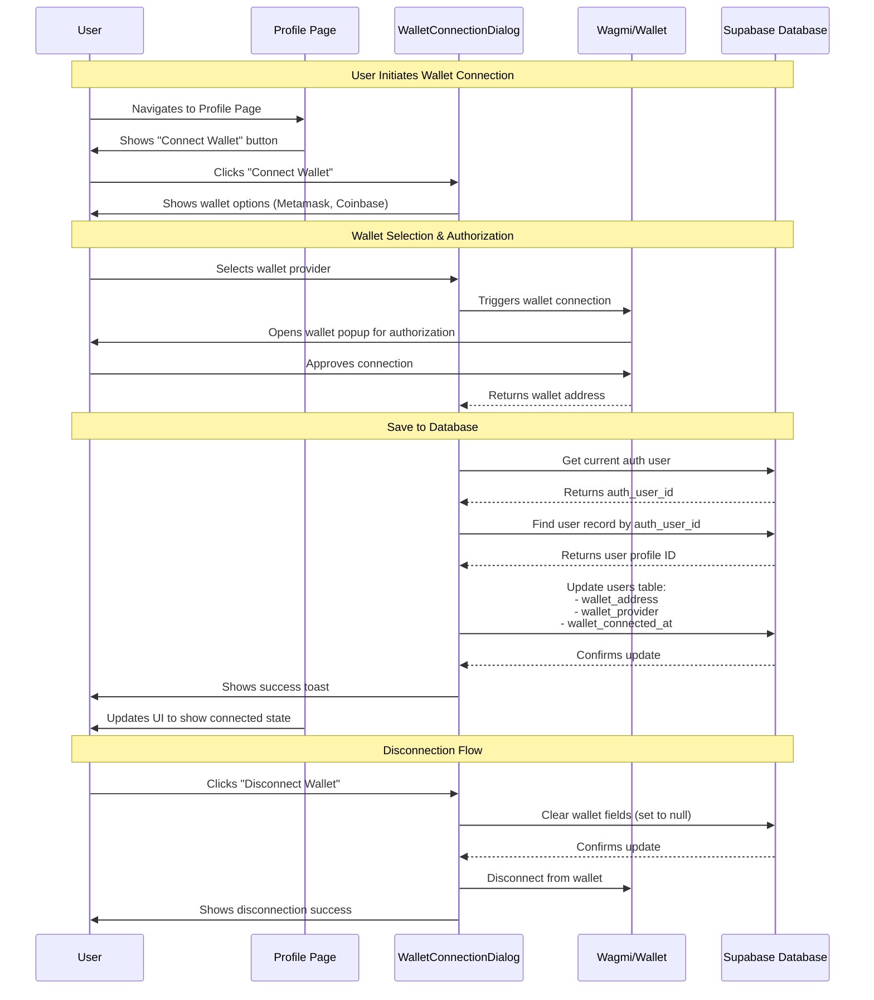
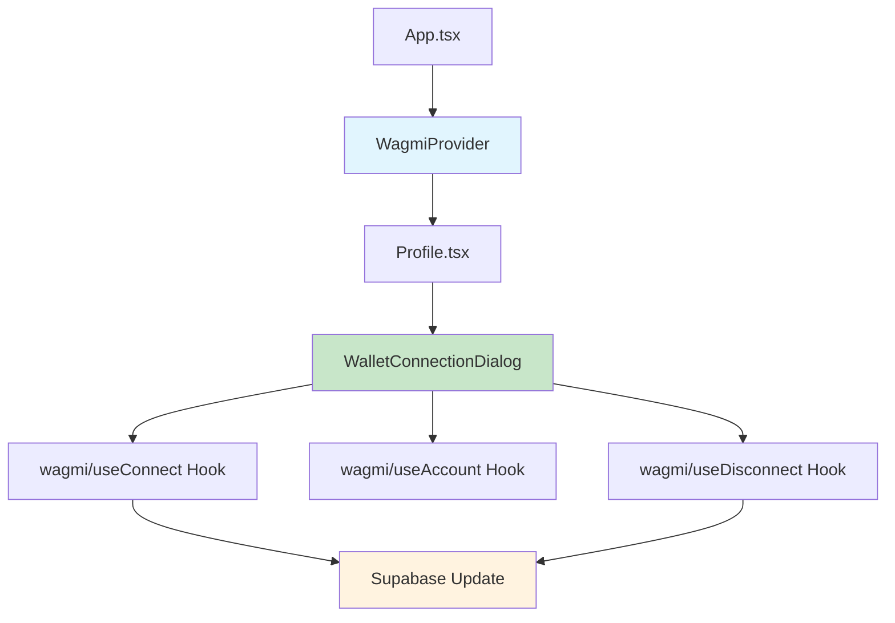

# Wallet Connection Flow

This diagram shows how users connect their crypto wallets (Metamask, Coinbase) and have that data stored in Supabase.



## Database Schema

### Users Table Updates
```sql
ALTER TABLE users 
ADD COLUMN wallet_address text,
ADD COLUMN wallet_provider text,
ADD COLUMN wallet_connected_at timestamp with time zone;

CREATE INDEX idx_users_wallet_address ON users(wallet_address);
```

### Fields
- `wallet_address` - User's connected crypto wallet address (e.g., 0x742d...)
- `wallet_provider` - Wallet provider name (metamask, coinbase, etc.)
- `wallet_connected_at` - Timestamp when wallet was first connected

## Supported Wallets

- **MetaMask** - Browser extension wallet
- **Coinbase Wallet** - Coinbase's official wallet

## Technical Stack

- **wagmi** - React Hooks for Ethereum
- **viem** - TypeScript interface for Ethereum
- **Base Chain** - Primary blockchain (Base Mainnet + Base Sepolia Testnet)

## Component Architecture



## Next Steps for P2P Payments

With wallet connection in place, you can now:

1. **Custom Tool: `send_crypto`** - Allow bot to initiate USDC transfers
2. **Transaction History** - Create `crypto_transactions` table
3. **Balance Display** - Show USDC balance in user profile
4. **Payment Commands** - Bot understands "send $10 USDC to @alice"
5. **Gas Sponsorship** - Optional: Use paymaster for gasless transactions
